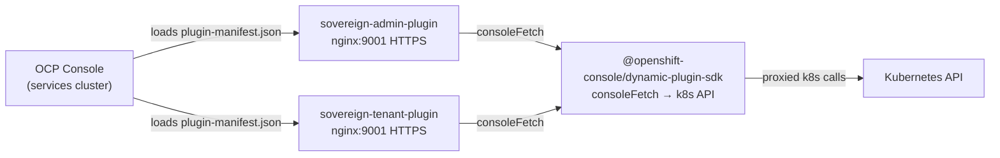

# OpenShift Console Plugins

## Overview

Two console plugins extend the OpenShift console UI on the **services cluster** with Sovereign Cloud management functionality. They run alongside the existing standalone dashboard applications.

## Deployment

| Component | Type | Namespace | Port |
|---|---|---|---|
| `sovereign-cloud-dashboard` | Standalone app (existing) | sovereign-cloud | 8443/8080 |
| `tenancy-dashboard` | Standalone app (existing) | sovereign-cloud | 8443/8080 |
| `sovereign-admin-plugin` | ConsolePlugin (new) | sovereign-cloud | 9001 |
| `sovereign-tenant-plugin` | ConsolePlugin (new) | sovereign-cloud | 9001 |

## Architecture



## Sovereign Admin Plugin

**Display name**: Sovereign Admin  
**Plugin name**: `sovereign-admin-plugin`  
**Nav section**: "Sovereign Admin"

| Nav Item | Route | Feature |
|---|---|---|
| Overview | /sovereign-admin | Platform health dashboard with donut chart, cluster tiles, alerts |
| Entities | /sovereign-admin/entities | List/create/delete Entity CRs with expandable status |
| Personas | /sovereign-admin/personas | Persona management per entity |
| Service URLs | /sovereign-admin/services | Route health dashboard across clusters |
| Operators | /sovereign-admin/operators | ClusterServiceVersion health status |

## Sovereign Tenant Plugin

**Display name**: Sovereign Tenant  
**Plugin name**: `sovereign-tenant-plugin`  
**Nav section**: "Sovereign Cloud" (matching screenshot)

| Nav Separator | Nav Item | Route |
|---|---|---|
| Tenancy | Entity | /sovereign-tenant |
| | Cloud AWS | /sovereign-tenant/cloudaws |
| | Cloud OSO | /sovereign-tenant/cloudoso |
| | Team | /sovereign-tenant/teams |
| | Platform Openshift | /sovereign-tenant/platforms |
| | Projects | /sovereign-tenant/projects |
| | Assignment | /sovereign-tenant/assignments |
| | Personas | /sovereign-tenant/personas |
| Access Control | RBAC | /sovereign-tenant/rbacs |
| | Vaults | /sovereign-tenant/vaults |
| | AAP Orgs | /sovereign-tenant/aap |
| | Quay Orgs | /sovereign-tenant/quay |

## Dark Mode Support

Both plugins use PatternFly 5 components which automatically respond to OCP's dark mode via CSS variables (`--pf-v5-global--*`). No additional configuration needed.

## Technical Notes

- **TLS**: OCP service serving certificate injected via `service.beta.openshift.io/serving-cert-secret-name` annotation
- **Auth**: `consoleFetch` forwards user's OCP bearer token to k8s API automatically
- **API**: All k8s calls via `/api/kubernetes/...` OCP console proxy (no separate backend)
- **Enabled via**: `oc patch console.operator.openshift.io/cluster` with plugin names

## Build

```bash
# Admin plugin
cd user_dashboard
make admin-plugin-build-push

# Tenant plugin
cd tenancy_dashboard
make tenant-plugin-build-push
```

## Deployment via ArgoCD

Both plugins are managed by the central ArgoCD via `sovereign-central-apps`:
- `sovereignAdminPlugin` in `helm/central/values.yaml`
- `sovereignTenantPlugin` in `helm/central/values.yaml`
