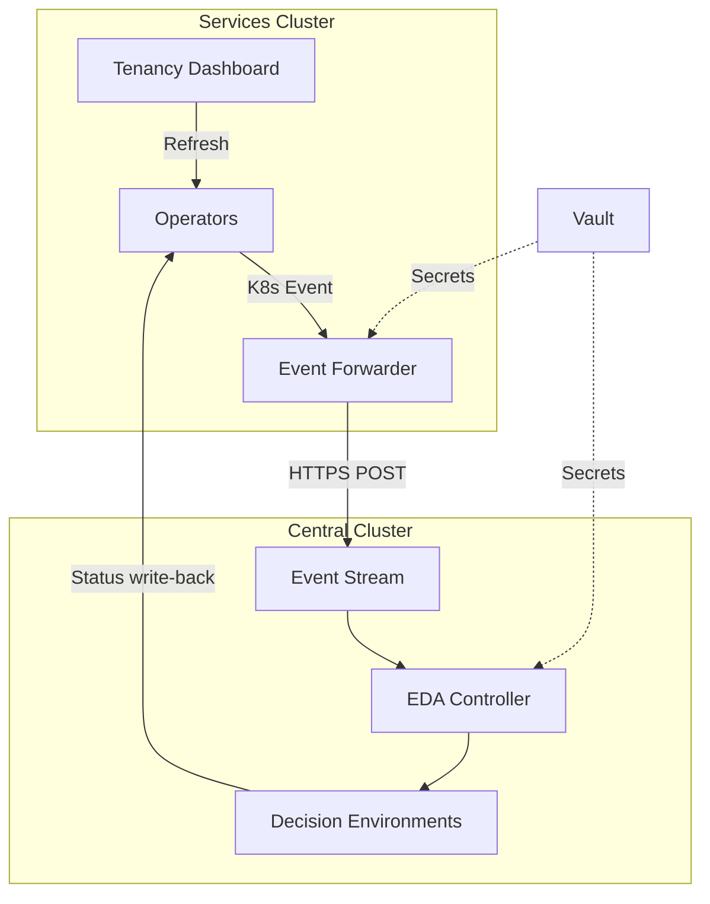

# Platform EDA Architecture — Business Presentation

*8 slides — management and stakeholder briefing*

---

## Slide 1 — Title

**Platform EDA Architecture**

Sovereign Cloud Platform Rebuild — Feature 006

June 2026

*Moving automation to a central, event-driven engine*

---

## Slide 2 — The Problem: Operators Do Too Much

**Today's operators are overloaded**

- Each operator (Entity, Team, Assignment, plugins) runs full provisioning logic inside the cluster
- Every operator needs credentials for Keycloak, Vault, cloud APIs, and Kubernetes
- A single logic change requires rebuilding and redeploying the entire operator
- RBAC permissions are broad because operators touch many external systems
- Scaling and troubleshooting become harder as the platform grows

**Result**: Slow iteration, wide attack surface, tight coupling between Kubernetes reconciliation and business automation.

---

## Slide 3 — The Solution: Event-Driven Architecture

**Split responsibilities cleanly**

| Component | New Role |
|-----------|----------|
| Operators (services cluster) | Detect CR changes, emit events, manage status handshake |
| Event Forwarder (services cluster) | Deliver events securely to central |
| EDA (central cluster) | Execute Ansible automation in isolated environments |

**How it works**: A user creates or updates a custom resource. The operator emits a structured event. EDA receives it, runs the right playbook, and writes the result back. The operator sees completion and stops.

No manual steps. No direct cluster access for provisioning changes.

---

## Slide 4 — Architecture Diagram

---

## Slide 5 — Benefits

**Scalability**

- Lightweight operators reconcile faster with smaller resource footprints
- EDA activations scale independently based on event volume
- Per-operator Decision Environments avoid one bloated shared image

**Reliability**

- Forwarder retries with deduplication; operators re-emit as backup
- All EDA playbooks are idempotent — safe to run multiple times
- Global test suite validates end-to-end flows continuously

**Maintainability**

- Provisioning logic changes update Ansible roles, not operator SDK builds
- Consistent event contract across all eleven operators
- Clear ownership: operators manage K8s API; EDA manages external systems

---

## Slide 6 — Security

**Vault, ExternalSecrets, least-privilege**

- No secrets in Git — all credentials in Vault, delivered via ExternalSecrets
- Operators no longer hold Keycloak, Vault, or cloud API credentials
- Event Stream authenticated with bearer tokens from Vault
- EDA admin credentials registered via sovereign Job, never committed
- Dashboard mutations use the logged-in user's OAuth token only
- API rate limiting prevents abuse of refresh and mutation endpoints
- Forwarder RBAC limited to watch Events and list Namespaces

---

## Slide 7 — Testing

**Global test suite**

The `global_tests/` Ansible suite validates the entire EDA pipeline:

| Test Area | What It Checks |
|-----------|----------------|
| Infrastructure | ArgoCD sync, node health, pod readiness |
| Operators | Pod health, event emission on CR actions |
| EDA | Event Stream delivery, activation health, status write-back |
| Dashboards | Reachability, API proxy, refresh flow |

Run on demand or in CI. Reports generated as JUnit/HTML.

Every refactored operator has create AND delete flow tests.

---

## Slide 8 — Next Steps

**Rollout and ongoing operations**

1. Enable event forwarder on services cluster (ArgoCD sync)
2. Run AAP license Jobs on both clusters
3. Execute eda-config Job to register DEs and activations
4. Deploy refactored operators tier by tier (Entity → plugins)
5. Validate with global test suite after each tier
6. Complete hardening gaps (NetworkPolicy, pod securityContext)
7. Train platform team on EDA developer guide for future operators

**Documentation**: Technical architecture, developer guide, hardening checklist, and conceptual overview available in `architecture/docs/`.
