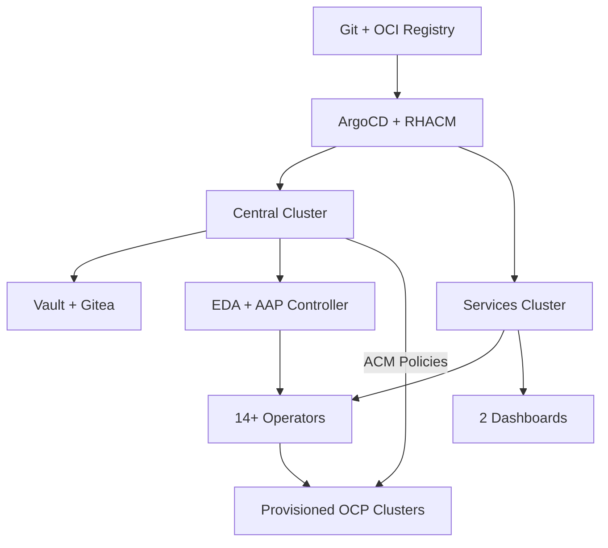
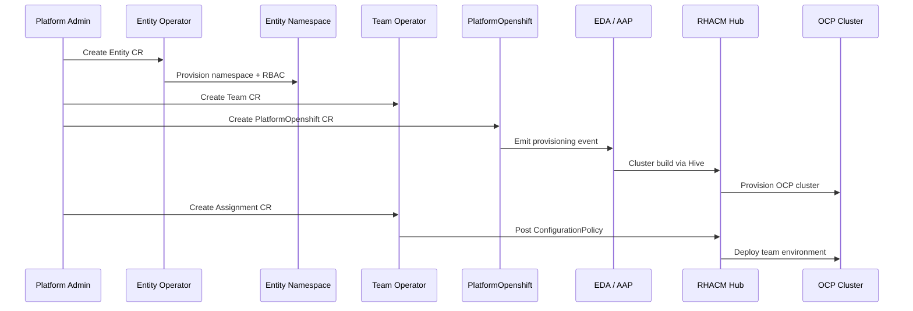
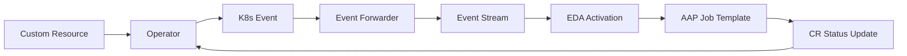
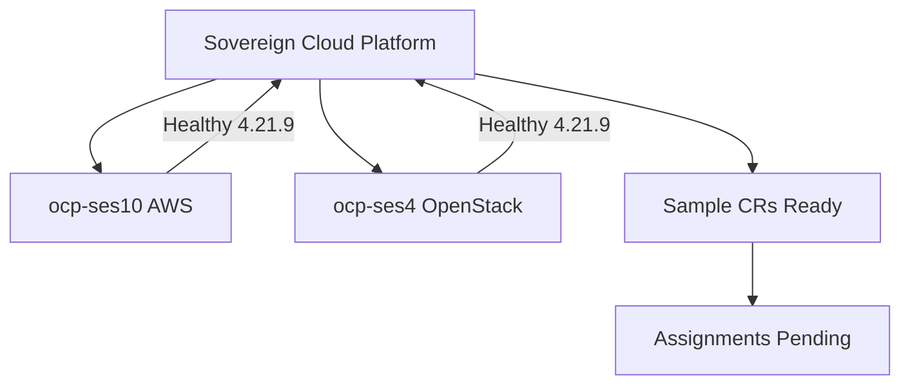

# Leadership Demo Deck — Hybrid Sovereign Cloud

**Audience:** Technical leadership (CTO / VP Engineering)  
**Format:** Presentation slides (`---` separators)  
**Last updated:** 2026-06-16

---

## Slide 1 — Executive Summary

### Title: Sovereign Cloud at a Glance

**The problem**

- Enterprises need **isolated, governed OpenShift clusters per tenant**
- Manual provisioning does not scale; drift and credential sprawl create audit risk
- Multi-cloud (AWS, OpenStack) and air-gapped requirements add complexity

**The solution**

- **Sovereign Cloud** — a GitOps-driven, multi-tenant platform on two OpenShift clusters
- Ten custom resources (CRs) declare intent; operators and automation execute provisioning
- Single app-of-apps chart keeps central and services clusters in sync after bootstrap

**Key differentiator**

- Fully **operator-driven provisioning** with a **security-first** design
- No secrets in Git; Vault + ExternalSecrets for all credential delivery
- Event-Driven Ansible (EDA) separates lightweight operators from heavy automation

**Status**

- **Live** with **2 provisioned clusters**: `ocp-ses10` (AWS) and `ocp-ses4` (OpenStack)
- Entity, Team, Project, Persona, and plugin CRs operational; Assignment rollout in progress (Spec 008)

---

## Slide 2 — Platform at a Glance

### Title: Two-Cluster Architecture

**Central cluster (management plane)**

- ArgoCD app-of-apps — single GitOps entry point for both clusters
- RHACM — multi-cluster hub, policy enforcement, spoke registration
- Vault, Gitea, Sovereign Jobs — secrets, Git mirror, post-deploy Ansible
- EDA + AAP Controller — event-driven provisioning engine

**Services cluster (control plane + workloads)**

- 14+ `hybridsovereign.redhat` operators — Entity, tenancy, Persona, plugins
- Sovereign Dashboard + Tenancy Dashboard — self-service UIs
- Keycloak — identity and SSO for tenant users

**Scale**

- 14+ operators, 2 dashboards, 24+ AAP job templates, EDA event forwarder

---

## Slide 3 — Tenant Journey

### Title: From Entity CR to Provisioned Cluster

**Steps**

1. **Entity CR** — platform admin declares a tenant; operator creates `entity-<name>` namespace
2. **Persona + Rbac CRs** — Keycloak groups and Kubernetes RoleBindings wired per role
3. **Team CR** — team structure and optional Istio/Argo features declared
4. **Project CR** — application or workload grouping within the entity
5. **PlatformOpenshift CR** — targets AWS or OpenStack; triggers cluster build via EDA/AAP
6. **Assignment CR** — links Team + Projects + Platform; ACM Policy delivers spoke resources

**Time-to-cluster:** fully automated once cloud environment CRs are ready — no manual `oc` steps after bootstrap

---

## Slide 4 — Security Model

### Title: Security-First by Design

**Vault-centric secrets**

- Zero plaintext or base64-encoded credentials in any Git repository
- PushSecret (central) → Vault KV → ExternalSecret (services) delivery chain
- Cross-cluster API tokens (e.g., Assignment → ACM) never stored in Git

**Three-layer RBAC**

| Layer | Mechanism | Purpose |
|-------|-----------|---------|
| 1 — Identity | Keycloak groups via `Rbac` / `Persona` CRs | Who the user is |
| 2 — Kubernetes | Roles + RoleBindings in entity namespaces | What CRs they can manage |
| 3 — Fleet | ACM ConfigurationPolicy on spoke clusters | What runs on tenant clusters |

**Zero-trust inter-cluster auth**

- All cross-cluster API calls use bearer tokens stored in Vault
- Operators hold minimal RBAC — credentials consumed by EDA/AAP at runtime

**Runtime security**

- RHACS (Advanced Cluster Security) available for image and runtime scanning
- Supply chain: private OCI registry, read-only robot pull account, certified base images

---

## Slide 5 — Automation Engine

### Title: EDA → AAP → Provisioning

**How it works**

- Operators on the services cluster detect CR changes and emit typed Kubernetes Events
- Event forwarder posts events to the central Event Stream (outbound-only connectivity)
- EDA activations match event type and call `run_job_template` on AAP Controller
- AAP runs Ansible in isolated Execution Environment containers
- Results written back to CR status (`ready`, `edaJobs` with AAP job URL)

**Every CR change triggers a provisioning job** — create, delete, and force-reconcile paths

**Coverage:** Entity, Team, Project, Persona, Assignment, PlatformOpenshift, CloudOSO, CloudAWS, and all plugin CR kinds

---

## Slide 6 — Self-Service Dashboards

### Title: Two Dashboards, One Platform

**Sovereign Dashboard** (`user_dashboard`)

- Entity CR management — create, list, delete tenants
- **Overview** — cluster-wide CR health donut chart and per-kind status tables
- **Services** — OpenShift Routes with live HTTP health probes
- Protected by OpenShift OAuth + `ose-oauth-proxy` sidecar

**Tenancy Dashboard** (`tenancy_dashboard`)

- Per-tenant CR management — Teams, Assignments, Projects, PlatformOpenshift, CloudOSO
- Plugin CRs — Vault, AAPOrg, QuayOrg, Rbac
- Persona CR views, EDA job links, force-reconcile button
- Entity-scoped sidebar; uses the signed-in user's OAuth token for all API calls

**Shared security model**

- No static ServiceAccount token for user-facing operations
- `user:full` OAuth scope; OpenShift RBAC enforced per request

---

## Slide 7 — Platform Components Catalogue

### Title: Operators and Infrastructure

**Core tenancy operators** (services cluster, `sovereign-cloud`)

| Operator | Tier | Purpose |
|----------|------|---------|
| Entity | Core | Provisions entity namespaces from `Entity` CRs |
| Persona | Core | Decouples RBAC persona bindings from Entity CR |
| Team | Core | Manages `Team` CR lifecycle and namespace context |
| Assignment | Core | Links Team + Projects + Platform; ACM Policy to spoke |
| Project | Core | Manages `Project` CR lifecycle |
| PlatformOpenshift | Core | Surfaces platform cluster metadata; triggers OCP builds |
| CloudOSO | Core | Provisions OpenStack environments via EDA |
| CloudAWS | Core | Provisions AWS environments via EDA |

**Plugin operators** (services cluster, `sovereign-cloud-plugins`)

| Operator | Tier | Purpose |
|----------|------|---------|
| plugin_rbac | Plugin | Keycloak groups from `RbacConfig` / `Rbac` CRs |
| plugin_vault | Plugin | Per-entity Vault instances from `Vault` / `VaultKV` CRs |
| plugin_aap | Plugin | AAP orgs and OIDC from `AAPConfig` / `AAPOrg` CRs |
| plugin_quay | Plugin | Quay orgs and OIDC from `QuayConfig` / `QuayOrg` CRs |
| plugin_sdx | Plugin | Go controller syncing all tenancy CRs to Gitea |

**Key infrastructure**

| Component | Cluster | Purpose |
|-----------|---------|---------|
| RHACM | Central | Multi-cluster hub, Hive cluster builds, policy enforcement |
| AAP (Controller + EDA) | Central | Job templates and event-driven automation |
| Vault | Central | Secrets management, encryption-as-a-service |
| Keycloak | Both | Identity, SSO, group-based access |
| RHACS | Both | Runtime security scanning (optional) |
| ODF / Noobaa | Both | S3-compatible storage for Quay and EDA job logs |
| Quay | Both | In-cluster container registry |
| Gitea | Central | Self-hosted Git; SDX sync target |
| Crunchy Postgres | Both | PostgreSQL for Keycloak, AAP, Quay, and data services |

---

## Slide 8 — Live Deployment Status

### Title: Provisioned Clusters

| Cluster | Cloud | Version | Health | Console |
|---------|-------|---------|--------|---------|
| **ocp-ses10** | AWS | 4.21.9 | Healthy | [console-openshift-console.apps.ocp-ses10.7fe67.sandbox5530.opentlc.com](https://console-openshift-console.apps.ocp-ses10.7fe67.sandbox5530.opentlc.com) |
| **ocp-ses4** | OpenStack | 4.21.9 | Healthy | [console-openshift-console.apps.ocp-ses4.a4fce.lab.example.com](https://console-openshift-console.apps.ocp-ses4.a4fce.lab.example.com) |

**Platform CR readiness (services cluster)**

- Entity, Persona, Team, Project, Rbac, AAPOrg, QuayOrg: **ready**
- CloudAWS (`ses10-env`): **ready**
- CloudOSO (`ses4-env`): environment prep in progress
- PlatformOpenshift + Assignment: pending full cluster build completion

---

## Slide 9 — Roadmap

### Title: Where We Are and Where We Are Going

**Current — Spec 008: Persona Consolidation**

- New Persona operator decouples RBAC from Entity CR (`namespaceRbac` removal)
- EDA job links and force-reconcile in both dashboards
- EDA rulebooks migrated to GitHub; separate activations per CR type
- Helper operator functionality merged into core EDA roles (CloudAWS, CloudOSO, PlatformOpenshift)

**Next**

- Helper operator decommission (`helper_CloudAWS`, `helper_CloudOSO`)
- Samples consolidation into `bootstrap/samples` Helm chart
- Assignment CR rollout and end-to-end testing on provisioned clusters
- Documentation and hardening check closure (Phase 11)

**Vision**

- **OCP Appliance image** — versioned, air-gapped deployable bundle embedding all platform components
- Fractal topology: Sovereign Cloud of Sovereign Clouds under a global OCM hub
- Three service delivery models (PaaS, shared IaaS + VCP, dedicated clusters) from one operator set

---

## Slide 10 — Q&A

### Title: Questions and References

**Key topics for discussion**

- Data residency enforcement (region-bound clusters, scoped Vault paths)
- Cross-cluster secret delivery without kubeconfig files
- Operator-chain pattern for declarative tenant lifecycle
- GitOps bootstrap sequencing (40+ sync waves, intentional bootstrap gap)

**Architecture documentation**

| Document | Path |
|----------|------|
| Platform overview | [00-overview.md](00-overview.md) |
| How it works | [02-how-it-works.md](02-how-it-works.md) |
| Security model | [03-security-model.md](03-security-model.md) |
| Components | [04-components-overview.md](04-components-overview.md) |
| RBAC model | [05-rbac-model.md](05-rbac-model.md) |
| EDA overview | [006-eda-overview.md](006-eda-overview.md) |
| Persona overview | [008-persona-overview.md](008-persona-overview.md) |
| Component interactions | [10-component-interaction-map.md](10-component-interaction-map.md) |
| Full architecture index | [../architecture.md](../architecture.md) |

**Platform team contacts**

- Platform engineering: *see internal team directory*
- Architecture questions: `architecture/docs/` repository
- Spec 008 tracking: `specs/008-platform-persona-consolidation/plan.md`

---

*End of deck.*
