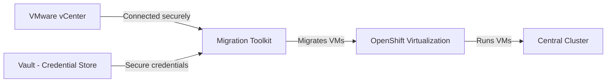

# Virtualization and VM Migration — Business Overview

---

## Slide 1: The Challenge

Many critical business workloads still run on VMware virtual machines. Moving these workloads to a modern cloud-native platform without disruption has historically required expensive, risky "big bang" migrations.

---

## Slide 2: Our Approach

The Sovereign Cloud platform now supports running virtual machines **alongside containers** on the same infrastructure. Existing VMware VMs can be migrated incrementally — one at a time — with no downtime required.

---

## Slide 3: What Was Deployed

Two new platform capabilities: **OpenShift Virtualization** (runs VMs) and **Migration Toolkit** (moves VMs from VMware).

---

## Slide 4: Security — Zero Secrets in Code

VMware credentials are never stored in any file or repository. They flow securely through the platform's credential vault (HashiCorp Vault) and are delivered to the migration tool automatically, with automatic rotation support.

---

## Slide 5: High Availability

All new components run with a minimum of two active replicas and automatic failover protection. A single server failure will not interrupt VM operations or ongoing migrations.

---

## Slide 6: What This Enables

- Run Windows and Linux VMs on the same platform as containerised applications
- Migrate VMware workloads at your own pace — no "big bang" required
- Unified management: one platform, one control plane, one audit trail

---

## Slide 7: Next Steps

- Identify VMware workloads suitable for migration
- Validate network connectivity between the platform and vCenter
- Begin a pilot migration with a non-production VM

---

## Slide 8: Platform Principles Maintained

All changes followed the platform's non-negotiable rules: secrets in Vault only, all changes through GitOps, high availability enforced, and full audit trail in Git history.
