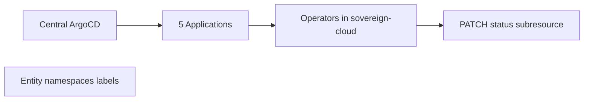
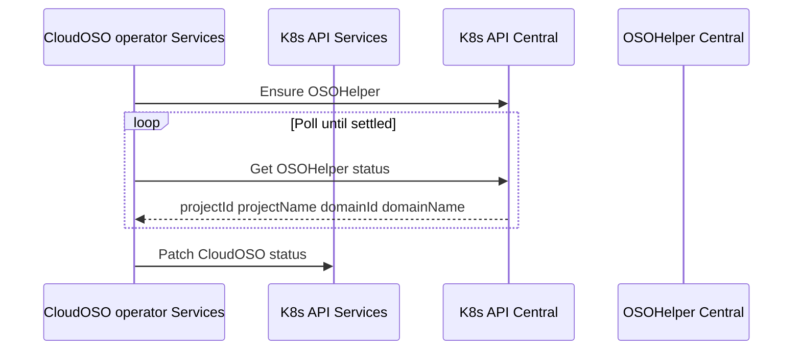

# Tenancy Operators (Team, Assignment, Project, PlatformOpenshift, CloudOSO)

## Overview

Five **Ansible-based** operators extend `hybridsovereign.redhat/v1alpha1` on the **services cluster**:

| Operator | Chart | Chart version | Image | Watches |
|----------|-------|---------------|-------|---------|
| Team | `team-operator` | 0.3.4 | 0.0.2 | `Team` |
| Assignment | `assignment-operator` | 0.4.4 | 0.1.2 | `Assignment` |
| Project | `project-operator` | 0.4.0 | 0.0.2 | `Project` |
| PlatformOpenshift | `platformopenshift-operator` | 0.5.3 | 0.3.2 | `PlatformOpenshift` |
| CloudOSO | `cloudoso-operator` | 0.5.0 | 0.3.0 | `CloudOSO` |

All deploy into **`sovereign-cloud`** from the **central Argo CD app-of-apps**, typically sync wave **38**. **CR instances** normally live in **entity namespaces**.

## Common reconciliation themes

| Concern | Behavior |
|---------|----------|
| **Trigger** | Tuned **`reconcilePeriod`** + **`maxConcurrentReconciles`** per operator — see [Operator performance tuning](./27-operator-performance.md) |
| **Namespace truth** | Controllers **`get`/`list`/`watch` `Namespace`**, deriving `entity`, `billing-id`, and related annotations/labels onto status |
| **Status contract** | **Subresources** (`/status`) patched; **`conditions`** and **`ready`** summarize health |
| **Assignment** | **Cross-CR**: reads **`Team`**, **`Project`**, **`PlatformOpenshift`** (read-only status) **in the same namespace** as the `Assignment` |

## Team (`teams.hybridsovereign.redhat`)

### Spec

| Field | Type | Notes |
|-------|------|-------|
| `features.istio` | `boolean` | Default false |
| `features.argo` | `boolean` | Default false |
| `rbacConfig` | `string` | `RbacConfig` name in `sovereign-cloud-plugins` |
| `teamAdmin` | `string[]` | `Rbac` CR names for team admins |

### Status

`entity`, `billingId`, `features`, `rbacConfig`, `teamAdmin`, `ready`, `conditions` (+ schema echoes such as `name`, `namespace`, `description`).

### Printer columns

Entity (`.status.entity`), RbacConfig, Istio, Argo, Ready, Age.

### Reconciliation (logic)

Observe the **namespace hosting the CR**; validate **entity labels** and optional **Secrets**/`RbacConfig` wiring; normalize **feature toggles** and **admin refs** into **status**.

### RBAC highlights (`team-operator-manager`)

- `Namespace`, `Secrets`, `Teams` (+`/status`/finalizers) full CUD except where limited
- `ConfigMaps`, `leases`, `events`

## Project (`projects.hybridsovereign.redhat`)

### Spec

| Field | Type | Notes |
|-------|------|-------|
| `rbacConfig` | `string` | `RbacConfig` reference |
| `projectAdmin` | `string[]` | `Rbac` names |

### Status

`entity`, `billingId`, `rbacConfig`, `projectAdmin`, `ready`, `conditions` (+ optional echoes).

### Printer columns

Entity, RbacConfig, Ready, Age.

### Reconciliation

Same **namespace label** ingestion pattern as Team; resolves **RBAC linkage** declared in **spec**.

### RBAC highlights (`project-operator-manager`)

- **`Projects`/`projects/status`** — `get`/`list`/`watch`/`patch`/`update` (no broader CRD delete verbs on `projects`).  
- `Namespace`, **`tokenreviews`** + **`subjectaccessreviews`**, leases, events.

## Assignment (`assignments.hybridsovereign.redhat`)

### Spec

| Field | Type | Notes |
|-------|------|-------|
| `team` | `string` | **Team CR name** in the **same namespace** |
| `projects` | `string[]` | **Project CR names** |
| `openshift` | `string` | **Single PlatformOpenshift CR name** (Phase 2: changed from `string[]` to `string`) |

### Status

| Field | Notes |
|-------|-------|
| `entity` | From namespace labels |
| `team` | Echo / resolve `spec.team` |
| `teamReady` | **Ready flag** copied from **`Team`** status |
| `projects` | **`{ name, ready }`** gathered from **`Project`** statuses |
| `openshift` | Resolved cluster name (string) |
| `openshiftReady` | Ready from `PlatformOpenshift.status.ready` |
| `clusterName` | From `PlatformOpenshift.status.appName` |
| `assignmentProvisioned` | True when OSOHelper/AWSHelper CR created on central cluster |
| `helperName` | Name of the helper CR created on central cluster |
| `ready` | Synthetic roll-up: `teamReady && openshiftReady` |
| `conditions` | Standard conditions |

### Printer columns

Team, Cluster (`.status.openshift`), Entity, Provisioned (`.status.assignmentProvisioned`), Ready, Age.

### Cross-CR linking

1. **`spec.team` → Live `Team` object** (`get/list/watch`): drive **`teamReady`** from **`Team.status.ready`**.  
2. **Each name in `spec.projects`** → **`Project`** resources: **`projects[].ready` ← `Project.status.ready`**.  
3. **`spec.openshift`** (string) → **`PlatformOpenshift`**: **`openshiftReady` ← `.status.ready`**; determines provider type (openstack/aws) for provisioning.

For full assignment provisioning flow (spoke cluster namespace/RBAC deployment), see [38-assignment-phase2.md](./38-assignment-phase2.md).

### RBAC highlights (`assignment-operator-manager`)

- **`assignments`** + **`assignments/status`**: **`get/list/patch/update/watch`** (**no CR create/delete**)  
- **Read-only** on **`teams/status`**, **`projects/status`**, **`platformopenshifts/status`**
- **`secrets` `get/list/watch`** — for reading central SA tokens (`osohelper-creator-sa`, `awshelper-creator-sa`)

## PlatformOpenshift (`platformopenshifts.hybridsovereign.redhat`)

### Spec

Empty object (**no user fields**).

### Status

`entity`, `billingId`, `name`, `ready`, `conditions` (+ `namespace`, `description` in CRD schema).

### Printer columns

Name (metadata), Entity, Ready, Age.

### Reconciliation

**Namespace reflection** CR: attaches **billing/entity identifiers** surfaced from **`Namespace` metadata**.

### RBAC highlights

`platformopenshifts` + status/finalizers `get/list/watch/patch/update`; `Namespace`, **`tokenreviews`** + **`subjectaccessreviews`**.

## CloudOSO (`cloudosos.hybridsovereign.redhat`)

### Spec

Empty (**no configurable desired state**).

### Status

`entity`, `billingId`, `name`, **`projectId`**, **`projectName`**, **`domainId`**, **`domainName`**, `ready`, `conditions`.

Domain identity is surfaced for downstream tooling and UX once the central helper completes provisioning.

### Printer columns

Same pattern as PlatformOpenshift (extend columns if CRD exposes project/domain fields).

### Reconciliation

1. **CloudOSO operator** (services cluster) reconciles the CR.
2. It **creates or updates an OSOHelper** custom resource on the **central** cluster (via configured central API access).
3. It **polls OSOHelper status** until the helper reports completion (or surfaces failure conditions).
4. From helper status it **extracts** `projectName`, `projectId`, **`domainId`**, **`domainName`** (alongside existing tenancy markers) and **patches `CloudOSO` status**.

Namespace labels still supply **`entity`** / **`billingId`** where applicable; **domain fields** are extracted from the helper CR status and patched onto `CloudOSO` status.

### RBAC highlights

**Full lifecycle** verbs on **`cloudosos`** + status/finalizers (create/delete/update included); `Namespace`, **`tokenreviews`** + **`subjectaccessreviews`**.

## RBAC comparison (ClusterRoles)

| Operator | Primary CR verbs | Reads peer CRs | TokenReview / SAR |
|---------|-------------------|----------------|-------------------|
| Team | CUD on `teams` | Secrets, namespaces | No |
| Project | PU on `projects` | namespaces | Yes |
| Assignment | PU on `assignments` only | **`teams/status`**, **`projects/status`**, **`platformopenshifts/status`** | No |
| PlatformOpenshift | PU + finalizers | namespaces | Yes |
| CloudOSO | Full CRUD `cloudosos` | namespaces | Yes |
| OpenStackMigration | CUD on `openstackmigrations` | ConfigMap catalog (read) | Yes |

## CloudOSO VRF fields

`spec.enableVRF` (boolean, default `false`) and optional `spec.vrfId` are passed through to Ansible as `ep_enable_vrf` / `ep_vrf_id` in `cloudoso-provision`. No Neutron mutation in the current phase.

## OpenStackMigration

See [OpenStack Migration](./56-openstack-migration.md) for CR schema, MTV catalog sync, and UI flow.

## Related docs

- [Services cluster topology](./04-services-cluster.md)
- [Tenancy Dashboard](./20-tenancy-dashboard.md)
- Observability: [Prometheus metrics and alerts](./26-observability.md)
- Plugin surface: [Plugin RBAC](./19-plugin-rbac.md)
