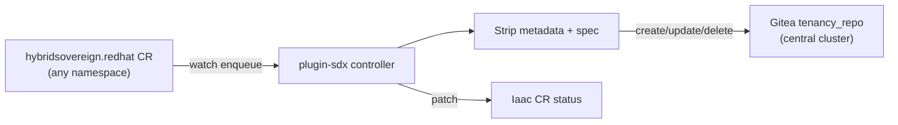

# Plugin SDX Operator

## Overview

The Plugin SDX (State/Data eXport) operator is a Go controller (`plugin_sdx/`) that watches `hybridsovereign.redhat/v1alpha1` Custom Resources cluster-wide and maintains a synchronized copy in the Gitea `tenancy_repo` on the central cluster. It replaces the deprecated Ansible-based `plugin-iaac` operator (`pluginIaac.enabled: false`, 0 replicas).

The `Iaac` CR remains the configuration anchor and status surface; SDX performs the sync work.

## Custom Resource

### Iaac

| Field | Description |
|-------|-------------|
| `apiVersion` | `hybridsovereign.redhat/v1alpha1` |
| `kind` | `Iaac` |
| `spec` | Reserved for future configuration (currently empty) |

```yaml
apiVersion: hybridsovereign.redhat/v1alpha1
kind: Iaac
metadata:
  name: sdx-sync
  namespace: sovereign-cloud-plugins
spec: {}
```

### Status Fields

| Field | Description |
|-------|-------------|
| `ready` | Whether the last sync completed successfully |
| `lastSyncTime` | Timestamp of last successful sync |
| `totalCRsSynced` | Number of CRs synced to Gitea |
| `syncErrors` | Number of errors during last sync |
| `syncedKinds` | Array of synced kinds with counts |

## Architecture

- **Source**: `plugin_sdx/` (Go 1.22+, controller-runtime)
- **Deployment**: `plugin-sdx` Helm chart via ArgoCD (`pluginSdx` app key) to `sovereign-cloud-plugins` on the services cluster
- **Reconcile Period**: 5 minutes (full sync on each `Iaac` reconcile; watched CR changes enqueue `Iaac`)
- **Watches** (read-only list; write to `iaac/status` only): Entity, Team, Assignment, Project, PlatformOpenshift, CloudOSO, CloudAWS, RbacConfig, Rbac, AAPConfig, AAPOrg, QuayConfig, QuayOrg, Vault, VaultKV, Iaac
- **Destination**: Gitea `tenancy_repo` on the central cluster via REST API
- **Credentials**: Gitea admin token from Secret `gitea-admin-token` (Vault path `central/data/gitea`, property `admin_token`)

### Sync Flow



On each reconcile, SDX lists all watched kinds, upserts stripped YAML per CR, removes orphaned paths from prior syncs, and patches `Iaac` status (`ready`, `totalCRsSynced`, `syncedKinds`, `syncErrors`).

### Gitea Repository Structure

Path rule: `{entity}/{Kind}/{name}.yaml`, where `entity` is the CR namespace with the `entity-` prefix removed, or `sovereign-cloud-plugins` for CRs in that namespace. Entity CRs also generate `entity/{namespace-derived}.yaml` summary files.

```
tenancy_repo/
├── entity/
│   └── sovereign-cloud.yaml       # Entity summary (name, namespace, labels, billingId)
├── sovereign-cloud/
│   └── Entity/acme-corp.yaml
├── acme-corp/
│   ├── Team/platform-eng.yaml
│   ├── Assignment/acme-assignment.yaml
│   ├── Project/web-app.yaml
│   ├── PlatformOpenshift/ocp-sdx-aws1.yaml
│   ├── CloudOSO/acme-dev-openstack.yaml
│   ├── CloudAWS/ses10-env.yaml
│   ├── Rbac/dev-team.yaml
│   ├── AAPOrg/acme-automation.yaml
│   └── QuayOrg/acme-registry.yaml
└── sovereign-cloud-plugins/
    ├── RbacConfig/keycloak-sovereign-tenants-services.yaml
    ├── AAPConfig/aap-sovereign-services.yaml
    └── QuayConfig/quay-sovereign-services.yaml
```

### YAML Content Rules

The operator strips all auto-populated fields to produce clean, redeployable YAML:

**Included fields:**
- `apiVersion`
- `kind`
- `metadata.name`
- `metadata.namespace`
- `metadata.labels`
- `spec` (entire section)

**Excluded fields:**
- `status`
- `metadata.resourceVersion`
- `metadata.uid`
- `metadata.managedFields`
- `metadata.creationTimestamp`
- `metadata.generation`
- `metadata.finalizers`
- `metadata.annotations` (omitted entirely)

## Prometheus Metrics

The operator exposes standard controller-runtime metrics on port `8443`:

| Metric | Description |
|--------|-------------|
| `controller_runtime_reconcile_total` | Total reconciliations by controller and result |
| `controller_runtime_reconcile_errors_total` | Total reconciliation errors |
| `controller_runtime_reconcile_time_seconds` | Reconciliation duration histogram |
| `workqueue_depth` | Current depth of the work queue |
| `workqueue_adds_total` | Total items added to the queue |

### PrometheusRule Alerts

| Alert | Condition | Severity |
|-------|-----------|----------|
| `PluginSdxReconcileErrors` | Reconcile errors in last 5m | warning |
| `PluginSdxOperatorDown` | Operator metrics endpoint unreachable | critical |

## Kubernetes Events

| Event Reason | Event Type | Description |
|-------------|------------|-------------|
| `SyncComplete` | Normal | Full sync cycle completed (`Iaac.status.conditions[Ready]`) |
