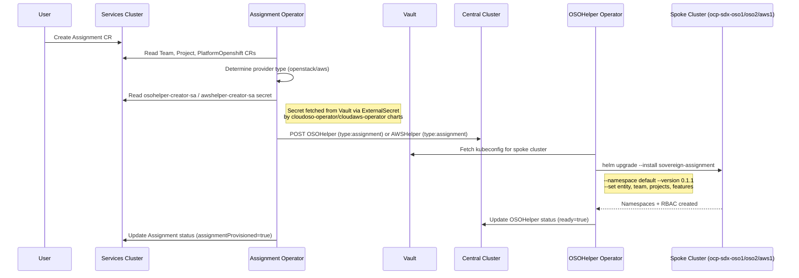

# Tenancy Operators — Phase 2 Assignment Flow

## Overview

Five **Ansible-based** operators extend `hybridsovereign.redhat/v1alpha1` on the **services cluster** plus two helper operators on the **central cluster**:

| Operator | Cluster | Chart | Chart version | Image | Watches |
|----------|---------|-------|---------------|-------|---------|
| Team | services | `team-operator` | 0.3.4 | 0.0.2 | `Team` |
| Assignment | services | `assignment-operator` | 0.4.4 | 0.1.2 | `Assignment` |
| Project | services | `project-operator` | 0.4.0 | 0.0.2 | `Project` |
| PlatformOpenshift | services | `platformopenshift-operator` | 0.5.3 | 0.3.2 | `PlatformOpenshift` |

---

## Assignment CR — Phase 2 Changes

### Spec

| Field | Type | Notes |
|-------|------|-------|
| `team` | `string` | **Team CR name** in the same namespace |
| `projects` | `string[]` | **Project CR names** in the same namespace |
| `openshift` | `string` | **Single PlatformOpenshift CR name** (changed from array in Phase 2) |

### Status

| Field | Type | Notes |
|-------|------|-------|
| `entity` | string | From namespace labels |
| `team` | string | Resolved from spec.team |
| `teamReady` | boolean | Ready flag from `Team.status.ready` |
| `projects` | object[] | `{ name, ready }` from Project statuses |
| `openshift` | string | Resolved from spec.openshift |
| `openshiftReady` | boolean | Ready from `PlatformOpenshift.status.ready` |
| `clusterName` | string | From `PlatformOpenshift.status.appName` |
| `assignmentProvisioned` | boolean | True when OSOHelper/AWSHelper CR created on central cluster |
| `helperName` | string | Name of the helper CR created on central |
| `ready` | boolean | `teamReady && openshiftReady` |

### Printer columns

Team, Cluster (`.status.openshift`), Entity, Provisioned (`.status.assignmentProvisioned`), Ready, Age.

---

## Assignment Provisioning Flow



---

## sovereign-assignment Helm Chart (v0.1.1)

Deployed to **spoke clusters** per assignment.

**Location**: `oci://quay.example.com/hybrid-sovereign/sovereign-assignment`

### Resources created per assignment

| Resource | Condition | Name pattern |
|----------|-----------|--------------|
| Namespace | `features.gitops=true` | `<entity>-<team>-gitops` |
| Namespace | `features.istio=true` | `<entity>-<team>-istio` |
| Namespace | Per project | `<entity>-<team>-<project>` |
| ServiceAccount | `features.gitops=true` | `<entity>-<team>-gitops` in gitops ns |
| RoleBinding (admin) | Per project ns | Binds `<entity>-<team>-admins` Keycloak group |
| RoleBinding (edit) | Per project ns | Binds `<entity>-<team>-editors` Keycloak group |
| RoleBinding (view) | Per project ns | Binds `<entity>-<team>-viewers` Keycloak group |
| RoleBinding (gitops SA) | `features.gitops=true` | Restricts SA to project namespaces |

### Idempotency

`namespaces.yaml` uses Helm `lookup()` to skip namespace creation if the namespace already exists — prevents conflicts on re-reconciliation or retries after partial failures.

---

## Cross-Cluster Authentication

```
Central Cluster
  └── cloudoso-operator chart:
        PushSecret (osohelper-creator-sa) → Vault: secret/osohelper-creator-sa
                                                    { token, ca.crt }
  └── cloudaws-operator chart:
        PushSecret (awshelper-creator-sa) → Vault: secret/awshelper-creator-sa
                                                    { token, ca.crt }

Services Cluster
  └── cloudoso-operator chart:
        ExternalSecret (osohelper-creator-sa) ← Vault → Secret in sovereign-cloud
  └── assignment-operator:
        Reads secret(osohelper-creator-sa): token + ca.crt
        POSTs to CENTRAL_API_SERVER (env var: api.central.lab.example.com:6443)
```

**CENTRAL\_API\_SERVER** is injected as an environment variable from bootstrap values into the assignment-operator Deployment.

---

## helper\_CloudOSO / helper\_CloudAWS — type:assignment Handler

Both helpers follow the same pattern:

1. Extract `spec.assignment` fields from the OSOHelper/AWSHelper CR
2. Look up the existing `clusterbuild` OSOHelper for the target platform → get `status.kubeconfigVaultPath`
3. Read Vault root token from `vault-init-secrets` Secret
4. `GET` kubeconfig from `vault_init_addr/v1/central/data/<kubeconfigVaultPath>`
5. Write kubeconfig to `/tmp/<clusterName>-assignment-kubeconfig`
6. `helm upgrade --install <entity>-<team>-assignment oci://…/sovereign-assignment --version 0.1.1 --namespace default --set entity=…,team=…,features.gitops=…,features.istio=…,projects={p1,p2} --atomic --timeout 300s`
7. Update OSOHelper/AWSHelper status: `ready=true, entity, team, clusterName, platformOpenshiftName`

**Delete handler**: `helm uninstall <entity>-<team>-assignment --kubeconfig /tmp/…`

---

## OSOHelper / AWSHelper CRD — type:assignment Additions

### New spec.assignment block

```yaml
spec:
  type: assignment
  assignment:
    platformOpenshiftName: <PlatformOpenshift CR name>
    entity: <entity name>
    team: <team name>
    projects: [<project1>, <project2>]
    features:
      istio: true|false
      gitops: true|false
```

### New status fields

`entity`, `team`, `clusterName`, `platformOpenshiftName` (in addition to existing `ready`, `conditions`).

---

## PlatformOpenshift aws.yml Fix (historical: ocp-ses7)

> Legacy cluster `ocp-ses7` is deprecated. Current AWS spoke: `ocp-sdx-aws1`.

**Problem**: `acmAvailable` field written as string `"Unknown"/"True"/"False"` from AWSHelper status → CRD rejected it (type: boolean) → 422 error → cluster stuck at `ready=false` → UI shows "pending".

**Fix** (PlatformOpenshift operator v0.3.2 / chart v0.5.3):
```yaml
cb_acm_available: >-
  {{ (awshelper_cb_status.json.status.acmAvailable | default('') | string | trim)
     in ['True', 'true', true] }}
# In status update:
acmAvailable: "{{ cb_acm_available | bool }}"
```

---

## ACM Policy Reconciliation (Phase 1 Fix)

Both `policy-basechart-operators` and `policy-spoke-external-secrets` policies now include:

```yaml
evaluationInterval:
  compliant: 24h
  noncompliant: 24h
```

---

## Hardening Checklist

| Check | Status |
|-------|--------|
| No secrets in Git | ✅ All secrets via ExternalSecret/PushSecret |
| No sovereign-* namespace deletion | ✅ |
| Vault-only credentials | ✅ SA tokens via Vault PushSecret/ExternalSecret |
| `no_log` on token/kubeconfig tasks | ✅ All sensitive tasks have `no_log: true` |
| RBAC least-privilege | ✅ assignment-operator limited to `get/list/watch` secrets |
| Idempotent namespace creation | ✅ `lookup()` in sovereign-assignment chart |
| Central API server not hardcoded in image | ✅ Injected via `CENTRAL_API_SERVER` env var from bootstrap values |

### Known Deviations

| Deviation | Where | Remediation Target |
|-----------|-------|-------------------|
| `--namespace default` for helm release metadata on spoke | `assignment.yml` in both helpers | Create a dedicated `<entity>-<team>` namespace for helm metadata in a future hardening pass |
| Central API server URL in bootstrap `values.yaml` | `bootstrap/helm/central/values.yaml` | Move to Vault path alongside osohelper-creator-sa token for true config-as-secret |
| `validate_certs: false` on Vault API calls from helpers | `assignment.yml` | Add Vault CA cert to helper operator trusted CA bundle |

---

## Version Summary (Post-Phase 2)

| Component | Chart | Image/App |
|-----------|-------|-----------|
| assignment-operator | 0.4.4 | 0.1.2 |
| platformopenshift-operator | 0.5.3 | 0.3.2 |
| tenancy-dashboard | 0.9.9 | 3.4.0 |
| sovereign-assignment (chart) | 0.1.1 | — |
