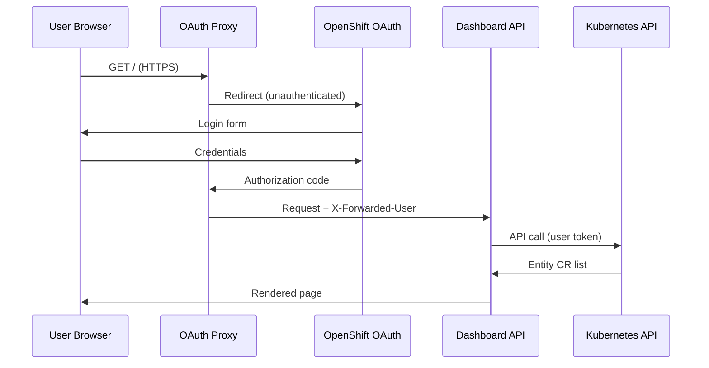
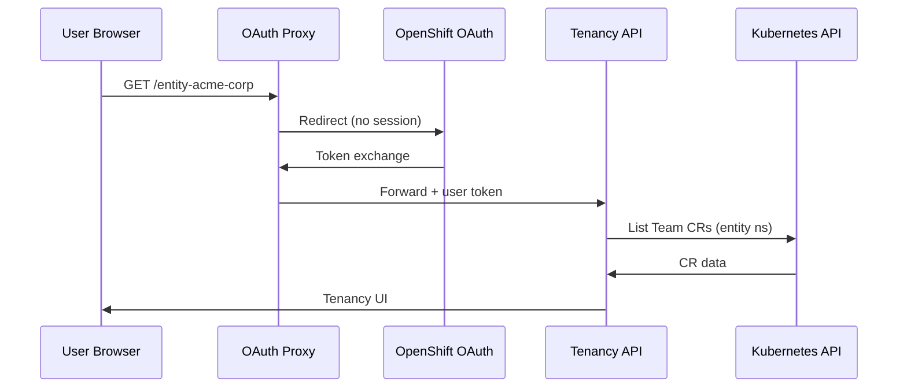
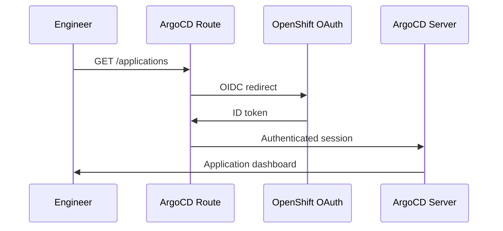
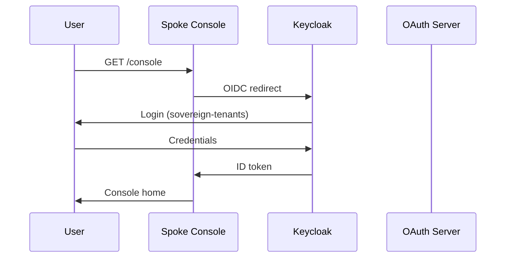
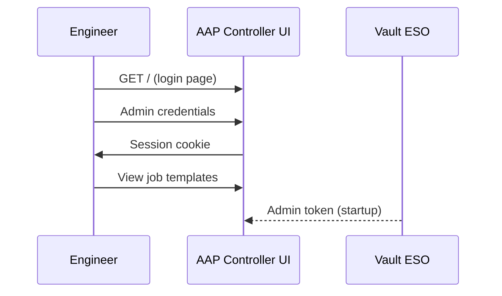

# Hybrid Sovereign Cloud — Presentation Tier

The presentation tier exposes user-facing interfaces for platform operators, tenant administrators, and developers. All components authenticate via OpenShift OAuth or OIDC and communicate over TLS-terminated Routes.

---

## 1. User Dashboard (`user_dashboard/`)

### Purpose and users

Platform operators and entity administrators use the Sovereign Cloud Dashboard to manage `Entity` custom resources, monitor cluster-wide CR health, and discover platform service routes.

### Authentication mechanism

OpenShift OAuth via `ose-oauth-proxy` sidecar. The proxy requests `user:full` scope and forwards `X-Forwarded-User` and the user's OAuth access token to the Express backend.

### Key pages/features

| Page | Path | Features |
|------|------|----------|
| Overview | `/overview` | Donut chart, per-kind status tables, reconciliation alerts |
| Entities | `/entities` | List, expand, delete `Entity` CRs |
| Entity Create | `/entities/create` | Validated form for new entities |
| Personas | `/personas` | Persona CR visibility |
| Operators | `/operators` | Operator health overview |
| Services | `/services` | Route discovery with live health checks |

### Login flow

### Security controls

- TLS reencrypt on Route; serving cert auto-provisioned
- Helmet.js: CSP, HSTS, X-Frame-Options, Referrer-Policy
- Rate limiting on API endpoints (`express-rate-limit`)
- User OAuth token only — no ServiceAccount token for user API calls
- OpenShift RBAC evaluates each request

### External URL

`https://sovereign-cloud-dashboard.apps.services.lab.example.com`

---

## 2. Tenancy Dashboard (`tenancy_dashboard/`)

### Purpose and users

Tenant administrators and developers manage tenancy and plugin CRs scoped to entity namespaces (`hybridsovereign.redhat/entity` label).

### Authentication mechanism

Same OpenShift OAuth proxy pattern as the User Dashboard. Backend uses the logged-in user's OAuth access token for all Kubernetes API mutations.

### Key pages/features

- CRUD for `Team`, `Assignment`, `Project`, `PlatformOpenshift`, `CloudOSO`, `CloudAWS`
- Plugin CRs: `Rbac`, `Vault`, `VaultKV`, `AAPOrg`, `QuayOrg`
- Entity-scoped overview with donut chart and resource health
- YAML view, searchable sidebar, `StatusBadge`, forced reconcile via annotation

### Login flow

### Security controls

- Same OAuth proxy hardening as User Dashboard
- `apiLimiter` 120/min; `mutationLimiter` 30/min
- k8s-proxy rejects calls without `X-Forwarded-Access-Token`
- Creator username annotated on created resources

### External URL

`https://tenancy-dashboard.apps.services.lab.example.com`

---

## 3. ArgoCD Web UI

### Purpose and users

Platform engineers monitor GitOps sync status, trigger refreshes, and inspect Application health across both clusters.

### Authentication mechanism

OpenShift OAuth integrated with ArgoCD RBAC. Central cluster only — services cluster has no ArgoCD management plane.

### Key pages/features

- Application list with Sync/Health status
- Resource tree and diff view
- Sync, refresh, rollback actions
- ApplicationSet-generated child Applications

### Login flow

### Security controls

- TLS on Route
- ArgoCD RBAC policies (project: central, project: services)
- No direct cluster mutations outside GitOps
- AppProject separation prevents cross-cluster project mixing

### External URL

`https://openshift-gitops-server-openshift-gitops.apps.central.lab.example.com`

---

## 4. OpenShift Web Console

### Purpose and users

Cluster administrators and tenant operators access native OCP console for provisioned spoke clusters (e.g., `ocp-ses10`, `ocp-ses4`) registered via RHACM.

### Authentication mechanism

Keycloak OIDC federation configured during cluster build post-install. Users authenticate via `sovereign-tenants` realm on services Keycloak.

### Key pages/features

- Workload, networking, storage management
- OperatorHub and installed operators
- Developer perspective for project namespaces
- ACM managed cluster console link from PlatformOpenshift status

### Login flow

### Security controls

- TLS on console Route
- Keycloak group-to-RBAC mapping via Assignment toolRbac
- Cluster-scoped admin limited to platform team
- NetworkPolicy on spoke (via sovereign-assignment chart)

### External URL

Per-cluster: e.g., `https://console-openshift-console.apps.<cluster-domain>`

---

## 5. AAP Controller UI

### Purpose and users

Platform engineers manage job templates, inventories, credentials, Execution Environments, and EDA activations for platform automation.

### Authentication mechanism

AAP local admin account (credentials from Vault via ExternalSecret). EDA activations use `aap_resource_token` for API calls.

### Key pages/features

- Job template catalog (24 provision/teardown templates)
- Job output and logs (`/execution/jobs/playbook/<id>/output`)
- EDA rulebook activations and Event Stream credentials
- Execution Environment registry management

### Login flow

### Security controls

- TLS on Route
- Admin credentials via ExternalSecret from Vault (`central/aap-admin-central`)
- Job template RBAC within `sovereign` organisation
- `no_log: true` on all credential registration Ansible tasks

### External URL

`https://sovereign-aap-controller-aap.apps.central.lab.example.com`

---

## Presentation Tier Summary

| Component | Cluster | Namespace | Auth |
|-----------|---------|-----------|------|
| User Dashboard | Services | `sovereign-cloud` | OpenShift OAuth |
| Tenancy Dashboard | Services | `sovereign-cloud` | OpenShift OAuth |
| ArgoCD UI | Central | `openshift-gitops` | OpenShift OAuth |
| OCP Console | Spoke | `openshift-console` | Keycloak OIDC |
| AAP Controller UI | Central | `aap` | AAP admin (Vault) |

## Related docs

- [15 Sovereign Dashboard](./15-sovereign-dashboard.md)
- [20 Tenancy Dashboard](./20-tenancy-dashboard.md)
- [55 Three-Tier Overview](./55-three-tier-overview.md)
