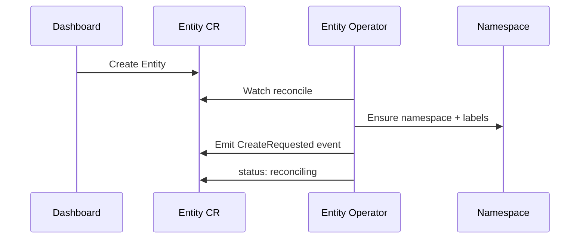
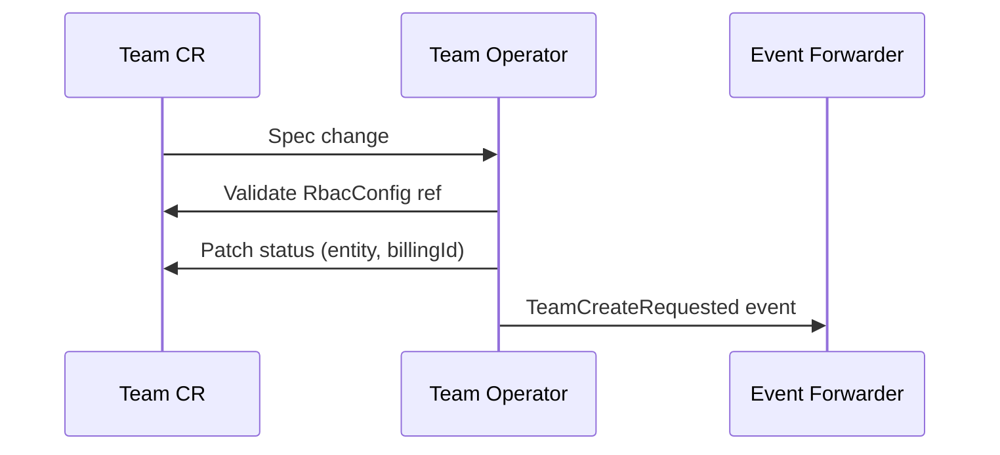
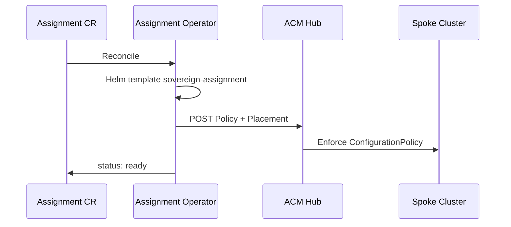
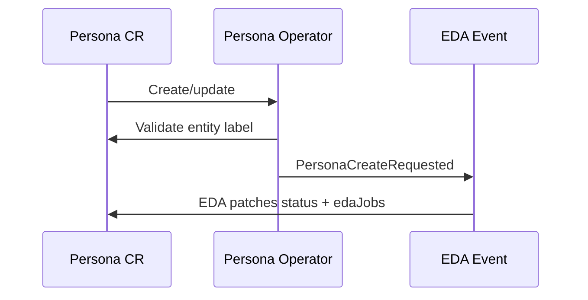
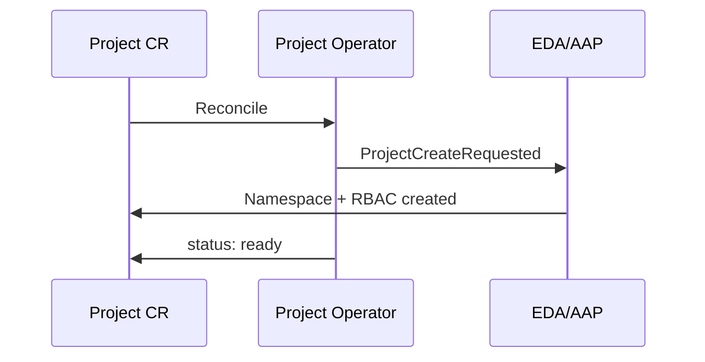
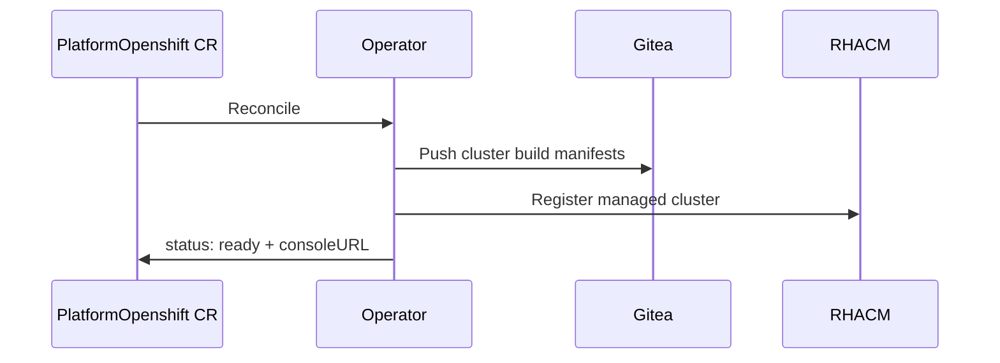

# Hybrid Sovereign Cloud — Logic/Application Tier (Part 1)

The logic tier contains Kubernetes operators, EDA automation, AAP job execution, and GitOps reconciliation. Components on the services cluster emit events; central cluster components execute automation and manage GitOps state.

---

## 1. Entity Operator

| Property | Value |
|----------|-------|
| Cluster | Services |
| Namespace | `sovereign-cloud` |
| CRD group | `hybridsovereign.redhat/v1alpha1` |

**Input**: `Entity` CR create/update/delete events.

**Output**: Entity namespace (`entity-<name>`), 14 named RBAC Roles/RoleBindings, typed K8s Events (`EntityCreateRequested`, etc.).

**Failure modes**: Missing `namespaceRbac` references → condition False; EDA timeout → status stuck reconciling; namespace creation RBAC denied → reconcile error.

---

## 2. Team Operator

| Property | Value |
|----------|-------|
| Cluster | Services |
| Namespace | `sovereign-cloud` |

**Input**: `Team` CR with `features.istio`, `features.argo`, `rbacConfig`, `teamAdmin`.

**Output**: Team namespace labels, Istio/Argo feature flags on status, `TeamCreateRequested` events.

**Failure modes**: Invalid `rbacConfig` name → not ready; EDA provision failure → status failed with edaJobs URL.

---

## 3. Assignment Operator

| Property | Value |
|----------|-------|
| Cluster | Services (operator) + Central (ACM Policy) |
| Namespace | `sovereign-cloud` |

**Input**: `Assignment` CR linking Team, Projects, PlatformOpenshift, optional `toolRbac`.

**Output**: ACM Policy/Placement/PlacementBinding on central cluster; spoke namespaces, Istio, ArgoCD via ConfigurationPolicy.

**Failure modes**: PlatformOpenshift not ready → waiting; ACM token expired → policy POST fails; spoke cluster unreachable → degraded status.

---

## 4. Persona Operator

| Property | Value |
|----------|-------|
| Cluster | Services |
| Namespace | `sovereign-cloud` |

**Input**: `Persona` CR with Keycloak group mappings and RBAC persona definitions.

**Output**: Keycloak group sync, `PersonaCreateRequested` events, status with group paths.

**Failure modes**: Missing entity namespace label → reconcile error; Keycloak API unreachable → failed status.

---

## 5. Project Operator

| Property | Value |
|----------|-------|
| Cluster | Services |
| Namespace | `sovereign-cloud` |

**Input**: `Project` CR in entity namespace.

**Output**: Project namespace provisioning via EDA, status with `projectProvisioned` flag.

**Failure modes**: Parent entity not ready → blocked; duplicate project name → admission or status conflict.

---

## 6. PlatformOpenshift Operator

| Property | Value |
|----------|-------|
| Cluster | Services |
| Namespace | `sovereign-cloud` |

**Input**: `PlatformOpenshift` CR (AWS or OpenStack cluster build spec).

**Output**: ClusterBuild CR in Gitea, ACM managed cluster registration, status mirroring (`appName`, `consoleURL`).

**Failure modes**: Invalid cloud credentials → CloudAWS/CloudOSO dependency failure; Gitea push failure → reconcile error; ACM import timeout → degraded.

---

## Related docs

- [53 Three-Tier Logic Part 2](./53-three-tier-logic-part2.md)
- [17 Entity Operator](./17-entity-operator.md)
- [12 Assignment Operator](./12-assignment-operator.md)
