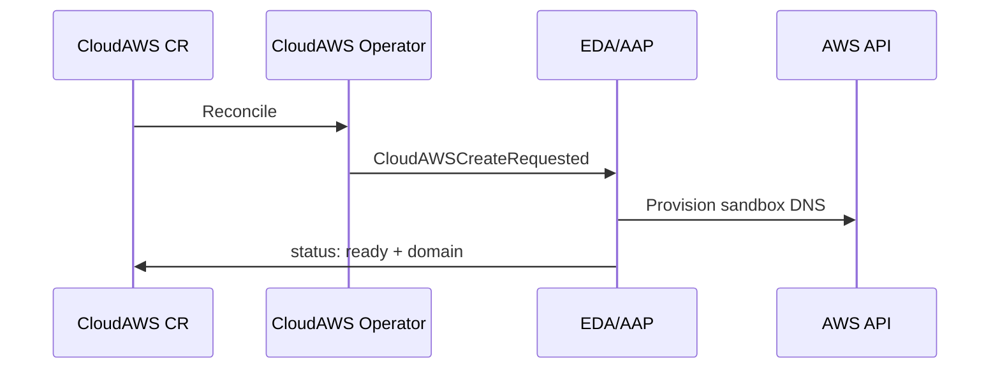
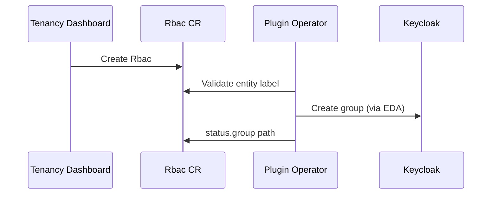
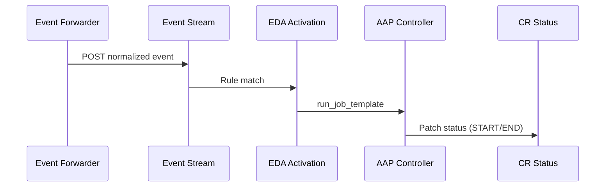
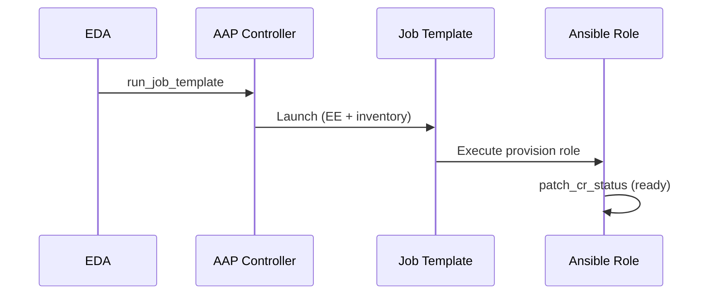
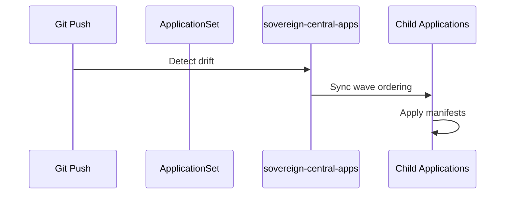

# Hybrid Sovereign Cloud — Logic/Application Tier (Part 2)

Continues the logic tier reference. See [Part 1](./53-three-tier-logic-part1.md) for Entity through PlatformOpenshift operators.

---

## 7. CloudAWS / CloudOSO Operators

| Property | Value |
|----------|-------|
| Cluster | Services |
| Namespace | `sovereign-cloud` |

**Input**: `CloudAWS` or `CloudOSO` CR specifying cloud environment parameters.

**Output**: AWS sandbox environment or OpenStack project; DNS domain on status; `CloudAWSCreateRequested` events.

**Failure modes**: Missing AWS credentials in Vault → 404 on AWSHelper CR; operator reconcile loop may reset status to failed (operational patch workaround documented in QA checklist).

---

## 8. Plugin Operators (rbac, vault, aap, quay, sdx)

| Property | Value |
|----------|-------|
| Cluster | Services |
| Namespace | `sovereign-cloud-plugins` (operators); entity namespaces (CR instances) |

**Input**: Config CRs (`RbacConfig`, `AAPConfig`, `QuayConfig`) in plugins namespace; entity CRs (`Rbac`, `Vault`, `AAPOrg`, `QuayOrg`, `VaultKV`) in entity namespaces.

**Output**: Keycloak groups, Vault instances, AAP orgs, Quay orgs, Gitea repo sync (SDX).

**Failure modes**: Missing entity label → failed; external service unreachable (Quay pending pods) → retry with backoff; Vault seal → provision blocked.

---

## 9. EDA (Event-Driven Ansible)

| Property | Value |
|----------|-------|
| Cluster | Central (controller) + Services (event forwarder) |
| Namespace | `aap` (EDA), `sovereign-cloud-plugins` (forwarder) |

**Input**: Normalized events from event forwarder via Event Stream POST.

**Output**: `run_job_template` calls to AAP Controller; CR status patches on services cluster.

**Failure modes**: Event Stream token invalid → 401 on POST; rulebook mismatch → event dropped; AAP job failure → CR status failed with job URL.

---

## 10. AAP Controller

| Property | Value |
|----------|-------|
| Cluster | Central |
| Namespace | `aap` |

**Input**: EDA `run_job_template` with `event_payload` extra var.

**Output**: Ansible playbook execution in per-operator Execution Environment; job ID and output URL in CR `edaJobs`.

**Failure modes**: EE image pull failure → job error; Vault credential missing → task failure; services cluster token expired → status patch 401.

---

## 11. ArgoCD

| Property | Value |
|----------|-------|
| Cluster | Central only |
| Namespace | `openshift-gitops` |

**Input**: Git/OCI chart changes in app-of-apps (`helm/central`).

**Output**: Deployed Applications to central and services clusters via `destination.server`.

**Failure modes**: OCI chart version mismatch → OutOfSync; ExternalSecret not ready → sync wave blocked; services cluster unreachable → services-targeted apps Degraded.

**Note**: Query with `oc get applications.argoproj.io` — the default `applications` alias resolves to `app.k8s.io`, not ArgoCD.

---

## Logic Tier Summary

| Component | Cluster | Namespace | Primary trigger |
|-----------|---------|-----------|-----------------|
| Entity Operator | Services | `sovereign-cloud` | Entity CR |
| Team Operator | Services | `sovereign-cloud` | Team CR |
| Assignment Operator | Services | `sovereign-cloud` | Assignment CR |
| Persona Operator | Services | `sovereign-cloud` | Persona CR |
| Project Operator | Services | `sovereign-cloud` | Project CR |
| PlatformOpenshift | Services | `sovereign-cloud` | PlatformOpenshift CR |
| CloudAWS / CloudOSO | Services | `sovereign-cloud` | Cloud CR |
| Plugin operators | Services | `sovereign-cloud-plugins` | Plugin CRs |
| Event Forwarder | Services | `sovereign-cloud-plugins` | K8s Events |
| EDA | Central | `aap` | Event Stream |
| AAP Controller | Central | `aap` | EDA job dispatch |
| ArgoCD | Central | `openshift-gitops` | Git/OCI change |

## Related docs

- [006 EDA Architecture](./006-eda-architecture.md)
- [48 AAP Job Templates](./48-aap-job-templates.md)
- [55 Three-Tier Overview](./55-three-tier-overview.md)
