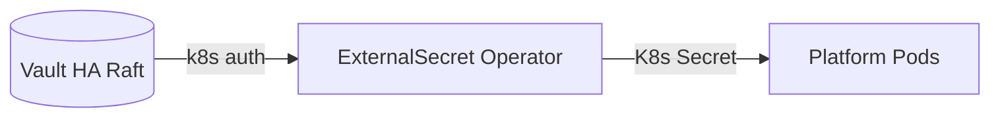
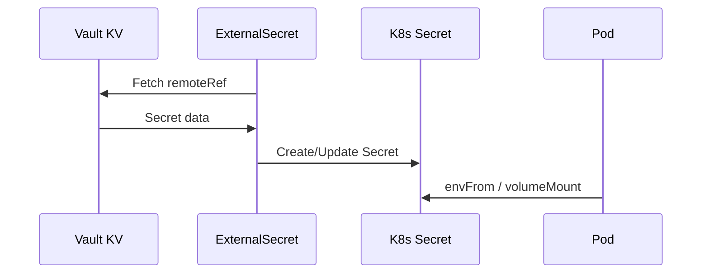
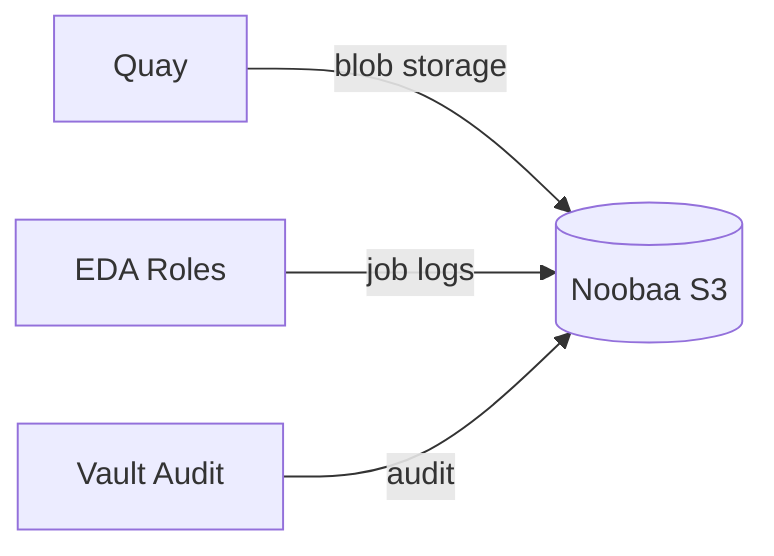
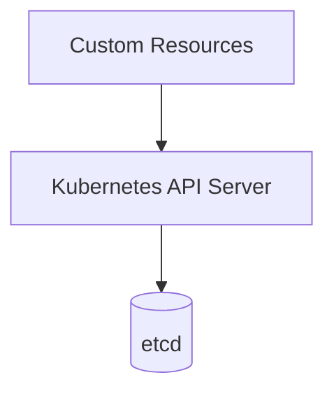
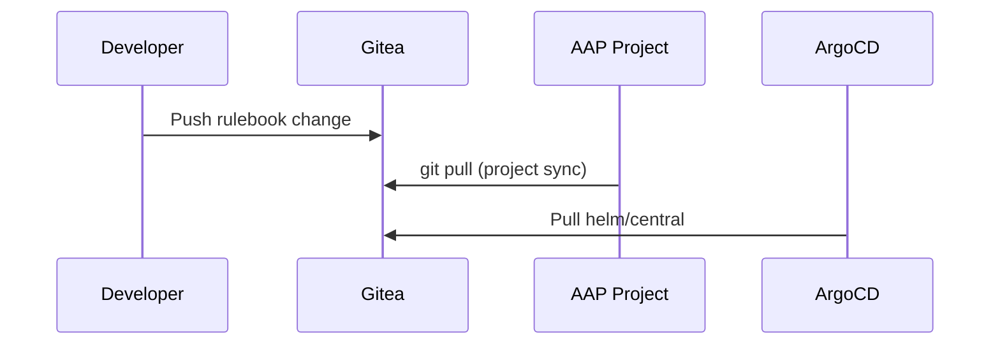

# Hybrid Sovereign Cloud — Data Tier

The data tier stores persistent state, secrets, container artifacts, and Git configuration. All sensitive data flows through Vault and External Secrets Operator — never committed to Git.

---

## 1. HashiCorp Vault (HA)

### What data it stores

| Vault instance | Data |
|----------------|------|
| vault-central | Platform secrets: OCI creds, Keycloak admin, AAP tokens, dashboard OAuth, Gitea admin, init keys |
| vault-services | Tenant Vault instances (Plugin Vault operator); no platform secrets |

### Access pattern

Read-heavy via ExternalSecret refresh intervals; write-heavy during bootstrap Jobs (PushSecret, Ansible init).

### Secret injection at startup

ExternalSecret resources reference `ClusterSecretStore` (`vault-backend`) with Kubernetes auth mounts (`kubernetes-central`, `kubernetes-services`). Jobs receive credentials via mounted Secrets populated by ESO sync waves.

### Backup/DR

Raft snapshots on 3-replica HA clusters; init keys backed up to `vault-central` namespace Secrets via PushSecret. Unseal keys stored in Vault KV after init Job.

---

## 2. External Secrets Operator

### What data it stores

No persistent data — synchronizes Vault KV paths to Kubernetes Secret objects.

### Access pattern

Periodic pull (read-heavy); PushSecret for bootstrap secret creation (write on init).

### Secret injection at startup

`ClusterSecretStore` configured by Ansible Jobs at sync waves 26–29. Each ExternalSecret uses negative sync-wave annotations to deploy before workloads.

### Backup/DR

State is derived from Vault; ESO itself is stateless. Recreate from Helm chart + Vault paths.

---

## 3. Crunchy Postgres (PGO)

### What data it stores

PostgreSQL databases for Keycloak (`services-rhbk`) and Quay (`services-quay`, `central-quay`).

### Access pattern

Write-heavy (transactional); read-heavy for auth sessions and registry metadata.

### Secret injection at startup

PGO generates credentials; copied to Vault via PushSecret; consumed by Keycloak/Quay via ExternalSecret.

### Backup/DR

PGO pgBackRest for continuous backup; replica failover within cluster. Cross-cluster DR requires manual restore to new PGO cluster.

---

## 4. OpenShift Data Foundation (Noobaa)

### What data it stores

S3-compatible object storage: Quay blob storage, Vault audit logs, EDA job logs (`eda-job-logs` bucket).

### Access pattern

Write-heavy for image pushes and log uploads; read-heavy for Quay pulls and dashboard log links.

### Secret injection at startup

Noobaa admin credentials in Vault; S3 access keys delivered via `eda-s3-creds` Secret (ExternalSecret) to EDA roles.

### Backup/DR

ODF backup operators; bucket replication not configured by default. EDA logs are ephemeral audit trail — retention policy TBD.

---

## 5. Red Hat Quay

### What data it stores

OCI container images, Helm charts, robot account tokens, team/org metadata.

### Access pattern

Read-heavy (image/chart pulls across clusters); write-heavy during CI/CD and `make upload-*` targets.

### Secret injection at startup

Database credentials via ExternalSecret; OIDC config from Keycloak client secret; `config.yaml` mounted from Secret.

### Backup/DR

Database backed by PGO; blob storage on Noobaa. External Quay (`quay.example.com`) serves as primary OCI registry for GitOps charts.

---

## 6. etcd

### What data it stores

All Kubernetes API objects: CRs, Secrets (encrypted at rest), ConfigMaps, RBAC, Events.

### Access pattern

Extremely write-heavy during reconciliation storms; read-heavy for watches and list operations.

### Secret injection at startup

N/A — etcd is the backing store. Application secrets stored as K8s Secret resources (populated by ESO, never hardcoded in charts).

### Backup/DR

OpenShift etcd backup (cluster-level); CR state recoverable from Git (ArgoCD) + Vault (secrets). etcd failure = cluster outage.

---

## 7. Gitea

### What data it stores

Git repositories: EDA rulebooks (`eda/`), cluster build manifests, bootstrap mirror.

### Access pattern

Read-heavy (AAP project checkout, ArgoCD repo sync); write-heavy during cluster build pushes and rulebook updates.

### Secret injection at startup

Admin credentials via ExternalSecret from Vault (`gitea-admin`); AAP uses `sovereign-gitea-cred` credential.

### Backup/DR

Git is distributed — clone mirrors serve as backup. Gitea PVC for local state; push to external remote recommended.

---

## Data Tier Summary

| Store | Cluster | Access | Primary consumers |
|-------|---------|--------|-------------------|
| Vault central | Central | Read-heavy | ESO, dashboards, Jobs |
| Vault services | Services | Mixed | Plugin Vault, tenants |
| ExternalSecret | Both | Pull sync | All workloads |
| Crunchy Postgres | Both | Transactional | Keycloak, Quay |
| Noobaa S3 | Both | Object R/W | Quay, EDA, Vault audit |
| Quay | Both + External | Image R/W | ArgoCD, operators, CI |
| etcd | Both | CR persistence | All operators, dashboards |
| Gitea | Central | Git R/W | AAP, ArgoCD, SDX plugin |

## Related docs

- [09 Vault](./09-vault.md)
- [18 Secrets Flow](./18-secrets-flow.md)
- [55 Three-Tier Overview](./55-three-tier-overview.md)
