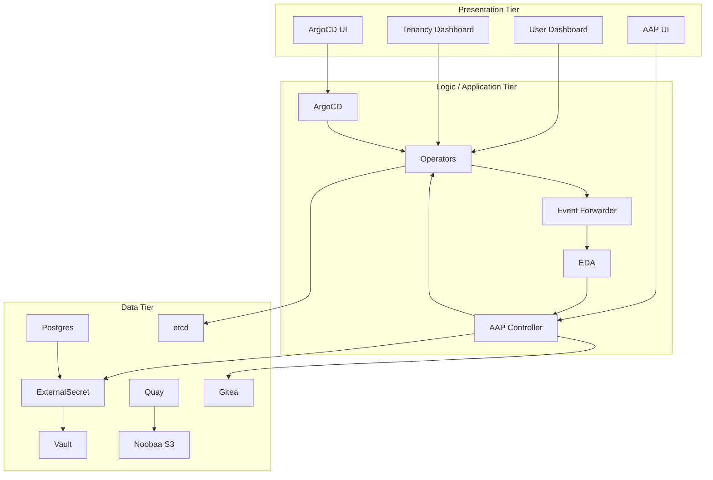
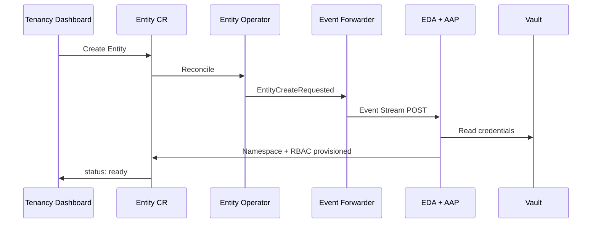
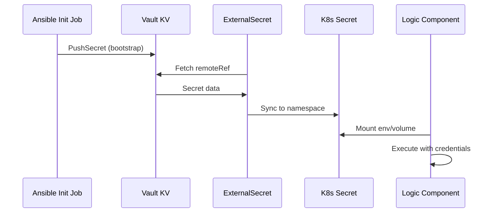

# Hybrid Sovereign Cloud — Three-Tier Architecture Overview

This document maps the Hybrid Sovereign Cloud platform to [IBM's Three-Tier Architecture](https://www.ibm.com/think/topics/three-tier-architecture): Presentation → Logic/Application → Data. The platform spans two OpenShift clusters (central and services) plus ACM-managed spoke clusters.

---

## 1. Tier Summary Table

| Component | Tier | Cluster | Namespace |
|-----------|------|---------|-----------|
| User Dashboard | Presentation | Services | `sovereign-cloud` |
| Tenancy Dashboard | Presentation | Services | `sovereign-cloud` |
| ArgoCD Web UI | Presentation | Central | `openshift-gitops` |
| OCP Console (spoke) | Presentation | Spoke | `openshift-console` |
| AAP Controller UI | Presentation | Central | `aap` |
| Entity Operator | Logic | Services | `sovereign-cloud` |
| Team Operator | Logic | Services | `sovereign-cloud` |
| Assignment Operator | Logic | Services + Central (ACM) | `sovereign-cloud` |
| Persona Operator | Logic | Services | `sovereign-cloud` |
| Project Operator | Logic | Services | `sovereign-cloud` |
| PlatformOpenshift Operator | Logic | Services | `sovereign-cloud` |
| CloudAWS / CloudOSO | Logic | Services | `sovereign-cloud` |
| Plugin operators (×5) | Logic | Services | `sovereign-cloud-plugins` |
| Event Forwarder | Logic | Services | `sovereign-cloud-plugins` |
| EDA | Logic | Central | `aap` |
| AAP Controller | Logic | Central | `aap` |
| ArgoCD | Logic | Central | `openshift-gitops` |
| Vault (HA) | Data | Both | `vault`, `vault-central` |
| External Secrets Operator | Data | Both | `external-secrets` |
| Crunchy Postgres | Data | Both | `services-rhbk`, `*-quay` |
| ODF / Noobaa | Data | Both | `openshift-storage` |
| Quay | Data | Both + External | `*-quay` |
| etcd | Data | Both + Spoke | `openshift-etcd` |
| Gitea | Data | Central | `gitea` |

---

## 2. Cross-Tier Data Flow Narrative

A tenant administrator creates a `Team` CR in the Tenancy Dashboard (presentation). The dashboard sends an authenticated Kubernetes API request (logic input). The Team Operator validates the CR, emits a `TeamCreateRequested` event, and sets status to reconciling. The Event Forwarder (logic) watches the event and POSTs to the central Event Stream. EDA matches the rule and calls AAP Controller, which runs the team-provision Ansible role. The role reads the services cluster token from the `argocd-cluster-services` Secret (data), provisions Keycloak groups via API calls, and patches CR status with the AAP job URL. The dashboard reads the updated status from etcd (data) and renders the result to the user.

Secrets never traverse the presentation tier directly. Vault (data) holds credentials; ExternalSecret syncs them to Kubernetes Secrets consumed by logic tier components at runtime.

---

## 3. Architecture Diagrams

### Diagram 1: Full Three-Tier Stack

### Diagram 2: Tenant Provisioning Flow

### Diagram 3: Secret Lifecycle

---

## 4. Failure Propagation Analysis

| Tier failure | Impact | Recovery |
|--------------|--------|----------|
| Presentation (dashboard down) | No UI; CRs still reconcile via `oc` or Git | ArgoCD redeploys Deployment; check Route and OAuth proxy |
| Presentation (Keycloak down) | SSO login fails for dashboards and Vault OIDC | Check `services-rhbk` pods; ArgoCD sync `rhbk-services` app |
| Logic (operator crash) | CRs stuck reconciling; events not emitted | Operator pod restart; check RBAC and watch permissions |
| Logic (EDA/AAP down) | Events received but provisioning never runs | Check Event Stream token; restart activations; verify AAP job templates |
| Logic (ArgoCD down) | No GitOps sync; manual changes not deployed | OpenShift GitOps operator recovery; check `applications.argoproj.io` |
| Data (Vault sealed) | ExternalSecrets fail; new pods cannot start | Unseal via init keys; run vault-init Job |
| Data (etcd loss) | Cluster API unavailable — total cluster outage | OpenShift etcd restore from backup |
| Data (Postgres down) | Keycloak/Quay unavailable | PGO failover; check pgBackRest |
| Data (Noobaa down) | Quay pushes fail; EDA log upload fails | ODF operator recovery; check storage class |

Cross-tier coupling: Logic depends on Data (secrets in Vault); Presentation depends on Logic (CR status in etcd) and Data (OAuth secrets). A Vault outage cascades to both Logic and Presentation tiers within minutes as ExternalSecret refresh fails.

---

## 5. Scaling Considerations

### Presentation tier

- Dashboard Deployments: horizontal pod autoscaling on CPU/request rate
- OAuth proxy: session affinity may limit scale-out; consider Redis session store for HA
- ArgoCD UI: single instance sufficient; scale ArgoCD repo-server for large app counts

### Logic tier

- Operators: tune `maxConcurrentReconciles` per operator (see [27 Operator Performance](./27-operator-performance.md))
- Event forwarder: single replica with LRU dedup; scale only if event volume exceeds watch throughput
- EDA activations: one activation per operator; increase AAP execution capacity (instances/workers) for parallel jobs
- AAP Controller: add execution nodes for concurrent job templates
- ArgoCD: scale `application-controller` replicas for 100+ Applications

### Data tier

- Vault: 3-node Raft HA; performance limited by Raft consensus — use read replicas pattern via ESO caching
- Postgres: PGO horizontal read replicas for Quay read scaling
- Noobaa: scale backing store pods; monitor bucket growth for EDA logs
- Quay: horizontal pod autoscaling on registry app; external Quay for production load
- etcd: OpenShift-managed; do not scale independently

---

## Related docs

- [52 Presentation Tier](./52-three-tier-presentation.md)
- [53 Logic Tier Part 1](./53-three-tier-logic-part1.md)
- [53 Logic Tier Part 2](./53-three-tier-logic-part2.md)
- [54 Data Tier](./54-three-tier-data.md)
