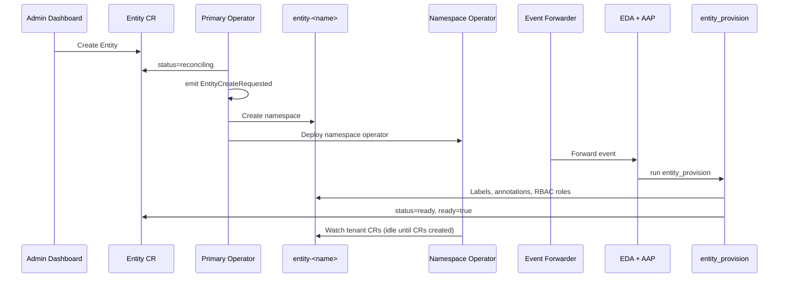

# C4 Level 4 — Entity Lifecycle State Machine

**Scope**: Entity CR → namespace operator deployment  
**API group**: `hybridsovereign.redhat/v1alpha1`  
**Code paths**: `hybridcloud/operator/primary/`, `hybridcloud/eda/entity/`  
**Last updated**: 2026-07-11

---

## Overview

Entity is the top-level tenancy boundary. Creating an Entity CR triggers a multi-step lifecycle spanning the primary operator, event forwarder, EDA, and per-entity namespace operator deployment.

This document maps the state machine at code level — the transitions operators and EDA roles implement.

---

## State Diagram

```mermaid
stateDiagram-v2
    [*] --> Pending: Entity CR applied

    Pending --> Reconciling: Primary operator reconcile
    Reconciling --> AwaitingEDA: Event emitted\nEntityCreateRequested

    AwaitingEDA --> Provisioning: EDA entity_provision\nrole starts
    Provisioning --> Ready: Namespace + RBAC created\nstatus.ready=true

    Ready --> Reconciling: spec.generation changes\nor reconcileNow annotation
    Reconciling --> Ready: EDA re-provision succeeds

    Ready --> Deleting: deletionTimestamp set
    Deleting --> AwaitingEDADelete: EntityDeleteRequested event
    AwaitingEDADelete --> Teardown: EDA entity_teardown runs
    Teardown --> Finalizing: deletionComplete=true
    Finalizing --> [*]: Finalizer removes\nnamespace operator + namespace

    Reconciling --> Failed: Operator or EDA error
    Provisioning --> Failed: EDA provisioning error
    Teardown --> Failed: EDA teardown error
    Failed --> Reconciling: User fixes spec\nor reconcileNow
```



---

## Status Fields

| Field | Type | Meaning |
|-------|------|---------|
| `status.status` | string | `reconciling`, `ready`, `failed` |
| `status.ready` | boolean | `true` when entity fully provisioned |
| `status.observedGeneration` | int | Last reconciled `metadata.generation` |
| `status.entity` | string | Provisioned namespace (`entity-<name>`) |
| `status.deletionComplete` | boolean | EDA teardown finished; finalizer may proceed |
| `status.conditions[].reason` | string | `AwaitingEDA`, `EDASucceeded`, `EDAFailed`, `OperatorFailed` |

---

## Create Lifecycle (Code Path)

### 1. CR Applied

User or Admin Dashboard creates:

```yaml
apiVersion: hybridsovereign.redhat/v1alpha1
kind: Entity
metadata:
  name: acme-corp
  namespace: sovereign-cloud
spec:
  description: "ACME Corporation"
  billingID: "ACME-001"
  namespaceRbac:
    entityAdmin: [acme-entity-admin]
    # ... 13 more role keys
```

### 2. Primary Operator Reconcile

**File**: `hybridcloud/operator/primary/roles/entity/tasks/main.yml`

```
validate spec (description, billingID required)
  → skip if observedGeneration >= generation AND status=ready
  → patch status: reconciling, ready=false, reason=AwaitingEDA
  → emit Event: reason=EntityCreateRequested, note=<spec JSON>
  → include deploy_namespace_operator.yml
```

### 3. Namespace Operator Deployment

**File**: `hybridcloud/operator/primary/roles/entity/tasks/deploy_namespace_operator.yml`

Creates in `entity-acme-corp`:

- Namespace with `hybridsovereign.redhat/entity: acme-corp` label
- ServiceAccount, Role, RoleBinding
- Deployment `hybridsovereign-namespace-operator` with `--watched-namespaces=entity-acme-corp`

### 4. Event Forwarder

**File**: `hybridcloud/eda/event-forwarder/src/forwarder.py`

Filters `EntityCreateRequested` from `entity-operator` → POSTs to EDA event stream + Kafka topic.

### 5. EDA Provisioning

**Rulebook**: `hybridcloud/eda/entity/rulebooks/entity-create.yml`  
**Role**: `hybridcloud/eda/entity/roles/entity_provision/tasks/main.yml`

```
resolve services cluster API token from Vault
  → read Entity CR from services cluster
  → create/label entity-<name> namespace
  → apply namespace annotations (description, website, console URL)
  → namespace_roles.yml: 14 named RBAC Roles + RoleBindings
  → patch status: ready=true, status=ready, reason=EDASucceeded
```

### 6. Steady State

Primary operator sees `observedGeneration >= generation` and `ready=true` → skips re-emit on subsequent reconciles.

---

## Update Lifecycle

| Trigger | Event reason | Behavior |
|---------|--------------|----------|
| `spec` field change | `EntityCreateRequested` | Generation mismatch → full re-provision |
| `reconcileNow: "true"` annotation | `EntityReconcileRequested` | Force re-provision even if ready |
| Annotation cleared | — | Primary operator nulls `reconcileNow` after read |

---

## Delete Lifecycle (Code Path)

### 1. Delete Requested

User deletes Entity CR → `deletionTimestamp` set → primary `entity_finalizer` role activates.

**File**: `hybridcloud/operator/primary/roles/entity_finalizer/tasks/main.yml`

```
patch status: reconciling, message="Awaiting EDA delete"
  → emit Event: reason=EntityDeleteRequested
  → if status.deletionComplete: proceed to cleanup
  → else: fail with "Waiting for EDA to complete deletion"
```

### 2. EDA Teardown

**Rulebook**: `hybridcloud/eda/entity/rulebooks/entity-delete.yml`  
**Role**: `hybridcloud/eda/entity/roles/entity_teardown/tasks/main.yml`

```
delete entity-<name> namespace on services cluster
  → patch status: deletionComplete=true
```

### 3. Finalizer Cleanup

When `status.deletionComplete: true`, finalizer:

1. Removes namespace operator Deployment, Role, RoleBinding, ServiceAccount
2. Removes `entity-<name>` namespace
3. Removes Entity CR finalizer

---

## Namespace Operator Steady State

Once deployed, the namespace operator in `entity-<name>` independently watches tenant CRs:

**File**: `hybridcloud/operator/namespace/watches.yaml`

Each kind (Team, Assignment, Project, etc.) follows the same event-emit pattern:

```
validate → status=reconciling → emit <Kind>CreateRequested → EDA provisions
```

The namespace operator does not depend on Entity `status.ready` for tenant CR reconciliation — it starts watching as soon as its Deployment is Running.

---

## Sequence Diagram (Create)



---

## Error Recovery

| Failure point | `status.reason` | Recovery |
|---------------|-----------------|----------|
| Primary operator validation | `OperatorFailed` | Fix spec; operator re-reconciles |
| EDA provisioning timeout | `EDAFailed` | Fix root cause; set `reconcileNow: "true"` |
| EDA teardown failure | `EDAFailed` | Fix and re-delete, or manual namespace cleanup |
| Finalizer stuck | `Awaiting EDA delete` | Ensure EDA activation healthy; check event forwarder |

---

## Related Documents

- [components/operator.md](../components/operator.md) — operator tiers
- [components/event-system.md](../components/event-system.md) — event routing
- [../decisions/ADR-002-multi-tier-operator.md](../decisions/ADR-002-multi-tier-operator.md)
- [../technical/17-entity-operator.md](../technical/17-entity-operator.md)
