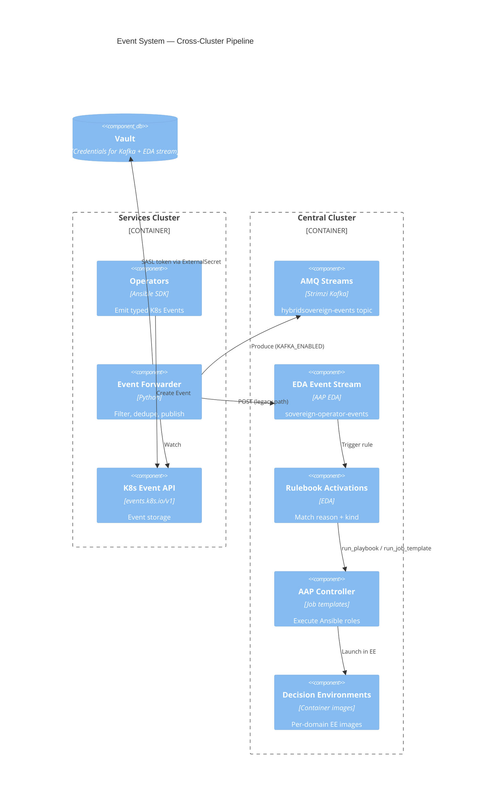
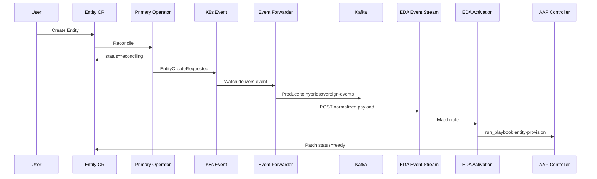

# C4 Level 3 — Event System

**Scope**: AMQ Streams, Event Forwarder, AAP EDA  
**API group**: `hybridsovereign.redhat/v1alpha1` (event `regarding.kind`)  
**Last updated**: 2026-07-11

---

## Purpose

Operators on the services cluster emit typed Kubernetes Events instead of running heavy Ansible inline. The event system routes those events to automation on the central cluster:

1. **Event Forwarder** watches `events.k8s.io/v1` and forwards matching events.
2. **AMQ Streams** (Kafka) provides a durable event bus for audit and future EDA consumption.
3. **AAP EDA** matches events via rulebook activations and dispatches Ansible playbooks.

---

## Component Diagram



---

## Event Forwarder

**Path**: `hybridcloud/eda/event-forwarder/src/forwarder.py`  
**Deployment**: Helm chart `bootstrap/helm/charts/event-forwarder/` → `sovereign-cloud-plugins`  
**Sync-wave**: 32

### Filter Rules

| Filter | Pattern |
|--------|---------|
| Namespaces | `sovereign-cloud`, `sovereign-cloud-plugins`, `entity-*` |
| Reporting controller | `*-operator` suffix |
| Reason | `*Requested` suffix |

### Outputs

| Destination | Topic / endpoint | Purpose |
|-------------|------------------|---------|
| Kafka | `hybridsovereign-events` | Durable audit bus; future primary EDA source |
| EDA Event Stream | `sovereign-operator-events` | Current rulebook activation trigger |

Credentials for Kafka SASL and the EDA stream token are sourced from Vault via ExternalSecret (`vaultSecretPath: central/event-forwarder`). No tokens in Helm values committed to Git.

---

## AMQ Streams

**Spec**: `hybridcloud/specs/016-amq-streams/spec.md`  
**Namespace**: `amq-streams` (central cluster)  
**Sync-wave**: 13

| Resource | Name | Config |
|----------|------|--------|
| Kafka cluster | `hybridsovereign-kafka` | 3 brokers, 3 ZooKeeper |
| Topic | `hybridsovereign-events` | Operator and platform events |
| Topic | `hybridsovereign-audit` | Audit trail (reserved) |

TLS and mutual authentication protect broker access. Producers and consumers authenticate via SASL credentials from Vault.

---

## AAP EDA

**Config-as-code**: `hybridcloud/aap-config/eda/`  
**Rulebooks**: `hybridcloud/eda/*/rulebooks/`  
**Common roles**: `hybridcloud/eda/common/` and `hybridcloud/eda/rulebooks/roles/`

### Event Stream

```yaml
# hybridcloud/aap-config/eda/event_streams.yml
eda_event_streams:
  - name: sovereign-operator-events
    forward_events: true
```

### Activation Pattern

Each CR kind has create and delete activations (34 activations total). Example:

```yaml
# hybridcloud/aap-config/eda/rulebook_activations.yml (excerpt)
- name: entity-create-activation
  rulebook: entity-create.yml
  decision_environment: de-entity
  event_streams:
    - event_stream: sovereign-operator-events
```

### Rulebook Matching

```yaml
# hybridcloud/eda/entity/rulebooks/entity-create.yml
condition: >-
  event.payload.reason in ["EntityCreateRequested", "EntityReconcileRequested"]
  and event.payload.regarding.kind == "Entity"
action:
  run_playbook:
    name: entity-provision-playbook.yml
```

---

## Event Contract

| Reason pattern | Example | When emitted |
|----------------|---------|--------------|
| `<Kind>CreateRequested` | `EntityCreateRequested` | CR created or `observedGeneration` stale |
| `<Kind>DeleteRequested` | `EntityDeleteRequested` | `deletionTimestamp` set |
| `<Kind>ReconcileRequested` | `EntityReconcileRequested` | `reconcileNow` annotation |

### Normalized Forwarder Payload

| Field | Purpose |
|-------|---------|
| `regarding.kind` | CR kind for rulebook matching |
| `regarding.name` | CR name |
| `regarding.namespace` | CR namespace |
| `reason` | Event reason string |
| `note` | Compact JSON spec snapshot (max 1024 chars) |

---

## End-to-End Sequence



---

## Decision Environments

Each domain has a dedicated Decision Environment image built from `hybridcloud/eda/<domain>/`:

| DE | Domain | Path |
|----|--------|------|
| `de-entity` | Entity lifecycle | `hybridcloud/eda/entity/` |
| `de-team` | Team management | `hybridcloud/eda/team/` |
| `de-assignment` | Assignment linking | `hybridcloud/eda/assignment/` |
| `de-plugin-rbac` | RBAC plugin | `hybridcloud/eda/plugin-rbac/` |
| `de-plugin-vault` | Vault plugin | `hybridcloud/eda/plugin-vault/` |
| `de-openstack-migration` | VM migration | `hybridcloud/eda/openstack-migration/` |

Images are pushed to Quay and referenced in `hybridcloud/aap-config/eda/decision_environments.yml`.

---

## Related Documents

- [operator.md](operator.md) — event-emitting operators
- [../decisions/ADR-003-kafka-events.md](../decisions/ADR-003-kafka-events.md)
- [../technical/006-eda-architecture.md](../technical/006-eda-architecture.md)
