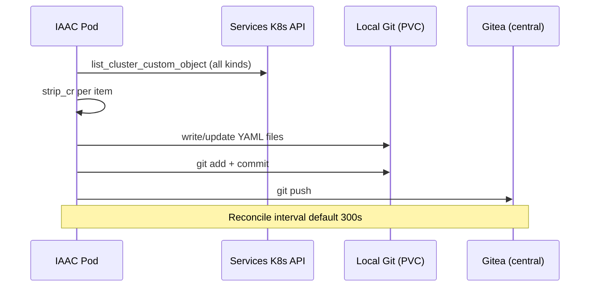

# C4 Level 3 — IAAC Git Sync

**Scope**: `hybridcloud/iaac/` — CR-to-Gitea config mirror  
**API group**: `hybridsovereign.redhat/v1alpha1`  
**Last updated**: 2026-07-11

---

## Purpose

IAAC (Infrastructure as a Code) replaces the legacy Go `plugin_sdx` operator with a Python StatefulSet that watches all `hybridsovereign.redhat` CRs on the services cluster and mirrors stripped YAML snapshots to the Gitea `tenancy_repo` on the central cluster.

This provides a Git-based audit trail and config-as-code view of live cluster state without storing secrets in Git.

---

## Component Diagram

```mermaid
C4Component
    title IAAC Git Sync — Services → Central

    Container_Boundary(iaac, "IAAC StatefulSet") {
        Component(main, "main.py", "Python", "Startup, signal handling, reconcile loop")
        Component(watcher, "CRWatcher", "Python", "Poll trigger for full sync")
        Component(engine, "GitSyncEngine", "Python", "List CRs, strip, commit, push")
        Component(strip, "strip.py", "Python", "Remove status, managedFields, secrets")
        Component(gitea, "GiteaClient", "Python", "REST API create/update/delete files")
        Component(pvc, "Git working tree", "PVC 10Gi", "Local clone of tenancy_repo")
    }

    ComponentDb(etcd, "Services etcd", "All hybridsovereign CRs")
    Component(giteaSrv, "Gitea", "Central cluster", "tenancy_repo")
    Component(vault, "Vault", "gitea-admin token")

    Rel(main, watcher, "poll_once every 30s")
    Rel(watcher, engine, "on_change → full_sync")
    Rel(engine, etcd, "list_cluster_custom_object per kind")
    Rel(engine, strip, "strip_cr per item")
    Rel(engine, gitea, "upsert/delete file")
    Rel(engine, pvc, "git commit + push")
    Rel(gitea, giteaSrv, "HTTPS REST")
    Rel(iaac, vault, "GITEA_TOKEN via ExternalSecret")
```

---

## Watched CR Kinds

From `hybridcloud/iaac/src/config.py`:

| Kind | Plural | Gitea path prefix |
|------|--------|-------------------|
| Entity | entities | `sovereign-cloud-plugins/` or entity name |
| Team | teams | `entity-<name>/` |
| Assignment | assignments | `entity-<name>/` |
| Project | projects | `entity-<name>/` |
| Persona | personas | `entity-<name>/` |
| PlatformOpenshift | platformopenshifts | `entity-<name>/` |
| CloudOSO | cloudosos | `entity-<name>/` |
| CloudAWS | cloudawss | `entity-<name>/` |
| OpenStackMigration | openstackmigrations | `entity-<name>/` |
| RbacConfig | rbacconfigs | `sovereign-cloud-plugins/` |
| Rbac | rbacs | `entity-<name>/` |
| AAPConfig | aapconfigs | `sovereign-cloud-plugins/` |
| AAPOrg | aaporgs | `entity-<name>/` |
| QuayConfig | quayconfigs | `sovereign-cloud-plugins/` |
| QuayOrg | quayorgs | `entity-<name>/` |
| Vault | vaults | `entity-<name>/` |
| VaultKV | vaultkvs | `entity-<name>/` |
| Iaac | iaacs | `sovereign-cloud-plugins/` |

Path formula: `{entity}/{kind}/{name}.yaml` (see `strip.gitea_path`).

---

## Strip Policy

`strip_cr()` retains only redeployable fields:

```yaml
# Output shape per CR
apiVersion: hybridsovereign.redhat/v1alpha1
kind: <Kind>
metadata:
  name: <name>
  namespace: <namespace>    # when present
  labels: <labels>        # when present
spec: <spec>              # no secrets — CRDs use Vault refs only
```

**Removed**: `status`, `managedFields`, `resourceVersion`, `uid`, `finalizers`, annotations with runtime data.

---

## Sync Flow



On each poll cycle (30s) or startup, `full_sync()` runs a complete reconciliation: list all CRs, diff against tracked paths, commit additions/updates/deletions.

---

## Deployment

| Setting | Value |
|---------|-------|
| Chart | `hybridcloud/iaac/helm/` |
| Namespace | `sovereign-cloud-plugins` |
| Sync-wave | 40 |
| Image | `quay.example.com/hybrid-sovereign/iaac-git-sync` |
| Reconcile interval | 300s (configurable) |

### Credentials

Gitea admin token is delivered via ExternalSecret:

```yaml
# hybridcloud/iaac/helm/values.yaml (structure only — token from Vault)
gitea:
  externalSecret:
    secretStoreName: vault-backend
    vaultPath: gitea-admin
    targetSecretName: gitea-admin-token
```

The token is injected as `GITEA_TOKEN` environment variable. No credentials in the `Iaac` CR spec.

---

## Iaac CR

The `Iaac` CR (`hybridsovereign.redhat/v1alpha1`) serves as the configuration anchor:

| Field | Purpose |
|-------|---------|
| `spec.repoUrl` | Gitea repository URL (optional override) |
| `spec.branch` | Target branch (default: `main`) |
| `spec.syncInterval` | Reconciliation interval |
| `status.ready` | Last sync succeeded |
| `status.lastSyncTime` | Timestamp of last successful sync |
| `status.totalCRsSynced` | CR count in last sync |

---

## Related Documents

- [../decisions/ADR-001-monorepo.md](../decisions/ADR-001-monorepo.md) — replaces Go plugin_sdx
- [../technical/25-plugin-iaac.md](../technical/25-plugin-iaac.md) — legacy SDX reference
- [../technical/14-gitea.md](../technical/14-gitea.md) — Gitea deployment
