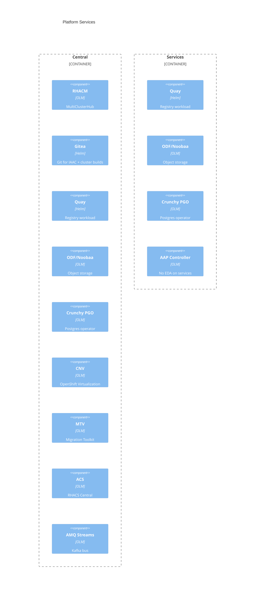

# C4 Level 3 — Platform Services

**Scope**: Shared platform charts managed by central ArgoCD  
**Last updated**: 2026-07-15

---

## Purpose

Platform services are the non-custom-operator building blocks: registries, databases, storage, virtualization, multi-cluster, and security scanning. They are packaged under `bootstrap/helm/charts/` and pinned in `bootstrap/helm/central/values.yaml`.

---

## Component map

---

## Placement matrix (lab-verified)

| Service | Central | Services | Notes |
|---------|---------|----------|-------|
| ArgoCD / GitOps | Yes | No (management) | Sole ApplicationSet host |
| RHACM | Yes | Managed cluster | |
| Vault | Yes (`central-vault`) | Yes (`services-vault`) | HA Raft ×3 each |
| ESO | Yes | Yes | |
| Gitea | Yes | No | |
| Keycloak | Yes | Yes | Separate realms |
| AAP Controller | Yes | Yes | |
| AAP EDA | Yes | **No** | `aap.eda.enabled: false` on services |
| AMQ Streams | Yes | No | Operators produce remotely |
| Quay / ODF / PGO | Yes | Yes | |
| CNV / MTV | Yes | — | Virtualization on central |
| ACS | Yes | Optional / off for services ACS | Central app `acs-central` Synced |
| Event Forwarder | — | **Disabled** | Direct Kafka publish |
| plugin-iaac (Go) | — | **Disabled** | Replaced by `iaacGitSync` |
| IAAC git-sync | — | Yes | `sovereign-cloud-plugins` |

---

## AAP split (important)

| Cluster | Controller | EDA | Hub |
|---------|------------|-----|-----|
| Central (`aapCentral`) | Enabled | Enabled | Disabled |
| Services (`aap`) | Enabled | Disabled | Disabled |

Config-as-code Job targets the **central** gateway for EDA + controller templates used by rulebooks. See [../../technical/007-services-aap-scope.md](../../technical/007-services-aap-scope.md).

---

## Related specs

`016`, `022`–`032`, `034` — see [../../../specs/README.md](../../../specs/README.md).
