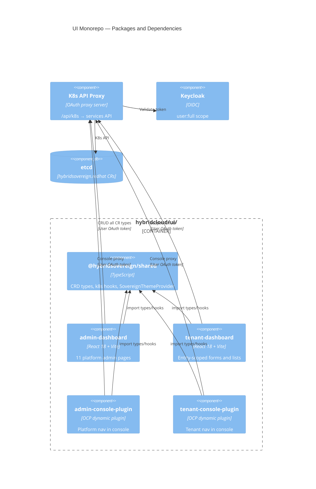
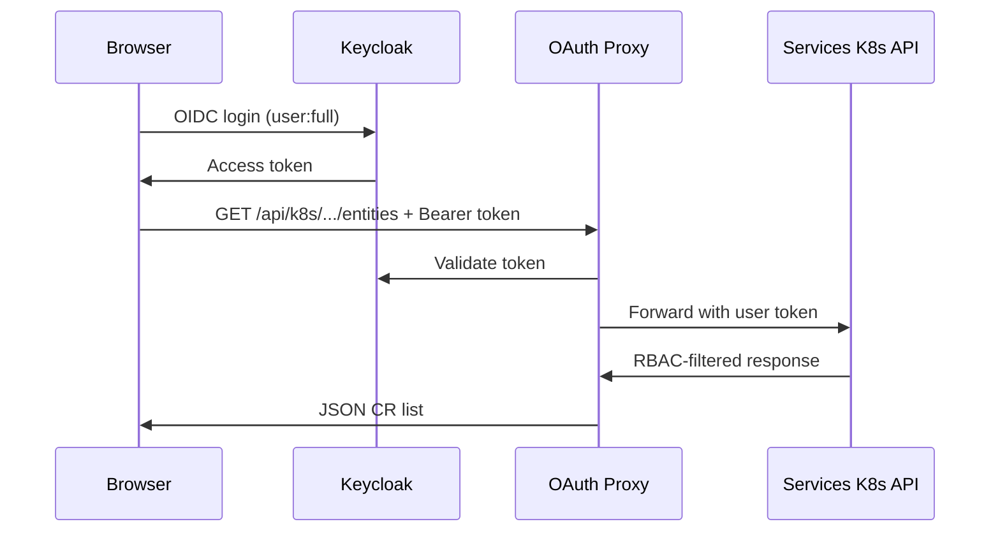

# C4 Level 3 — UI Packages

**Scope**: `hybridcloud/ui/` PatternFly 5 monorepo  
**API group**: `hybridsovereign.redhat/v1alpha1` (TypeScript types)  
**Last updated**: 2026-07-22

---

## Purpose

The UI monorepo replaces legacy `user_dashboard` and `tenancy_dashboard` React apps. It provides four deployable UI packages plus a shared library, all consuming the Kubernetes API through an OAuth token proxy (never the pod ServiceAccount token for user CRUD).

## Live deploy pins (services / `sovereign-cloud`)

| Package | Image tag | ArgoCD app |
|---------|-----------|------------|
| Admin dashboard | `2.0.16` | `sovereign-cloud-dashboard` |
| Tenant dashboard | `5.0.15` | `tenancy-dashboard` |
| Admin console plugin | `1.2.13` | `sovereign-admin-plugin` |
| Tenant console plugin | `1.3.11` | `sovereign-tenant-plugin` |

Pins: `bootstrap/helm/central/values.yaml`. Image build/push: `cd hybridcloud/ui && make build-push`.

---

## Package Overview

| Package | npm name | Deployment target | Audience |
|---------|----------|-------------------|----------|
| Shared library | `@hybridsovereign/shared` | npm workspace (not deployed) | Internal — types, hooks, theme |
| Admin Dashboard | `@hybridsovereign/admin-dashboard` | `sovereign-cloud` Deployment | Platform administrators |
| Tenant Dashboard | `@hybridsovereign/tenant-dashboard` | `sovereign-cloud` Deployment | Tenant admins and developers |
| Admin Console Plugin | `@hybridsovereign/admin-console-plugin` | OCP `ConsolePlugin` CR | Platform admins in OCP console |
| Tenant Console Plugin | `@hybridsovereign/tenant-console-plugin` | OCP `ConsolePlugin` CR | Tenant users in OCP console |

---

## Component Diagram



---

## Shared Library (`packages/shared/`)

Provides the contract between UI and operators:

- **CRD types** — TypeScript interfaces for all `hybridsovereign.redhat/v1alpha1` kinds
- **K8s hooks** — `useK8sWatch`, `useK8sList`, CRUD helpers
- **Theme** — `SovereignThemeProvider` (PatternFly 5 light/dark)

```typescript
// Supported kinds (from hybridcloud/ui/packages/shared/)
Entity, Team, Assignment, Project, Persona,
PlatformOpenshift, CloudOSO, CloudAWS, OpenStackMigration,
Rbac, RbacConfig, AAPOrg, AAPConfig, QuayOrg, QuayConfig,
Vault, VaultKV,
HybridFabric, CloudGateway, TransportLink, HybridNetwork, NetworkPlacement,
UIHealthChecker
```

---

## Admin Dashboard

**Path**: `hybridcloud/ui/packages/admin-dashboard/`  
**Dev server**: `make dev-admin` → `http://localhost:3000`  
**Helm chart**: `bootstrap/helm/charts/sovereign-dashboard/` (admin variant)

### Capabilities

- List and manage all CR types across all entities
- Entity onboarding (create `Entity` CR in `sovereign-cloud`)
- Plugin config management (`RbacConfig`, `AAPConfig`, `QuayConfig`)
- Platform-wide status and health views
- **UI Health** (`/networking/uihealth`): `UIHealthChecker` URL registry; Refresh / Run checks probe from the dashboard pod (no CR reconcile). See [57-hybridvpc-uihealth.md](../technical/57-hybridvpc-uihealth.md).
- Hybrid VPC admin pages (fabrics, gateways, transport links)
- Create + update forms for admin and shared tenancy kinds via `@hybridsovereign/shared`

### Security

- User OAuth token only (`user:full` scope)
- RBAC-aware UI: actions hidden when K8s API returns 403
- No credentials stored in browser local storage

---

## Tenant Dashboard

**Path**: `hybridcloud/ui/packages/tenant-dashboard/`  
**Dev server**: `make dev-tenant` → `http://localhost:3001`  
**Helm chart**: `bootstrap/helm/charts/tenancy-dashboard/`

### Capabilities

- Entity-scoped CRUD for Team, Project, Assignment, Persona, cloud CRs (including PlatformOpenshift / CloudOSO / CloudAWS create+update forms)
- Hybrid VPC tenant kinds (`HybridNetwork`, `NetworkPlacement`) with create/update forms
- Plugin CR management within entity namespace (Rbac, AAPOrg, QuayOrg, Vault)
- 14 named RBAC roles enforced by K8s RoleBindings (see [operator.md](operator.md))

### Security

- Namespace isolation via `hybridsovereign.redhat/entity` label
- No cross-entity data leakage — K8s RBAC enforces scope

---

## Console Plugins

**Paths**:

- `hybridcloud/ui/packages/admin-console-plugin/`
- `hybridcloud/ui/packages/tenant-console-plugin/`

Both register as `console.openshift.io/v1` `ConsolePlugin` CRs with proxy endpoints to the dashboard backend services. PatternFly 5 styling matches standalone dashboards.

| Plugin | Console nav | Pages |
|--------|-------------|-------|
| Admin | Platform → Hybrid Sovereign | Entity list, plugin config, platform status |
| Tenant | User → My Entity | Teams, projects, assignments, clouds |

---

## Build and Deploy

```bash
cd hybridcloud/ui
make install    # npm workspaces install
make build      # build all packages
make build-push # push images to Quay
```

Image tags are referenced in `bootstrap/helm/central/values.yaml` under `adminDashboard` and `tenancyDashboard` Application keys.

---

## API Access Pattern



---

## Related Documents

- [context.md](../context.md) — external actors
- [../technical/15-sovereign-dashboard.md](../technical/15-sovereign-dashboard.md)
- [../technical/20-tenancy-dashboard.md](../technical/20-tenancy-dashboard.md)
- [../12-console-plugins.md](../12-console-plugins.md)
