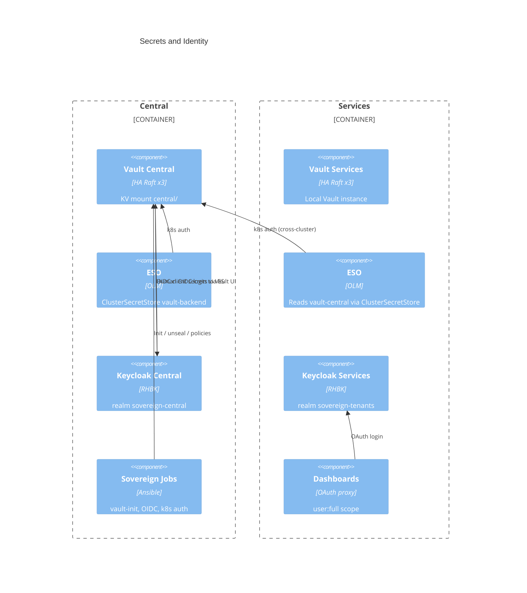

# C4 Level 3 — Secrets & Identity

**Scope**: Vault, External Secrets, Keycloak, OAuth proxies  
**Last updated**: 2026-07-15

---

## Purpose

All credentials live in Vault. Clusters receive them via ExternalSecret / PushSecret. Humans authenticate with Keycloak OIDC. No secrets in Git.

---

## Component diagram

---

## Placement (verified lab)

| Component | Namespace | Mode |
|-----------|-----------|------|
| Vault central | `central-vault` | HA Raft, 3 replicas |
| Vault services | `services-vault` | HA Raft, 3 replicas |
| ESO | both clusters | Operator + controller |
| Keycloak central | `central-rhbk` | 2 instances, Crunchy PG |
| Keycloak services | `services-rhbk` | 2 instances, Crunchy PG |

---

## Auth model

| Who | How |
|-----|-----|
| ESO / workloads | Vault Kubernetes auth (`kubernetes-central`, `kubernetes-services`) |
| Humans | Keycloak OIDC → Vault / OpenShift / dashboards |
| Automation Jobs | Short-lived SA + ExternalSecrets; never commit tokens |

Group `sovereign-admin` maps to elevated OpenShift and Vault policies.

---

## Rules

1. Never create plain `Secret` resources in Helm for credentials — use ExternalSecret with `creationPolicy: Owner`.
2. PushSecret moves cluster-generated secrets into Vault when needed.
3. Dashboard OAuth client secrets: Vault paths `dashboard-oauth`, `tenancy-dashboard-oauth`.
4. Lab TLS often uses edge termination / disabled in-pod TLS — track in [../../technical/deviations.md](../../technical/deviations.md).

---

## Related

- [../../technical/18-secrets-flow.md](../../technical/18-secrets-flow.md)
- [../../technical/09-vault.md](../../technical/09-vault.md)
- [../../technical/06-keycloak.md](../../technical/06-keycloak.md)
- Specs `022`, `023`
