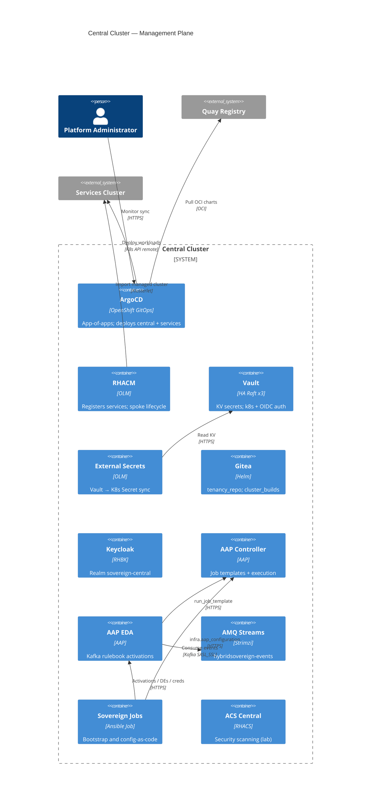
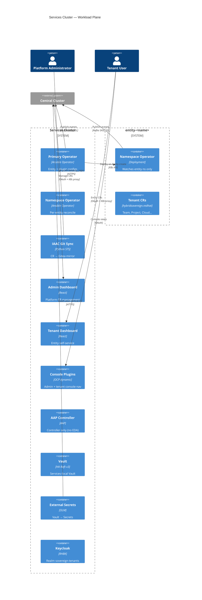
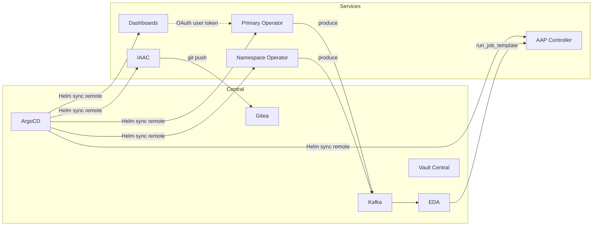

# C4 Level 2 — Container Diagrams

**Scope**: Central and services OpenShift clusters  
**Last updated**: 2026-07-15

---

## Overview

One ArgoCD on central manages both clusters. Custom `hybridsovereign.redhat` operators and tenant UIs run on **services**. Management plane (ArgoCD, RHACM, Vault, Gitea, Kafka, AAP EDA) runs on **central**. Secrets never appear in Git.

---

## Central cluster containers

### Central namespaces (selected)

| Namespace | Containers |
|-----------|------------|
| `openshift-gitops` | ArgoCD |
| `open-cluster-management` | RHACM / MultiClusterHub |
| `central-vault` | Vault HA (3) + injector |
| `external-secrets` / `external-secrets-operator` | ESO |
| `gitea` | Gitea |
| `central-rhbk` | Keycloak |
| `aap` | AAP Controller + EDA |
| `amq-streams` | Kafka `hybridsovereign-kafka` |
| `sovereign-cloud-jobs` | Ansible Jobs |
| `openshift-cnv` / MTV ns | Virtualization + migration toolkit |

---

## Services cluster containers

### Services namespaces (selected)

| Namespace | Containers |
|-----------|------------|
| `sovereign-cloud` | Primary operator, dashboards, console plugins |
| `sovereign-cloud-plugins` | IAAC git-sync; plugin config CRs |
| `sovereign-cloud-jobs` / `helpers` | Automation support |
| `aap` | AAP Controller (EDA disabled) |
| `services-vault` | Vault HA |
| `services-rhbk` | Keycloak |
| `entity-<name>` | Namespace operator + tenant CRs |

**Retired on services:** Event Forwarder DaemonSet (`eventForwarder.enabled: false`). Operators publish directly to Kafka.

---

## Cross-cluster communication

| Path | Protocol | Credential source |
|------|----------|-------------------|
| ArgoCD → services API | K8s API | Bootstrap cluster secret / Vault |
| Operators → Kafka | SASL_SSL Route | Vault `amq-producer` via ExternalSecret |
| EDA → Kafka | SASL_SSL | EDA credential from Vault |
| EDA → AAP Controller | HTTPS | Controller token credential |
| IAAC → Gitea | HTTPS | Vault `gitea-admin` ExternalSecret |
| Dashboards → K8s API | OAuth user token | Keycloak OIDC |

---

## Sync-wave highlights

| Wave | Component | Cluster |
|------|-----------|---------|
| 10–15 | RHACM, Vault, AMQ Streams | Central |
| 20 | RHBK | Both |
| 30 | AAP (central EDA + services controller) | Both |
| 38 | Primary operator | Services |
| 40–42 | IAAC, dashboards, console plugins | Services |

Full table: `bootstrap/helm/central/values.yaml`.

---

## Related

- [context.md](context.md)
- [components/event-system.md](components/event-system.md)
- [components/operator.md](components/operator.md)
- [components/ui.md](components/ui.md)
