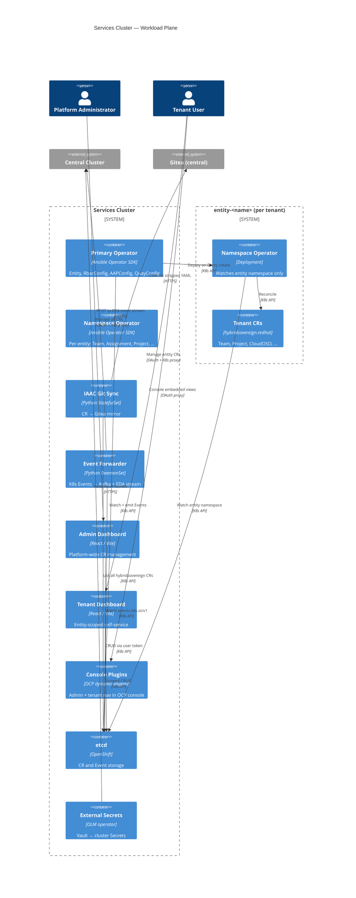
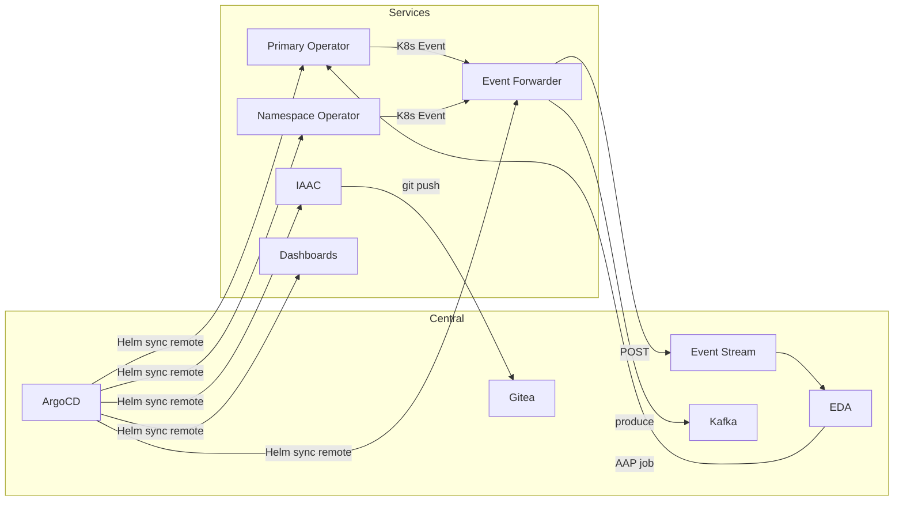

# C4 Level 2 — Container Diagrams

**Scope**: Central and services OpenShift clusters  
**API group**: `hybridsovereign.redhat/v1alpha1`  
**Last updated**: 2026-07-11

---

## Overview

The platform spans two OpenShift clusters managed by a single ArgoCD instance on central. All `hybridsovereign.redhat` operators and tenant-facing UIs run on the services cluster. Management-plane services (ArgoCD, RHACM, Vault, Gitea, AAP/EDA) run on central.

Secrets never appear in Git. Vault holds credentials; ExternalSecrets sync them into cluster Secrets at runtime.

---

## Central Cluster Containers

```mermaid
C4Container
    title Central Cluster — Management Plane

    Person(admin, "Platform Administrator")

    System_Boundary(central, "Central Cluster") {
        Container(argocd, "ArgoCD", "OpenShift GitOps", "App-of-apps; deploys to central + services")
        Container(rhacm, "RHACM", "OLM operator", "Registers services cluster; spoke lifecycle")
        Container(vault, "Vault", "Helm chart", "KV secrets; k8s auth for ESO")
        Container(eso, "External Secrets", "OLM operator", "Vault → K8s Secret sync")
        Container(gitea, "Gitea", "Helm chart", "tenancy_repo; cluster_builds repos")
        Container(keycloak, "Keycloak (RHBK)", "Helm chart", "OIDC for both clusters")
        Container(aap, "AAP Controller", "Helm chart", "Job templates; Ansible execution")
        Container(eda, "AAP EDA", "Helm chart", "Rulebook activations; event matching")
        Container(amq, "AMQ Streams", "Strimzi Kafka", "hybridsovereign-events topic")
        Container(jobs, "Sovereign Jobs", "Ansible Job", "Bootstrap, aap-config, keycloak init")
    }

    System_Ext(quay, "Quay Registry")
    System_Ext(services, "Services Cluster")

    Rel(admin, argocd, "Monitor sync status", "HTTPS")
    Rel(argocd, services, "Deploy workloads", "K8s API remote")
    Rel(argocd, central, "Deploy local workloads", "K8s API")
    Rel(rhacm, services, "Import managed cluster", "Klusterlet")
    Rel(jobs, aap, "Configure via infra.aap_configuration", "HTTPS")
    Rel(jobs, eda, "Configure activations and DEs", "HTTPS")
    Rel(jobs, vault, "Seed bootstrap secrets", "HTTPS")
    Rel(eso, vault, "Read KV paths", "HTTPS")
    Rel(gitea, vault, "Admin token via ExternalSecret", "HTTPS")
    Rel(eda, aap, "run_job_template / run_playbook", "HTTPS")
    Rel(eda, amq, "Consume events (future path)", "Kafka TLS")
    Rel(argocd, quay, "Pull OCI charts", "OCI")
```

### Central Namespaces

| Namespace | Containers |
|-----------|------------|
| `openshift-gitops` | ArgoCD, ApplicationSet controller |
| `open-cluster-management` | RHACM operator, MultiClusterHub |
| `vault` | Vault HA cluster |
| `external-secrets` | External Secrets Operator |
| `gitea` | Gitea server |
| `rhbk` | Keycloak |
| `aap` | AAP Controller + EDA |
| `amq-streams` | Kafka cluster (`hybridsovereign-kafka`) |
| `sovereign-cloud-jobs` | Ansible bootstrap and config-as-code Jobs |

---

## Services Cluster Containers



### Services Namespaces

| Namespace | Containers |
|-----------|------------|
| `sovereign-cloud` | Primary operator, Admin Dashboard, Tenant Dashboard, console plugin backends |
| `sovereign-cloud-plugins` | IAAC StatefulSet, Event Forwarder |
| `sovereign-cloud-jobs` | Ansible runner Jobs (if any services-side automation) |
| `entity-<name>` | Namespace operator Deployment, tenant CRs, namespace RBAC Roles |

---

## Cross-Cluster Communication



| Path | Protocol | Credential source |
|------|----------|-------------------|
| ArgoCD → services API | K8s API (cluster secret) | Bootstrap `helm/init` PushSecret |
| Event Forwarder → EDA stream | HTTPS POST | Vault → ExternalSecret |
| EDA → services API | K8s API (cluster-admin token) | Vault → `argocd-cluster-services` |
| IAAC → Gitea | HTTPS REST | Vault → `gitea-admin-token` ExternalSecret |
| Dashboards → K8s API | OAuth user token proxy | Keycloak OIDC |

---

## Sync-Wave Ordering (Selected)

| Wave | Component | Cluster |
|------|-----------|---------|
| 13 | AMQ Streams Kafka | Central |
| 32 | Event Forwarder | Services |
| 38 | Primary Operator + CRDs | Services |
| 40 | IAAC Git Sync | Services |

Full wave table: `hybridcloud/bootstrap/helm/central/values.yaml`.

---

## Related Documents

- [context.md](context.md) — L1 system context
- [components/operator.md](components/operator.md) — operator tier detail
- [components/event-system.md](components/event-system.md) — event pipeline
- [../technical/03-central-cluster.md](../technical/03-central-cluster.md) — central cluster reference
- [../technical/04-services-cluster.md](../technical/04-services-cluster.md) — services cluster reference
