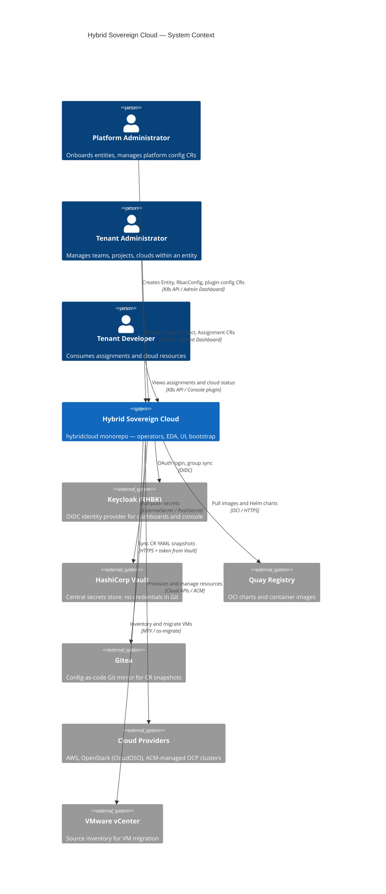

# C4 Level 1 — System Context

**Scope**: Hybrid Sovereign Cloud platform (`hybridcloud/` monorepo)  
**API group**: `hybridsovereign.redhat/v1alpha1`  
**Last updated**: 2026-07-11

---

## Purpose

Hybrid Sovereign Cloud is a multi-tenant hybrid cloud management platform. Platform administrators onboard entities (tenants), provision OpenShift and cloud resources, and manage plugin integrations (AAP, Quay, Vault, RBAC). Tenant users self-service teams, projects, assignments, and cloud environments within their entity boundary.

All runtime configuration flows through GitOps (ArgoCD on the central cluster). No secrets are stored in Git; credentials are delivered from Vault via ExternalSecrets.

---

## System Context Diagram

---

## External Actors

| Actor | Interaction | Authentication |
|-------|-------------|----------------|
| Platform Administrator | Entity onboarding, plugin config (`RbacConfig`, `AAPConfig`, `QuayConfig`), cluster bootstrap | Keycloak OAuth via Admin Dashboard or OCP console plugin |
| Tenant Administrator | Team, Project, Assignment, Persona, cloud CRs within `entity-<name>` | Keycloak OAuth; 14 named RBAC roles |
| Tenant Developer | Read-only or scoped CRUD per RoleBinding | Keycloak OAuth |

---

## External Systems

| System | Role in platform | Monorepo path |
|--------|------------------|---------------|
| Keycloak (RHBK) | SSO for dashboards, console plugins, Vault OIDC | `hybridcloud/bootstrap/ansible/` |
| Vault | Credential store for all automation | `hybridcloud/bootstrap/helm/charts/vault-*` |
| Quay | Image and Helm chart registry | `hybridcloud/bootstrap/make/upload-*.mk` |
| Gitea | Tenancy config mirror (`tenancy_repo`) | `hybridcloud/iaac/` |
| RHACM | Multi-cluster registration and spoke provisioning | `hybridcloud/bootstrap/helm/charts/rhacm/` |
| Cloud providers | AWS, OpenStack, managed OCP | `hybridcloud/operator/namespace/` roles |

---

## Cluster Topology (Context Summary)

| Cluster | API endpoint (lab) | Management role |
|---------|-------------------|-----------------|
| Central | `api.central.lab.example.com` | ArgoCD app-of-apps, RHACM, Vault, Gitea, AAP/EDA |
| Services | `api.services.lab.example.com` | All `hybridsovereign.redhat` operators, dashboards, tenant CRs |

Central ArgoCD deploys to both clusters. The services cluster has no ArgoCD management plane.

---

## Monorepo Layout

| Path | Responsibility |
|------|----------------|
| `hybridcloud/bootstrap/` | ArgoCD app-of-apps, init chart, platform OCI charts |
| `hybridcloud/operator/primary/` | Primary operator (Entity + plugin configs) |
| `hybridcloud/operator/namespace/` | Per-entity namespace operator |
| `hybridcloud/eda/` | Event-driven automation rulebooks and decision environments |
| `hybridcloud/iaac/` | Python StatefulSet — CR-to-Gitea sync |
| `hybridcloud/ui/` | PatternFly 5 dashboards and console plugins |
| `hybridcloud/aap-config/` | AAP/EDA config-as-code |
| `hybridcloud/migration/` | VMware → CloudOSO migration playbooks |
| `hybridcloud/samples/` | Sanitized sample CRs |
| `hybridcloud/architecture/` | C4 model and technical documentation |

---

## Related Documents

- [containers.md](containers.md) — L2 container diagrams
- [components/operator.md](components/operator.md) — multi-tier operator detail
- [../decisions/ADR-001-monorepo.md](../decisions/ADR-001-monorepo.md) — monorepo migration rationale
