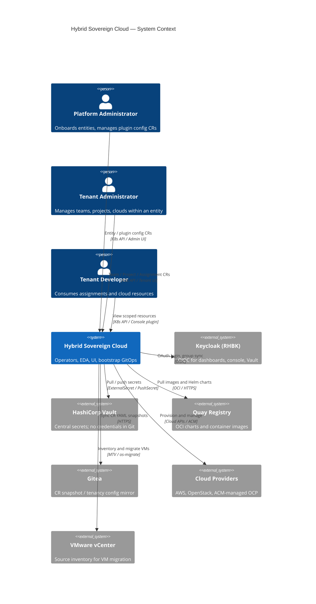

# C4 Level 1 — System Context

**Scope**: Hybrid Sovereign Cloud (`hybridcloud/` monorepo)  
**API group**: `hybridsovereign.redhat/v1alpha1`  
**Last updated**: 2026-07-15

---

## Purpose

Hybrid Sovereign Cloud is a multi-tenant hybrid cloud management platform. Platform administrators onboard entities (tenants), provision OpenShift and cloud resources, and manage plugin integrations (AAP, Quay, Vault, RBAC). Tenant users self-service teams, projects, assignments, and cloud environments inside their entity boundary.

Runtime configuration is GitOps-only after bootstrap (ArgoCD on the central cluster). Secrets never live in Git; Vault + ExternalSecrets deliver credentials at runtime.

---

## System Context Diagram

---

## Actors

| Actor | Interaction | Auth |
|-------|-------------|------|
| Platform Administrator | Entity onboarding, `RbacConfig` / `AAPConfig` / `QuayConfig`, bootstrap | Keycloak via Admin Dashboard or OCP console plugin |
| Tenant Administrator | Team, Project, Assignment, Persona, cloud CRs in `entity-<name>` | Keycloak; 14 named RBAC roles |
| Tenant Developer | Scoped CRUD / read per RoleBinding | Keycloak |

---

## External systems

| System | Role | Monorepo path |
|--------|------|---------------|
| Keycloak (RHBK) | SSO for UI, console, Vault OIDC | `bootstrap/helm/charts/rhbk/`, sovereign Jobs |
| Vault | Credential store (HA Raft, both clusters) | `bootstrap/helm/charts/vault*` |
| Quay | Image + Helm chart registry | `bootstrap/make/upload-*.mk` |
| Gitea | `tenancy_repo` + cluster-builds | `bootstrap/helm/charts/gitea/`, `iaac/` |
| RHACM | Managed cluster / spoke lifecycle | `bootstrap/helm/charts/rhacm/` |
| AMQ Streams | Cross-cluster event bus | `bootstrap/helm/charts/amq-streams/` |
| AAP + EDA | Job execution and rulebook activations | `aap-config/`, `eda/` |
| Cloud providers | AWS, OpenStack, managed OCP | `operator/namespace/` roles |

---

## Cluster topology

| Cluster | Lab API | Management role |
|---------|---------|-----------------|
| Central | `api.central.lab.example.com` | Sole ArgoCD control plane; RHACM; Vault; Gitea; Kafka; AAP **Controller + EDA** |
| Services | `api.services.lab.example.com` | All `hybridsovereign.redhat` operators, UIs, tenant CRs; AAP Controller only |

Central ArgoCD deploys to both clusters via `destination.server`. The services cluster must not host Application / ApplicationSet management resources.

---

## Monorepo layout

| Path | Responsibility |
|------|----------------|
| `bootstrap/` | ArgoCD app-of-apps, init chart, platform OCI charts |
| `operator/primary/` | Primary operator (Entity + plugin configs) |
| `operator/namespace/` | Per-entity namespace operator |
| `eda/` | Rulebooks and decision environments |
| `iaac/` | Python StatefulSet — CR → Gitea sync |
| `ui/` | PatternFly dashboards + console plugins |
| `aap-config/` | AAP/EDA config-as-code |
| `migration/` | VMware → CloudOSO migration playbooks |
| `samples/` | Sanitized sample CRs |
| `specs/` | Feature specifications `001`–`034` |
| `architecture/` | This C4 documentation set |

---

## Related

- [containers.md](containers.md) — L2
- [components/operator.md](components/operator.md) — operator tiers
- [../decisions/ADR-001-monorepo.md](../decisions/ADR-001-monorepo.md)
