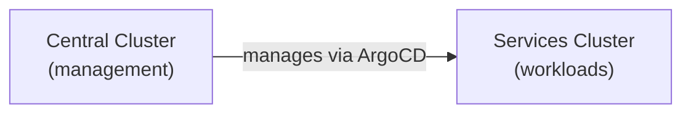
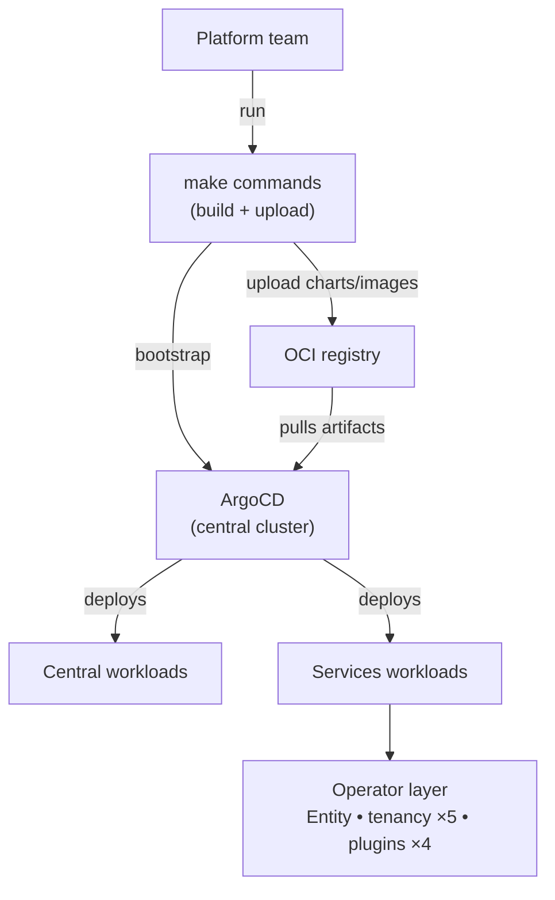

# Platform Overview

## What is this?

A two-cluster OpenShift platform that bootstraps itself using GitOps.

Multiple `make` commands build the artifacts, then one final command hands control to ArgoCD. After that, ArgoCD keeps everything in sync automatically.

## The Two Clusters

| Cluster | Role |
|---|---|
| **Central** | Runs ArgoCD, RHACM, Vault, Gitea, Sovereign Jobs. Makes decisions. |
| **Services** | Runs AAP, Keycloak, platform operators, dashboards, and tenant-facing control plane. |

## Key Components

| Component | What it does | Where |
|---|---|---|
| ArgoCD | Keeps clusters in sync with Git | Central |
| RHACM | Multi-cluster management | Central |
| Vault | Secrets management | Central |
| External Secrets | Vault → Kubernetes secret sync | Central |
| Keycloak | Identity and SSO | Central & Services |
| Entity Operator | Provisions entity namespaces from `Entity` CRs | Services |
| Persona Operator | RBAC persona management and Keycloak group sync | Services |
| Tenancy operators | `Team`, `Assignment`, `Project`, `PlatformOpenshift`, `CloudOSO`, `CloudAWS` CR controllers | Services |
| Plugin operators | RBAC, Vault, AAP, Quay (`plugin_*` Ansible operators) | Services |
| Sovereign Dashboard | Entity UI | Services |
| Tenancy Dashboard | Tenancy + Vault/AAP/Quay UI | Services |
| ACS | Security scanning | *(disabled)* |
| Crunchy Postgres | Database operator | Both |
| ODF / Noobaa | Object storage for Quay | Both |
| Quay (registry) | In-cluster registry workload | Both |
| OCI Registry (Quay) | External charts + images for GitOps | External |

## How it works

After bootstrap, you only change Git. ArgoCD handles the rest.
