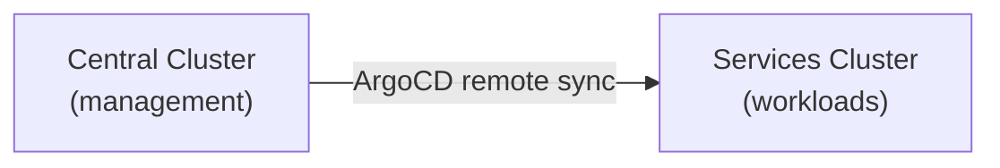

# Platform Overview

For the authoritative topology model see **[C4 Level 1 — Context](../c4/context.md)**.

## What is this?

A two-cluster OpenShift platform that bootstraps with GitOps. `make` targets publish charts and images; `make init-central-argo` hands control to ArgoCD. After that, all configuration changes flow through Git → ArgoCD.

## The two clusters

| Cluster | Role |
|---------|------|
| **Central** | ArgoCD, RHACM, Vault HA, Gitea, Keycloak, AMQ Streams, AAP Controller **+ EDA**, CNV/MTV, Sovereign Jobs |
| **Services** | Primary + namespace operators, dashboards, console plugins, AAP Controller (no EDA), Vault HA, Keycloak, IAAC git-sync |

## Key components

| Component | What it does | Where |
|-----------|--------------|-------|
| ArgoCD | Keeps clusters in sync with Git | Central only |
| RHACM | Multi-cluster management | Central |
| Vault | Secrets (HA Raft ×3) | Both (`central-vault`, `services-vault`) |
| External Secrets | Vault → Kubernetes Secrets | Both |
| Keycloak | Identity and SSO | Both (separate realms) |
| AMQ Streams | Event bus for operators → EDA | Central |
| AAP + EDA | Automation + rulebook activations | Central (EDA); both Controllers |
| Primary / namespace operators | `hybridsovereign.redhat` CRs | Services |
| IAAC git-sync | CR snapshots → Gitea | Services |
| Admin / tenant dashboards | PatternFly UIs | Services |
| Console plugins | OCP dynamic plugins | Services |
| ACS | Security scanning | Central (lab) |
| Crunchy Postgres / ODF / Quay | Data plane building blocks | Both |

**Retired:** Event Forwarder (operators publish to Kafka directly).

## Non-negotiables

1. No secrets in Git  
2. Never delete `sovereign-*` namespaces  
3. After bootstrap, GitOps only  

## Next

- [C4 containers](../c4/containers.md)  
- [How it works](02-how-it-works.md)  
- [Security model](03-security-model.md)  
