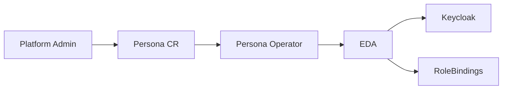

# Persona Operator — Business Overview

## What is a Persona?

A **Persona** defines a named RBAC role that can be assigned to users or groups within a tenant (Entity). Instead of configuring access directly on Entity CRs, Personas provide a clean, reusable abstraction for role-based access.

## Why Personas?

| Before | After |
|--------|-------|
| RBAC embedded in Entity CR (`spec.namespaceRbac`) | Separate Persona CRs per role |
| One monolithic RBAC configuration | Granular, per-role management |
| Hard to audit who has what access | Each Persona CR is auditable |
| Adding new roles requires Entity CR changes | Create new Persona CR independently |

## How It Works

1. Admin creates a `Persona` CR specifying the type (e.g., `entityAdmin`) and an RBAC group
2. The Persona operator validates and emits an event
3. EDA picks up the event and configures Keycloak groups and Kubernetes RoleBindings
4. Users in the Keycloak group get the corresponding access level

## Persona Types

| Type | Access Level |
|------|-------------|
| entityAdmin | Full namespace admin |
| auditor | Read-only access to all CRs |
| assignmentAdmin | Manage assignments |
| platformOpenshiftAdmin | Manage OpenShift clusters |
| cloudOSOAdmin | Manage OpenStack cloud resources |
| cloudAWSAdmin | Manage AWS cloud resources |
| identityAdmin | Manage RBAC CRs |
| teamAdmin / teamView | Manage or view teams |
| projectAdmin / projectView | Manage or view projects |

## Key Benefits

- **Separation of Concerns**: RBAC management decoupled from Entity management
- **Scalability**: Add new persona types without modifying existing operators
- **Auditability**: Each persona is a distinct Kubernetes resource with full history
- **Self-Service**: Tenant admins can create Persona CRs for their users
