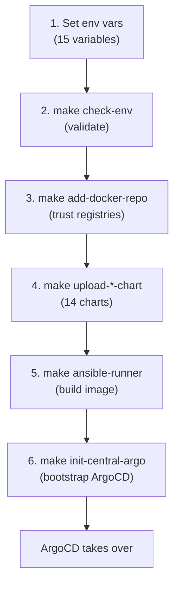
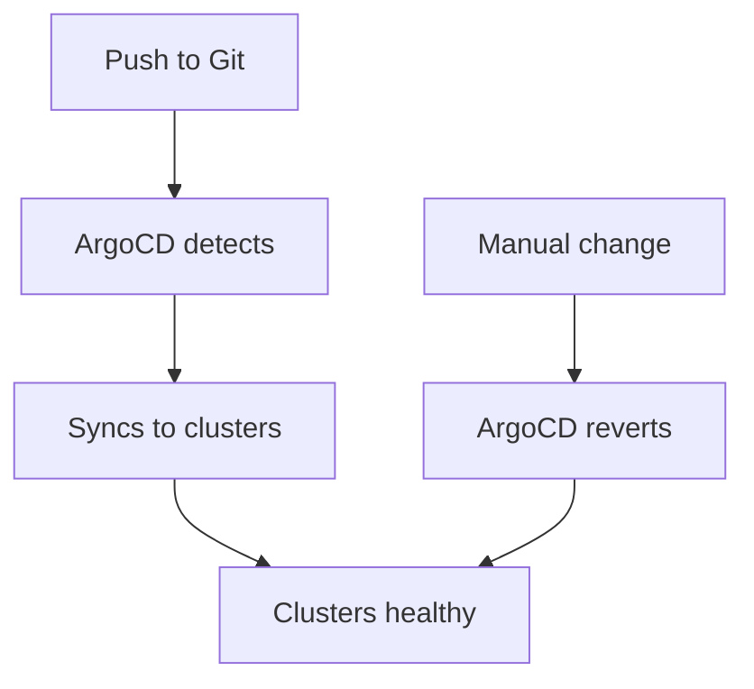

# How It Works

## The Bootstrap Process

The entire platform is bootstrapped through a series of `make` commands. Each one builds an artifact or configures part of the system.

This is NOT a single command. Each `make` target builds or uploads one piece of the platform.

## After Bootstrap — GitOps Flow

Once bootstrapped, the platform runs on autopilot:

## Self-Healing

If someone manually changes something on a cluster, ArgoCD detects the drift and reverts it. No manual intervention needed.

## Who Does What?

| Actor | Responsibility |
|---|---|
| **Platform Team** | Manages Git repo, runs initial bootstrap |
| **ArgoCD** | Keeps clusters in sync with Git |
| **RHACM** | Multi-cluster visibility and policies |
| **Keycloak** | User authentication and access control |
| **Vault** | Stores and delivers platform secrets |
| **Ansible Jobs** | Configures Keycloak, Vault, Gitea post-deploy |
