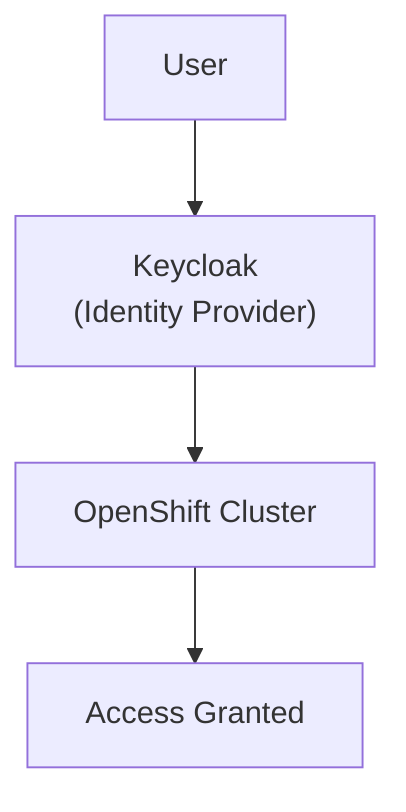
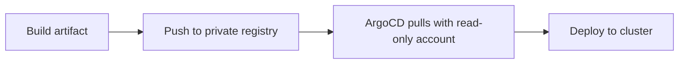

# Security Model

## How Access Works

Users authenticate through Keycloak, not directly to the cluster.

## Access Levels

| Group | What they can do | Where |
|---|---|---|
| `sovereign-admin` | Full cluster admin | Both clusters |
| Tenant users | Namespace-scoped access | Services cluster only |

## Secrets Management

| Secret Type | How it's stored | Who can access |
|---|---|---|
| Cluster credentials | Environment variables (operator's machine) | Platform team only |
| Keycloak client secrets | Kubernetes Secrets | Automated jobs only |
| Git tokens | Encrypted ArgoCD secrets | ArgoCD only |
| OCI registry tokens | Kubernetes Secrets | ArgoCD only |

### No-secrets-in-repo rule

Platform and component repositories enforce the same posture:

| Control | Requirement |
|---------|-------------|
| **AGENTS.md** | Every repo ships **`AGENTS.md`** documenting **Secret Management**: never commit credentials; use Vault and operators |
| **`.gitignore`** | Common secret filenames and env dumps are blocked by **shared `.gitignore` patterns** |
| **Runtime delivery** | All cluster secrets flow through **Vault** plus **ExternalSecret** / **PushSecret** — see [Platform secrets flow](../technical/18-secrets-flow.md) |

**No secrets are ever stored in Git.**

## Supply Chain Security

- All artifacts stored in **private** registries
- Push uses admin token (restricted access)
- Pull uses **read-only** robot account
- Base images from **certified** Red Hat sources
