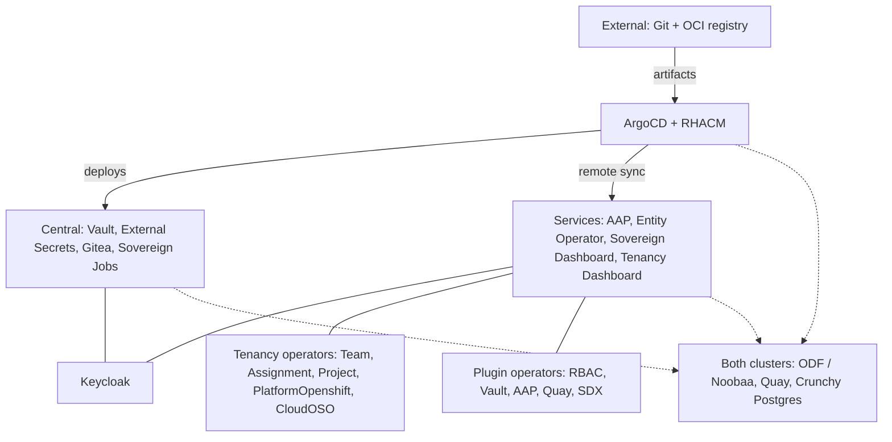
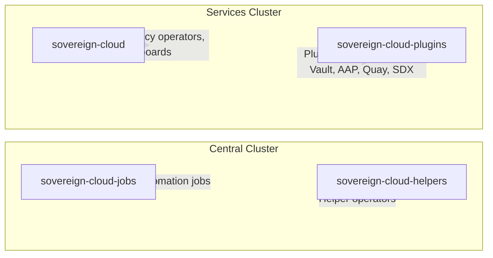
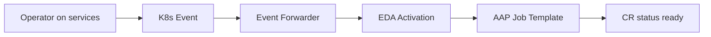

# Platform Components

## Component Map

The diagram keeps each **cluster role** as explicit nodes (≤15). Use the tables below for the full deployed list.

## Namespace Topology

## What Each Component Does

| Component | Description | Where |
|---|---|---|
| **ArgoCD** | GitOps engine — keeps clusters matching Git | Central |
| **RHACM** | Multi-cluster management and visibility | Central |
| **Keycloak (RHBK)** | Identity and access management (SSO) | Central & Services |
| **Vault** | Secrets management, encryption-as-a-service | Central |
| **External Secrets (ESO)** | Syncs secrets from Vault to Kubernetes | Central |
| **Gitea** | Self-hosted Git service | Central |
| **Sovereign Jobs** | Ansible automation for platform config | Central |
| **ACS (RHACS)** | Security scanning and compliance | **Disabled** |
| **AAP** | Ansible Automation Platform | Services |
| **ODF / Noobaa** | S3-compatible object storage for Quay | Both |
| **Quay** | Enterprise container image registry | Both |
| **Crunchy Postgres** | Production PostgreSQL operator | Both |
| **Entity Operator** | Tenant namespace provisioning from `Entity` CRs | Services |
| **Persona Operator** | `Persona` CR — decoupled RBAC persona bindings per role type (Spec 008) | Services |
| **Team Operator** | `Team` CR lifecycle and status from namespace context | Services |
| **Assignment Operator** | `Assignment` CR — links teams, projects, platforms | Services |
| **Project Operator** | `Project` CR lifecycle and status | Services |
| **PlatformOpenshift Operator** | `PlatformOpenshift` CR — surfaces platform cluster metadata | Services |
| **CloudOSO Operator** | `CloudOSO` CR — provisions **OSOHelper** on central; status includes **project** + **domain** (`domainId`, `domainName`) from helper | Services |
| **Sovereign Dashboard** | Entity workflows + **cluster-wide Overview** (CR health) + **Services** (Routes + live probes) | Services |
| **Tenancy Dashboard** | Tenancy + plugin CR UI (teams, assignments, Vault, AAP, Quay, RBAC) | Services |
| **Plugin RBAC** | Keycloak RBAC from `RbacConfig` / `Rbac` | Services |
| **Plugin Vault** | Per-entity Vault instances and KV from `Vault` / `VaultKV` | Services |
| **Plugin AAP** | AAP orgs and OIDC from `AAPConfig` / `AAPOrg` | Services |
| **Plugin Quay** | Quay orgs and OIDC from `QuayConfig` / `QuayOrg` | Services |
| **Plugin SDX** | Go controller (`plugin_sdx`) syncing all `hybridsovereign.redhat` CRs to Gitea `tenancy_repo` via `Iaac` CR status | Services |

## Persona Operator (Spec 008)

The Persona operator decouples RBAC role assignment from the Entity operator. Previously, `Entity.spec.namespaceRbac` listed Rbac CR names per role type; Persona CRs now declare each binding independently.

| Field | Purpose |
|-------|---------|
| `spec.type` | One of 14 role types (e.g., `entityAdmin`, `teamAdmin`, `assignmentAdmin`) |
| `spec.rbac` | Reference to an `Rbac` CR in the same entity namespace |

Reconciliation follows the EDA event pattern: the operator emits `PersonaCreateRequested`, EDA/AAP configures Keycloak groups and Kubernetes RoleBindings, then patches `status.ready`. See [Persona overview](008-persona-overview.md) and [Persona operator](../technical/45-persona-operator.md).

## Plugin SDX (`plugin_sdx`)

Plugin SDX is a **Go-based** controller (not EDA-driven) deployed in `sovereign-cloud-plugins`. It watches all tenancy and plugin CR kinds cluster-wide and maintains a synchronized copy in Gitea `tenancy_repo` on the central cluster.

- **Trigger:** `Iaac` CR reconcile (every 5 minutes) plus enqueue on any watched CR change
- **Output:** Stripped YAML at `{entity}/{Kind}/{name}.yaml` in Gitea
- **Status:** `Iaac.status` reports `ready`, `totalCRsSynced`, `syncedKinds`, `syncErrors`
- **Credentials:** Gitea admin token via Vault → ExternalSecret

See [Plugin SDX technical reference](../technical/25-plugin-iaac.md).

## EDA / AAP Architecture

Heavy automation runs outside operator pods via Event-Driven Ansible and AAP Controller job templates:

1. Operator validates CR, sets `status: reconciling`, emits typed Event
2. Event forwarder (services) POSTs to central Event Stream
3. EDA activation matches event reason + kind, calls `run_job_template`
4. AAP runs Ansible in an Execution Environment container
5. Role patches CR status with `ready` and `edaJobs` (AAP job URL)

**Coverage:** Entity, Team, Project, Persona, Assignment, PlatformOpenshift, CloudOSO, CloudAWS, and all plugin CR kinds. SDX syncs to Gitea separately. See [EDA overview](006-eda-overview.md) and [AAP job templates](../technical/48-aap-job-templates.md).

## Dashboard Stack

Two React/Node.js dashboards deploy to `sovereign-cloud` on the services cluster, both protected by `ose-oauth-proxy` and the logged-in user's OAuth token.

| Dashboard | Repo | Primary users | Key pages |
|-----------|------|---------------|-----------|
| **Sovereign Dashboard** | `user_dashboard/` | Platform admins | Overview (CR health), Services (route probes), Entity list/create |
| **Tenancy Dashboard** | `tenancy_dashboard/` | Tenant admins | Teams, Assignments, Projects, PlatformOpenshift, CloudOSO, Persona, plugin CRs |

Shared patterns: Material UI, force-reconcile annotation, EDA job link chips, entity namespace sidebar (`hybridsovereign.redhat/entity` label). See [Sovereign Dashboard](../technical/15-sovereign-dashboard.md) and [Tenancy Dashboard](../technical/20-tenancy-dashboard.md).

## Operator Placement Rules

| API Group | Cluster | Examples |
|---|---|---|
| `hybridsovereign.redhat` | **Services** | Entity, Persona, Team, Assignment, Project, PlatformOpenshift, CloudOSO, CloudAWS operators; `plugin_rbac`, `plugin_vault`, `plugin_aap`, `plugin_quay`, `plugin_sdx` |
| `helper.hybridsovereign.redhat` | **Central** | *(future additions)* |

## How Components Relate

1. **ArgoCD** reads from Git and deploys workloads to central and services (remote **Application** targets).
2. **RHACM** registers and monitors the services cluster from central.
3. **Keycloak** provides SSO for operators and dashboard users on both clusters.
4. **Vault** stores platform secrets; **External Secrets** materializes them into namespaces (including plugin admin credentials).
5. **External OCI / Quay** stores Helm charts and images consumed by ArgoCD and cluster pulls.
6. **ODF/Noobaa** backs object storage for **Quay**; **Crunchy Postgres** supports data services (Keycloak, AAP, Quay, and others).
7. **Sovereign Jobs** (central) post-configures Keycloak, Vault, and Gitea after GitOps rollout.
8. **Entity Operator** provisions entity namespaces from `Entity` CRs; tenancy operators enrich **Team**, **Project**, **Assignment**, and **PlatformOpenshift** status from namespace labels and cross-CR references (**Assignment**). **CloudOSO** additionally mirrors **project** and **domain** identifiers from **OSOHelper** on the central cluster ([Tenancy operators](../technical/24-tenancy-operators.md)).
9. **Sovereign Dashboard** focuses on entity workflows and adds **Overview** (cluster-wide CR health) and **Services** (Routes + health checks); **Tenancy Dashboard** covers tenancy CRs and Vault/AAP/Quay plugin resources with the user’s OAuth token.
10. **Persona operator** manages `Persona` CRs independently of Entity — each binds a role type to an `Rbac` CR; EDA provisions Keycloak groups and RoleBindings.
11. **Plugin operators** (RBAC, Vault, AAP, Quay, SDX) are cluster-scoped controllers in **sovereign-cloud-plugins** that reconcile entity-scoped CRs and shared `*Config` CRs in the plugins namespace. SDX (Go) watches all tenancy CRs cluster-wide and exports stripped YAML to Gitea — it does not use the EDA event path.
12. **EDA/AAP** on the central cluster executes all provisioning/teardown Ansible via job templates; operators on services emit events only.
