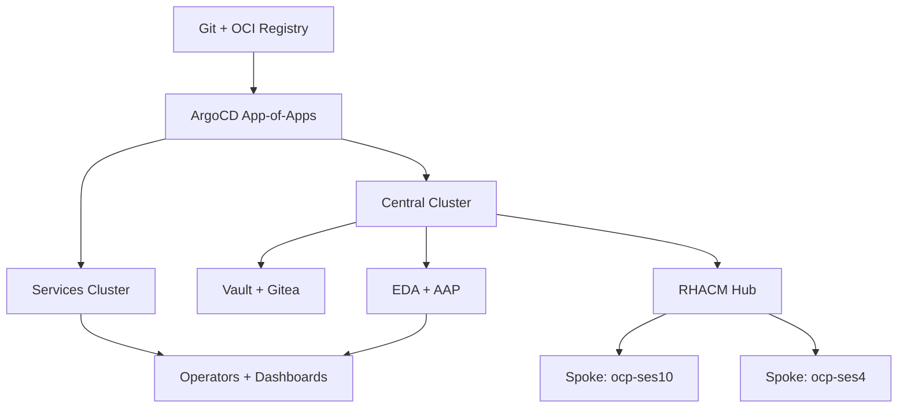
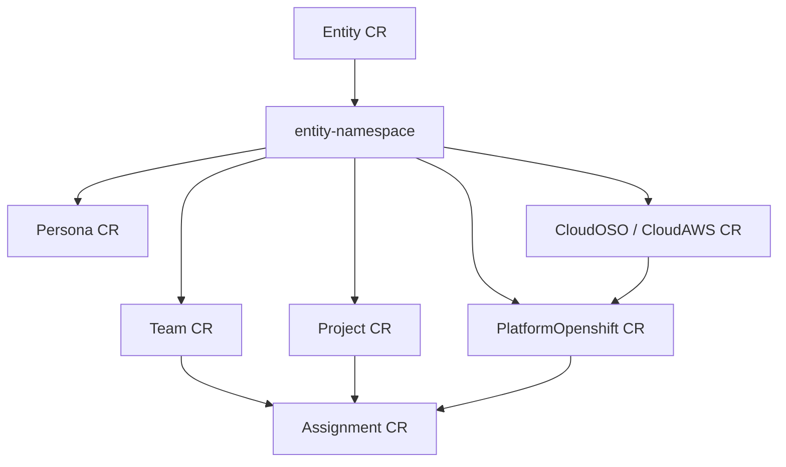
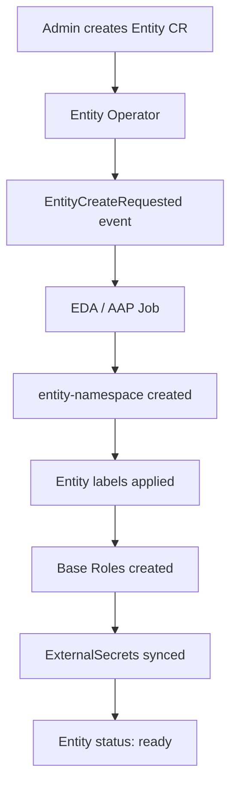
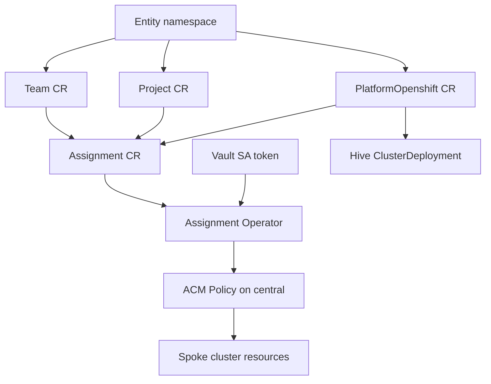
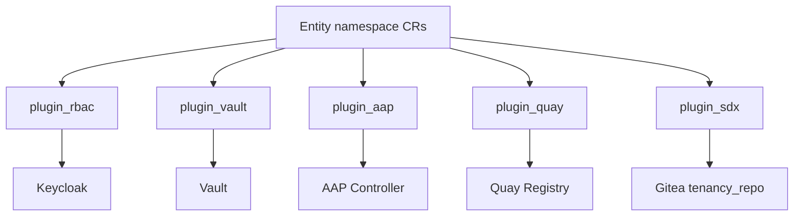

# Component Interaction Map — Hybrid Sovereign Cloud

**Audience:** Technical leadership, architects, onboarding engineers  
**Last updated:** 2026-06-16

This document provides five focused diagrams showing how Sovereign Cloud components connect. Each diagram stays within 15 nodes and omits styling so it renders consistently in any viewer.

---

## Diagram 1: Cluster Topology

The platform runs on two OpenShift clusters managed by a single central ArgoCD instance. The central cluster holds management tooling (ArgoCD, RHACM, Vault, Gitea, EDA/AAP). The services cluster runs tenant-facing operators, dashboards, and Keycloak. Both clusters share storage operators (ODF, Quay, Crunchy Postgres). Provisioned tenant clusters (spokes) register with RHACM on central.

---

## Diagram 2: Operator Placement and CR Dependency Graph

All `hybridsovereign.redhat` operators deploy to the **services cluster**. Helper operators (`helper.hybridsovereign.redhat`) on central are being decommissioned as part of Spec 008 — their logic moves into EDA roles. CR dependencies flow downward: an Entity creates the namespace foundation; Team, Project, and PlatformOpenshift CRs populate it; Assignment links them and drives spoke provisioning.

**Placement summary**

| Location | Components |
|----------|------------|
| Services — `sovereign-cloud` | Entity, Persona, Team, Assignment, Project, PlatformOpenshift, CloudOSO, CloudAWS, dashboards |
| Services — `sovereign-cloud-plugins` | plugin_rbac, plugin_vault, plugin_aap, plugin_quay, plugin_sdx |
| Central — `sovereign-cloud-jobs` | Ansible Jobs, EDA config, AAP controller config |
| Central — `aap` | AAP Controller, EDA controller |

---

## Diagram 3: Entity Lifecycle

Creating an Entity CR is the entry point for every tenant. The Entity operator emits an event; EDA/AAP creates the namespace, applies entity labels, sets up base RBAC scaffolding, and provisions ExternalSecrets for plugin credentials. Persona CRs (Spec 008) now handle per-role RoleBindings separately from Entity provisioning.

**Key status fields:** `status.entity` (namespace name), `status.openshiftConsoleURL`, `status.ready`

---

## Diagram 4: Tenant Data Flow

An Assignment CR is the culmination of the tenant journey. The Assignment operator reads Team, Project, and PlatformOpenshift CRs in the same entity namespace, resolves RBAC group references, renders the `sovereign-assignment` Helm chart, and posts an ACM ConfigurationPolicy to the central hub. RHACM enforces the policy on the target spoke cluster, creating namespaces, RBAC, optional Argo CD, and service mesh resources.

**Secret chain:** central ServiceAccount → PushSecret → Vault → ExternalSecret on services → Assignment operator reads token at reconcile time.

---

## Diagram 5: Plugin Operator Wiring

Plugin operators reconcile entity-scoped CRs against shared `*Config` CRs in `sovereign-cloud-plugins`. Each plugin integrates with a platform service: Keycloak for RBAC, Vault for secrets, AAP for automation orgs, Quay for registries. Plugin SDX (`plugin_sdx`) is a Go controller that watches all tenancy CRs cluster-wide and syncs stripped YAML to Gitea on central — it does not use the EDA event path.

---

## Related Documentation

| Topic | Document |
|-------|----------|
| Component catalogue | [04-components-overview.md](04-components-overview.md) |
| EDA architecture | [../technical/006-eda-architecture.md](../technical/006-eda-architecture.md) |
| Entity operator | [../technical/17-entity-operator.md](../technical/17-entity-operator.md) |
| Assignment operator | [../technical/12-assignment-operator.md](../technical/12-assignment-operator.md) |
| Persona operator | [../technical/45-persona-operator.md](../technical/45-persona-operator.md) |
| Plugin SDX | [../technical/25-plugin-iaac.md](../technical/25-plugin-iaac.md) |
| Leadership deck | [09-leadership-demo-deck.md](09-leadership-demo-deck.md) |
