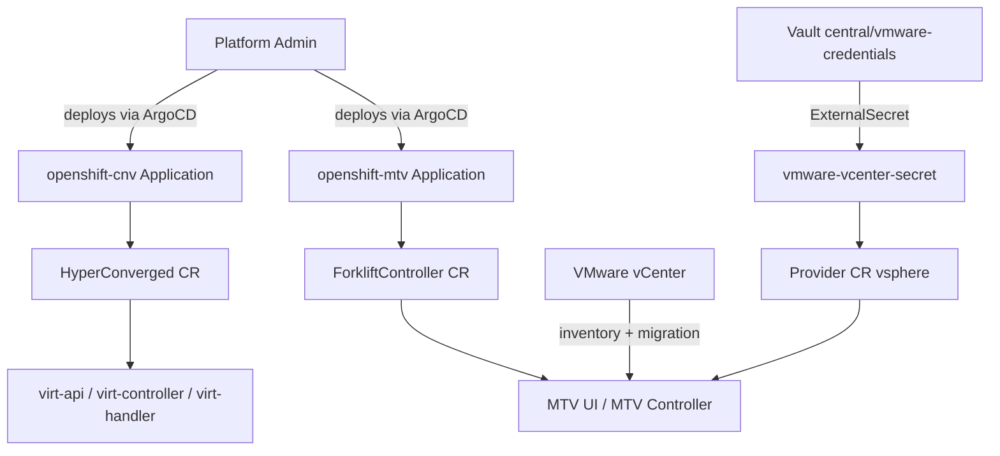

# OpenShift Virtualization and VMware Migration

## What It Is

OpenShift Virtualization (CNV) brings virtual machine workloads onto the OpenShift platform alongside containers. It uses the KubeVirt project to run VMs as native Kubernetes workloads. The Migration Toolkit for Virtualization (MTV) provides a path to migrate existing virtual machines from VMware vSphere into the platform.

## Why It Exists

Many organisations run critical workloads on VMware. Migrating these workloads to a cloud-native platform incrementally — VM by VM — reduces risk and avoids a "lift and shift" of the entire estate at once. CNV provides the landing zone; MTV provides the migration toolchain.

## How It Fits the Platform

## Key Concepts

- **CNV**: The OpenShift Virtualization operator installs KubeVirt. Once active, the platform can schedule and run VMs on worker nodes.
- **HyperConverged**: The single CR that drives CNV installation and configuration.
- **MTV**: The Migration Toolkit for Virtualization. Connects to VMware, imports VM definitions, converts disk images, and creates running VMs on CNV.
- **Provider**: An MTV resource representing a migration source. One Provider per vCenter.
- **Vault-backed credentials**: VMware vCenter credentials are never stored in Git. They flow from operator environment variables through the bootstrap process into Vault, then into the cluster via External Secrets Operator.
