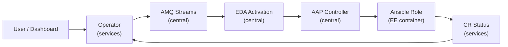

# Technical Reference: Platform EDA Architecture

**Feature**: 006 Platform EDA Rebuild  
**Audience**: Platform engineers, operator developers  
**Last updated**: 2026-07-14

---

## Overview

The Platform EDA rebuild moves heavy Ansible automation out of `hybridsovereign.redhat` operators on the services cluster and into Event-Driven Ansible (EDA) on the central cluster. Operators become lightweight event emitters; EDA dispatches provisioning to **AAP Controller job templates** running in per-operator Execution Environments.

**Cluster placement**:

| Component | Cluster | Namespace |
|-----------|---------|-----------|
| Operators (`hybridsovereign.redhat`) | Services | `sovereign-cloud`, `sovereign-cloud-plugins` |
| AMQ Streams Kafka | Central | `amq-streams` |
| AAP EDA controller | Central | `aap` |
| AAP Controller | Central | `aap` |
| AAP Controller (AAPOrg only) | Services | `aap` |
| AAP config-as-code Job | Central | `sovereign-cloud-jobs` |
| Global test suite | External runner | `global_tests/` |

---

## Event Flow

End-to-end path from a user action to completed automation:

1. **Trigger** — User creates/updates/deletes a CR, or clicks Refresh in the tenancy dashboard.
2. **Operator reconcile** — Operator validates prerequisites, sets `status: reconciling`, publishes event JSON to Kafka (`hybridsovereign-events`).
3. **EDA rulebook** — Central activation consumes from Kafka (`ansible.eda.kafka`), matches `reason` + `regarding.kind`, calls `run_job_template`.
4. **AAP job template** — AAP Controller launches a Job using the operator's Execution Environment and `eda.git` project.
5. **AAP role** — Executes Ansible logic; patches CR status at START (running) and END (ready/failed) with AAP job ID and URL.
6. **Operator completion** — Operator sees `observedGeneration` match and stops re-emitting; on delete, finalizer removes CR after `deletionComplete: true`.

Optional: operators may still emit K8s Events for `oc get events` debugging when `operator_emit_k8s_events` is enabled.

### Event Flow Diagram



---

## Event Contract

All operators emit `events.k8s.io/v1` Events following a shared contract. See [event-contract.md](../../../specs/006-platform-eda-rebuild/contracts/event-contract.md) for the full schema.

**Reason convention**:

| Pattern | Example | When |
|---------|---------|------|
| `<Kind>CreateRequested` | `EntityCreateRequested` | CR created or generation stale |
| `<Kind>DeleteRequested` | `EntityDeleteRequested` | CR has `deletionTimestamp` |
| `<Kind>ReconcileRequested` | `EntityReconcileRequested` | `reconcileNow` annotation set |

**Forwarder payload** (normalized JSON):

| Field | Purpose |
|-------|---------|
| `event_uid` | K8s Event metadata UID (dedup key) |
| `reason` | Rulebook filter target |
| `action` | `Create`, `Delete`, or `Reconcile` |
| `regarding` | CR apiVersion, kind, name, namespace, uid |
| `note` | JSON spec snapshot |
| `reportingController` | Operator name (e.g. `entity-operator`) |
| `timestamp` | ISO 8601 UTC |
| `cluster` | Source cluster identifier (`services`) |

---

## Event Forwarder Internals

Source: `eda/event-forwarder/src/forwarder.py`  
Chart: `bootstrap/helm/charts/event-forwarder/`

### Watch

- Uses `kubernetes.watch` on `EventsV1Api.list_event_for_all_namespaces`.
- Maintains `resource_version` from BOOKMARK events for efficient reconnect.
- Watch timeout: 300s; reconnects on disconnect or API error.

### Filter

Events must pass all checks:

- Namespace matches `entity-*` or `sovereign-cloud-plugins`.
- `reportingController` matches `*-operator` regex.
- `reason` matches `*Requested` suffix.

### Normalize

Maps K8s Event fields to the forwarder JSON contract. Timestamps converted to UTC `Z` suffix.

### POST

- `requests.post` to `EVENT_STREAM_URL` with `Authorization: Bearer <token>`.
- Token from ExternalSecret (`event-forwarder-token`), Vault path `central/event-forwarder`.

### Retry

- Up to 3 retries with 1s, 2s, 4s backoff.
- 30s HTTP timeout per attempt.
- Failed events logged; operator re-emits on `reconcileInterval` as backup.

### Dedup

- LRU cache (10,000 entries) keyed by Event metadata UID.
- Prevents duplicate POSTs when watch reconnects or Event is modified.

### Health

- HTTP server on port 8080 returns `OK` for liveness/readiness probes.

---

## Execution Environment Lifecycle

Each operator has a dedicated Execution Environment (EE) / Decision Environment (DE) image used by **both** the AAP Controller (for job templates) and the EDA Controller (for activations).

### Build

```text
eda/<operator>/
├── decision-environment.yml   # ansible-builder v3 definition
├── Makefile                   # make de-<operator>-build-push
├── rulebooks/                 # EDA rulebooks
└── roles/                     # Ansible roles (run by AAP via Gitea project)
```

**Entity EE definition** (`eda/entity/decision-environment.yml`):

- Base: `registry.redhat.io/ansible-automation-platform-25/de-minimal-rhel9:latest`
- Collections: `kubernetes.core`, `ansible.controller`
- Python: `kubernetes>=28.1.0`

### Push

`make -C eda/entity de-entity-build-push` builds and pushes to private Quay (`de-entity:<tag>`).

### Register

**EDA Controller** — the `eda-config` sovereign Job (`bootstrap/ansible/roles/eda-config/`) registers:

1. Decision Environments (`ansible.eda.decision_environment`)
2. Event Stream credential and stream (`ansible.eda.credential`, `ansible.eda.event_stream`)
3. EDA project pointing at rulebook Git repo (`ansible.eda.project`)
4. Rulebook activations per operator using `aap_resource_token` (`ansible.eda.rulebook_activation`)

Sync wave 32 in `bootstrap/helm/central/values.yaml` (`sovereignJobs.jobs.edaConfig`).

**AAP Controller** — the `aap-controller-config` sovereign Job (`bootstrap/ansible/roles/aap-controller-config/`) registers:

1. Execution Environments (same EE images as DEs)
2. Organisation, project, inventory, credentials
3. Job templates (24 total, 2 per operator) with `ask_variables_on_launch: true`

Sync wave 33 in `bootstrap/helm/central/values.yaml` (`sovereignJobs.jobs.aapControllerConfig`).

---

## Status Handshake Protocol

Operators and EDA share CR status fields per [operator-eda-handshake.md](../../../specs/006-platform-eda-rebuild/contracts/operator-eda-handshake.md).

### Create / Update

| Step | Actor | Action |
|------|-------|--------|
| 1 | Operator | `status: reconciling`, `ready: false`, `conditions[Ready]=AwaitingEDA` |
| 2 | Operator | Emit `<Kind>CreateRequested` Event |
| 3 | EDA | `run_job_template` → AAP launches job |
| 4 | AAP Role (START) | `status.edaJobs = [{jobId: <TOWER_JOB_ID>, url: <aap-url>, status: running}]` |
| 5 | AAP Role | Provision resources, write domain fields |
| 6 | AAP Role (END) | `status: ready`, `ready: true`, `observedGeneration: <generation>`, `edaJobs[0].status: success` |

### Delete

| Step | Actor | Action |
|------|-------|--------|
| 1 | Operator | `status: reconciling`, emit `<Kind>DeleteRequested` |
| 2 | EDA | `run_job_template` → AAP launches teardown job |
| 3 | AAP Role | Teardown external resources |
| 4 | AAP Role | `deletionComplete: true` |
| 5 | Operator | Finalizer exits; CR garbage collected |

### Forced Reconcile (Dashboard Refresh)

| Step | Actor | Action |
|------|-------|--------|
| 1 | Dashboard | PATCH `ansible.sdk.operatorframework.io/reconcileNow: "true"` |
| 2 | Operator | Detect via `watchAnnotationsChanges`, emit `<Kind>ReconcileRequested` |
| 3 | Operator | Clear annotation (set to null) |
| 4 | EDA | `run_job_template` → full status update as create flow |

### edaJobs Array (Single Entry)

`status.edaJobs` always holds **exactly one entry** — the most recent AAP job:

```json
{
  "edaJobs": [{
    "jobId": "247",
    "url": "https://sovereign-aap-controller-aap.apps.central.lab.example.com/execution/jobs/playbook/247/output",
    "status": "success",
    "timestamp": "2026-06-14T..."
  }]
}
```

The dashboard's `EdaJobsChips` component renders this as a clickable chip with the AAP job ID.

### Field Ownership

| Field | Owner |
|-------|-------|
| `status.status` | Operator → `reconciling`; AAP Role → `ready`/`failed` |
| `status.ready` | AAP Role only |
| `status.observedGeneration` | AAP Role only |
| `status.deletionComplete` | AAP Role only |
| `status.edaJobs` | AAP Role only (START and END callbacks) |
| Domain fields (e.g. `entity`, `groupId`) | AAP Role only |

### Operator Re-Emit Criteria

Operator re-emits when ALL of:

1. `status.status` is `pending` or `reconciling`
2. `observedGeneration < metadata.generation` (or absent)
3. OR `reconcileNow` annotation is set

---

## Cross-Cluster Access Pattern

EDA runs on central but must read and write CRs on services.

**Connection source**: Secret `argocd-cluster-services` in `openshift-gitops` namespace on central. This is the ArgoCD-registered services cluster connection.

**Extraction** (in every EDA provision/teardown role):

```yaml
services_bearer_token: >-
  {{ (argocd_cluster_secret.resources[0].data.config | b64decode | from_json).bearerToken }}
services_api_host: >-
  {{ (argocd_cluster_secret.resources[0].data.config | b64decode | from_json).server }}
```

**Module defaults**: `kubernetes.core.k8s` and `k8s_info` use `host` + `api_key` for cross-cluster calls.

**Security controls**:

- Token read with `no_log: true`
- Token never committed to Git
- Token rotates when ArgoCD cluster secret is refreshed
- EDA writes limited to CR status and owned resources

---

## Entity Example (Reference Implementation)

### Operator (`Entity/operator/roles/entity/tasks/main.yml`)

- Validates `description` and `billingID`
- Sets reconciling status with `AwaitingEDA` condition
- Emits `EntityCreateRequested` with spec JSON in `note`
- Skips when `observedGeneration >= generation` and `ready: true`

### Rulebook (`eda/rulebooks/entity-create.yml`)

```yaml
condition: >
  event.payload.reason == "EntityCreateRequested"
  and event.payload.regarding.kind == "Entity"
action:
  run_job_template:
    name: entity-provision
    organization: sovereign
    job_args:
      extra_vars:
        event_payload: "{{ event.payload }}"
```

### Provision Role (`eda/rulebooks/roles/entity_provision/`)

- Parses `event_payload` for CR name, namespace, spec
- Connects to services cluster via ArgoCD secret
- Patches CR status at START with `{status: reconciling, jobId: <TOWER_JOB_ID>}`
- Creates `entity-<name>` namespace with required labels
- Applies namespace RBAC roles
- Patches Entity CR status at END with `ready: true`, `observedGeneration`, AAP job URL

---

## Guarantees and Edge Cases

| Concern | Behavior |
|---------|----------|
| Delivery | Best-effort; operator re-emits on reconcile interval |
| Ordering | Not guaranteed; EDA actions must be idempotent |
| Dedup | Forwarder LRU + idempotent Ansible roles |
| Event TTL | K8s Events expire ~1 hour; forwarder must process within window |
| Connectivity loss | Forwarder retries; operator backup re-emit |

---

## Helper Merge (008-platform-persona-consolidation)

AWSHelper and OSOHelper operators have been merged into EDA roles. No more helper CRs are created; EDA roles execute the provisioning logic directly.

| Former Helper | Type | New EDA Location |
|--------------|------|-----------------|
| AWSHelper | environmentprep | `eda/cloudaws/roles/cloudaws_provision/tasks/aws_environmentprep.yml` |
| AWSHelper | clusterbuild | `eda/platformopenshift/roles/platformopenshift_provision/tasks/aws_clusterbuild*.yml` |
| OSOHelper | environmentprep | `eda/cloudoso/roles/cloudoso_provision/tasks/environmentprep.yml` |
| OSOHelper | clusterbuild | `eda/platformopenshift/roles/platformopenshift_provision/tasks/openstack_clusterbuild*.yml` |

## EDA Repository

**GitHub**: `git@github.com:hybrid-sovereign-cloud/eda.git` (migrated from Gitea)

Each CR type has its own directory with separate create/delete rulebook activations. See [EDA GitHub Migration](46-eda-github-migration.md) for details.

---

## Related Documentation

- [006 EDA Overview](../concepts/006-eda-overview.md) — non-technical summary
- [006 EDA Developer Guide](../tutorial/006-eda-developer-guide.md) — extending EDA for new operators
- [006 Hardening Check](../../hardeningcheck/006-platform-eda-rebuild.md) — CIS/NIST validation
- [Entity Operator](17-entity-operator.md) — Entity CR reference
- [Persona Operator](45-persona-operator.md) — Persona CR reference
- [EDA GitHub Migration](46-eda-github-migration.md) — EDA repo migration and helper merge
- [Secrets Flow](18-secrets-flow.md) — Vault and ExternalSecret patterns
- [AAP Job Templates](48-aap-job-templates.md) — Job template catalog and lifecycle
