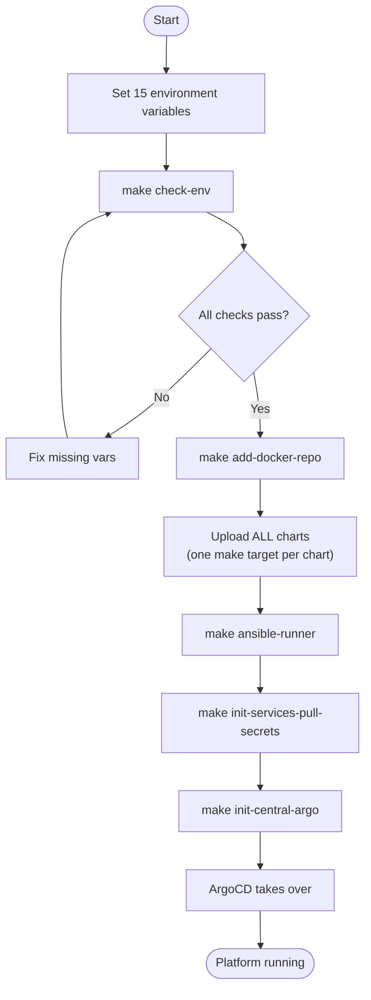
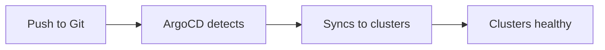

# Bootstrap Flow

## How to go from zero to a running platform

The bootstrap process involves multiple `make` targets that build artifacts
and deploy the platform. This is NOT a single-command operation.

## Step-by-step

### Step 1: Set environment variables

You need 15 variables covering:
- Login details for both clusters (central + services)
- OCI registry admin token and robot credentials
- Image registry credentials
- Git repository URL and token

### Step 2: `make check-env`

Validates all variables exist and tests connectivity to both clusters, OCI registry, and image registry.

### Step 3: `make add-docker-repo`

Configures both clusters to trust the image registry for pulling container images.

### Step 4: Upload all charts

Each platform component has its own chart and upload target. All must be uploaded before bootstrapping.

```mermaid
flowchart LR
    subgraph Charts["make upload-*-chart"]
        ACM["upload-acm-chart"]
        NS["upload-sovereign-<br/>namespaces-chart"]
        RHBK["upload-rhbk-chart"]
        ACS["upload-acs-chart"]
        VAULT["upload-vault-chart"]
        AAP["upload-aap-chart"]
        ODF["upload-odf-chart"]
        QUAY["upload-quay-chart"]
        CPG["upload-crunchy-<br/>postgres-chart"]
        GITEA["upload-gitea-chart"]
        ESO["upload-external-<br/>secrets-chart"]
        VSS["upload-vault-<br/>secret-store-chart"]
        AJ["upload-ansible-<br/>job-chart"]
    end
    Charts --> OCI["OCI Registry<br/>(Quay)"]
```

### Step 5: `make ansible-runner`

Builds and pushes the Ansible execution environment container image used by platform automation jobs.

### Step 6: `make init-services-pull-secrets`

Creates `quay-pull-secret` in `sovereign-cloud` and `sovereign-cloud-plugins` namespaces on the services cluster. Required before Entity Operator and Dashboard can pull images.

### Step 7: `make init-central-argo`

The final bootstrap command:
1. Logs in to the central cluster
2. Deploys the init chart (`helm/init`) with all credentials
3. Creates the ApplicationSet which generates the app-of-apps
4. ArgoCD takes over — all components deploy automatically

## What happens after bootstrap

After bootstrap, you change Git. ArgoCD handles the rest.

## Complete make target reference

### Check and Prepare
| Target | Purpose |
|---|---|
| `make check-env` | Verify env vars + test logins |
| `make add-docker-repo` | Trust image registry on both clusters |

### Build Artifacts (charts)
| Target | Chart | Purpose |
|---|---|---|
| `make upload-acm-chart` | rhacm | RHACM operator |
| `make upload-sovereign-namespaces-chart` | sovereign-namespaces | Platform namespaces |
| `make upload-rhbk-chart` | rhbk | Keycloak operator + instance |
| `make upload-rhbk-config-chart` | rhbk-config | Keycloak Ansible config |
| `make upload-acs-chart` | acs | ACS operator + Central |
| `make upload-vault-chart` | vault | HashiCorp Vault |
| `make upload-aap-chart` | aap | Ansible Automation Platform |
| `make upload-odf-chart` | odf | ODF / Noobaa storage |
| `make upload-quay-chart` | quay | Red Hat Quay registry |
| `make upload-crunchy-postgres-chart` | crunchy-postgres | Crunchy Postgres for Kubernetes |
| `make upload-gitea-chart` | gitea | Gitea Git service |
| `make upload-external-secrets-chart` | external-secrets | External Secrets Operator |
| `make upload-ansible-job-chart` | ansible-job | Generic Ansible job runner |
| `make upload-vault-secret-store-chart` | vault-secret-store | Vault ClusterSecretStore |

### Build Artifacts (images)
| Target | Purpose |
|---|---|
| `make ansible-runner` | Build + push ansible-runner image |

### Bootstrap
| Target | Purpose |
|---|---|
| `make init-services-pull-secrets` | Create OCI pull secrets on services cluster |
| `make init-central-argo` | Deploy init chart, trigger app-of-apps |
