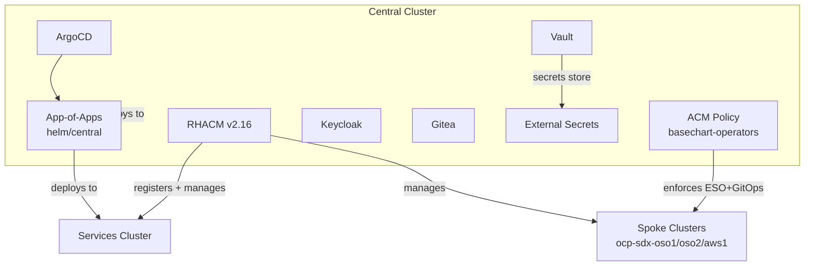

# Central Cluster

## What runs here

The central cluster is the management plane. It runs the tools that manage both clusters.

## Namespaces

| Namespace | Purpose |
|---|---|
| `sovereign-cloud-jobs` | Ansible automation jobs (vault-init, keycloak, gitea) |
| `sovereign-cloud-helpers` | Helper operators (`helper.hybridsovereign.redhat`) |
| `openshift-gitops` | ArgoCD; also hosts ACM policies (basechart, spoke-eso) |

## Components

### ArgoCD (OpenShift GitOps)

- Watches the Git repository for changes
- Deploys Helm charts to both clusters
- Self-heals: if someone changes something manually, ArgoCD reverts it
- Prunes: if something is removed from Git, ArgoCD removes it from the cluster

### ApplicationSet

- Generates the `sovereign-central-apps` Application (app-of-apps)
- Points to `helm/central` which contains ALL ArgoCD Applications
- Services cluster apps use `destination.server` targeting the services cluster URL
- There is NO separate `helm/services` directory

### RHACM (Red Hat Advanced Cluster Management) v2.16

- Installed via OLM Subscription from `redhat-operators` catalog
- OperatorGroup in SingleNamespace mode (`open-cluster-management`)
- MultiClusterHub with components: console, search, cluster-lifecycle
- Registers the services cluster as a managed cluster

## Central-Only Components

| Component | Namespace | Purpose |
|-----------|-----------|---------|
| ArgoCD | `openshift-gitops` | GitOps engine for both clusters |
| RHACM | `open-cluster-management` | Multi-cluster management |
| Vault | `vault` | Secrets management |
| Gitea | `gitea` | Self-hosted Git service |
| External Secrets | `external-secrets` | Vault-to-K8s secret sync |
| Vault SecretStore | cluster-scoped | ClusterSecretStore to Vault |
| Sovereign Jobs | `sovereign-cloud-jobs` | Ansible automation jobs |

## Deployment Order

The RHACM deployment is two-phase due to CRD dependency:

1. **Phase 1**: Namespace + OperatorGroup + Subscription deploy (operator installs, CRD registers)
2. **Phase 2**: MultiClusterHub CR deploys (requires CRD from Phase 1)

This is controlled by `enableMultiClusterHub` in the central values.

## Sync Policy

All Applications on this cluster use:

| Setting | Value | Why |
|---|---|---|
| `selfHeal` | `true` | Auto-revert manual changes |
| `prune` | `true` | Remove resources deleted from Git |
| `CreateNamespace` | `true` | Auto-create namespaces |
| `ServerSideApply` | `true` | Avoid conflicts with large CRDs |
| `SkipDryRunOnMissingResource` | `true` | Handle CRD ordering |
