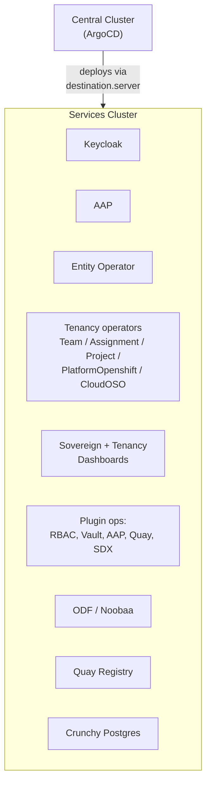

# Services Cluster

## What runs here

The services cluster runs the actual platform workloads and all `hybridsovereign.redhat` operators. It doesn't manage itself — the central cluster manages it via ArgoCD and RHACM.

## Namespaces

| Namespace | Purpose |
|---|---|
| `sovereign-cloud` | Entity Operator, Sovereign Dashboard, Tenancy Dashboard, tenancy operators |
| `sovereign-cloud-plugins` | Plugin operators (`plugin_rbac`, `plugin_vault`, `plugin_aap`, `plugin_quay`, `plugin_sdx`) |

These namespaces are **not** deployed on the central cluster anymore. They were removed there so they exist only on the services cluster.

## How it gets managed

1. ArgoCD on central cluster creates Applications with `destination.server` pointing to the services cluster URL
2. The services cluster is registered with ArgoCD via a cluster secret (created by `helm/init`)
3. ArgoCD deploys and syncs workloads remotely
4. There is NO ArgoCD ApplicationSet or Application on the services cluster

## Components Deployed Here

| Component | Namespace | Purpose |
|-----------|-----------|---------|
| Keycloak (RHBK) | `rhbk` | Tenant identity and access management |
| AAP | `aap` | Ansible Automation Platform |
| Entity Operator | `sovereign-cloud` | Tenant namespace provisioning from Entity CRs |
| Team Operator | `sovereign-cloud` | Team CR management |
| Assignment Operator | `sovereign-cloud` | Assignment CR management (links Teams, Projects, Platforms) |
| Project Operator | `sovereign-cloud` | Project CR management |
| PlatformOpenshift Operator | `sovereign-cloud` | PlatformOpenshift CR management |
| CloudOSO Operator | `sovereign-cloud` | CloudOSO CR management |
| Sovereign Dashboard | `sovereign-cloud` | Entity management UI with OpenShift OAuth |
| Tenancy Dashboard | `sovereign-cloud` | Tenancy + plugin CR UI; user OAuth token to Kubernetes API |
| Plugin RBAC | `sovereign-cloud-plugins` | Keycloak OIDC clients and groups from `RbacConfig` / `Rbac` |
| Plugin Vault | `sovereign-cloud-plugins` | Vault instance provisioning per entity |
| Plugin AAP | `sovereign-cloud-plugins` | AAP organization management per entity |
| Plugin Quay | `sovereign-cloud-plugins` | Quay organization management per entity |
| Plugin SDX | `sovereign-cloud-plugins` | CR-to-Gitea sync for all `hybridsovereign.redhat` CRs |
| ODF / Noobaa | `openshift-storage` | Object storage for Quay |
| Quay | `quay-enterprise` | Container image registry |
| Crunchy Postgres | `openshift-operators` | PostgreSQL operator |

## Operator Placement Rules

| API Group | Must Deploy Here | Examples |
|---|---|---|
| `hybridsovereign.redhat` | **Yes** | Entity Operator; Team, Assignment, Project, PlatformOpenshift, CloudOSO; `plugin_rbac`, `plugin_vault`, `plugin_aap`, `plugin_quay`, `plugin_sdx` |
| `helper.hybridsovereign.redhat` | **No** (central only) | *(future)* |

## Connection to Central

| How | Detail |
|---|---|
| Registered via | ArgoCD cluster secret (created by `helm/init`) |
| Managed by | RHACM MultiClusterHub on central |
| Synced by | Central ArgoCD Applications with `destination.server` |

## NON-NEGOTIABLE Restrictions

1. **NO** ApplicationSet on the services cluster
2. **NO** Application on the services cluster
3. **NO** RHACM on the services cluster
4. All management goes through central ArgoCD
