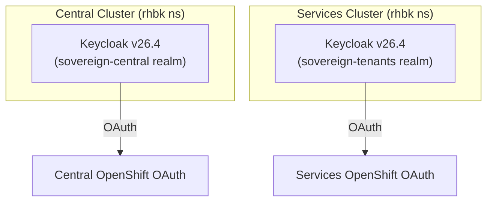
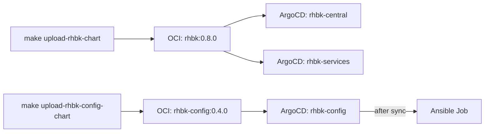

# Keycloak (Red Hat Build of Keycloak)

## What it does

Keycloak provides identity and access management (IAM) for the platform. It runs on both clusters in HA mode within the dedicated `rhbk` namespace.

## Namespace

All Keycloak resources (operator, instances, secrets) live in the `rhbk` namespace on both clusters.

## Realms

| Realm | Cluster | Purpose |
|---|---|---|
| `sovereign-central` | Central | Admin access to central cluster |
| `sovereign-tenants` | Services | Tenant access to services cluster |

## Clients

| Client | Realm | Role |
|---|---|---|
| `sovereign-central` | sovereign-central | Service account, OAuth for central cluster |
| `sovereign-tenants-services` | sovereign-tenants | Service account, OAuth for services cluster |

## Deployment

- **Namespace:** `rhbk` (dedicated)
- **Operator:** `rhbk-operator` (channel `stable-v26.4`, OLM Subscription)
- **HA mode:** 2 instances per cluster
- **Dev mode:** HTTP enabled, embedded H2 database (production: external PostgreSQL + TLS)
- **Charts:**
  - `rhbk` (v0.10.0) — operator + Keycloak instance
  - `rhbk-config` (v0.4.0) — Ansible configuration job

## OAuth integration

The `keycloak-oauth` Ansible role configures OpenShift OAuth to use Keycloak as an identity provider. For the services cluster, the route certificate is signed by the ingress operator CA. The role:

1. Reads the ingress CA from `default-ingress-cert` ConfigMap in `openshift-config-managed`
2. Creates a `keycloak-services-ca` ConfigMap in `openshift-config`
3. References it via `ca.name` in the OAuth OpenID provider spec

This prevents `x509: certificate signed by unknown authority` errors.

## Ansible Configuration Pipeline

The `rhbk-config` chart deploys a Kubernetes Job that:

1. Obtains admin token from Keycloak master realm
2. Creates `sovereign-central` realm (idempotent)
3. Creates `sovereign-central` client with service account

The Ansible runner image is built from `bootstrap/ansible/imagebuild/ansiblerunner/Containerfile` and includes:
- The playbook at `/runner/project/configure-keycloak.yml`
- All roles at `/runner/project/roles/`
- Keycloak, Kubernetes, and OpenShift CLI tools

## Chart Split Architecture

