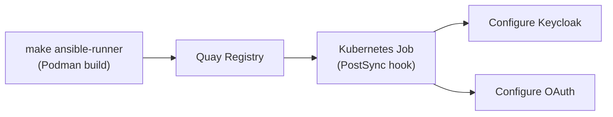

# Ansible Execution Environment

## What it is

A container image (`ansible-runner`) that contains all Ansible collections and CLI tools needed to configure the platform.



## Base Image

`registry.redhat.io/ansible-automation-platform-26/ee-supported-rhel9:2.0-1777391447`

## Installed Collections

| Collection | Purpose |
|---|---|
| `infra.aap_configuration` | AAP configuration |
| `community.aws` | AWS automation |
| `openstack.cloud` | OpenStack automation |
| `middleware_automation.keycloak` | Keycloak realm/client management |
| `community.general` | General utilities |
| `kubernetes.core` | Kubernetes/OpenShift API operations |

## Installed CLIs

| CLI | Purpose |
|---|---|
| `oc` / `kubectl` | OpenShift/Kubernetes operations |
| `openstack` | OpenStack CLI |
| `helm` | Helm chart management |

## Build and Push

```bash
make ansible-runner
```

This:
1. Creates the Quay repository (if needed)
2. Logs in to the image registry
3. Builds the container with Podman
4. Pushes to `quay.example.com/hybrid-sovereign/ansible-runner:latest`
