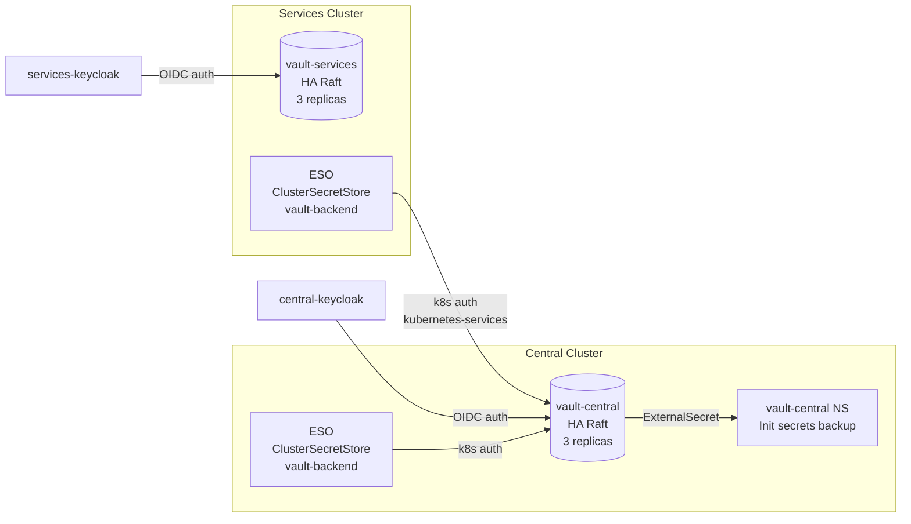

# HashiCorp Vault

## Overview

Vault provides secrets management, encryption-as-a-service, and PKI for the Sovereign Cloud platform. Two Vault clusters are deployed: `vault-central` (central cluster) and `vault-services` (services cluster).

## Deployment

| Component | Cluster | Namespace | Mode |
|-----------|---------|-----------|------|
| vault-central | Central | `vault` | HA Raft (3 replicas) |
| vault-services | Services | `vault` | HA Raft (3 replicas) |
| vault-central-namespace | Central | `vault-central` | Init secret backup |

### vault-central (Primary)

All platform secrets live in `vault-central`. It is the single source of truth for:
- OCI registry credentials
- Keycloak admin credentials (central + services)
- Vault init keys for both vaults
- Dashboard OAuth secrets
- Gitea admin credentials
- Keycloak client secrets

### vault-services (Tenant)

`vault-services` is used by the Plugin Vault operator to provision dedicated Vault instances per tenant. It does NOT store platform-level secrets.

## Chart: `bootstrap/helm/charts/vault`

Wraps the upstream HashiCorp Vault Helm chart with OpenShift overrides:
- `global.openshift: true`
- HA Raft mode, 3 replicas
- Images mirrored to `quay.example.com/hybrid-sovereign/`
- OpenShift Route (TLS edge termination)
- UI + Agent Injector enabled



## Authentication Methods

### Kubernetes Auth (for External Secrets Operator)

Two Kubernetes auth mounts are configured on `vault-central`:

| Mount | Cluster | Purpose |
|-------|---------|---------|
| `kubernetes-central` | Central | ESO SA token review (central cluster) |
| `kubernetes-services` | Services | ESO SA token review (services cluster) |

The ESO ServiceAccount `external-secrets-vault-sa` in the `external-secrets` namespace is bound to the `external-secrets-policy` role (read on `central/*`) on both mounts.

**Setup:** Configured by the `vaultK8sAuth` Ansible job at sync wave 26, after vault initialization.

### OIDC Auth (for human access)

| Vault | OIDC Provider | Realm | Admin Group |
|-------|---------------|-------|-------------|
| vault-central | central-keycloak | `sovereign-central` | `sovereign-admin` |
| vault-services | services-keycloak | `sovereign-tenants` | `sovereign-admin` |

The `sovereign-admin` Keycloak group maps to the `sovereign-admin-policy` (full access) on both vaults.

**Setup:** Configured by the `vaultOidcAuth` Ansible job at sync wave 29.

### Token Auth (init-only)

The Vault root token is used **only** during initialization (vault-init job, wave 23). After k8s auth is configured (wave 26), the root token should not be used for routine operations.

**Deviation from best practice:** Root token is stored in k8s Secret `vault-init-secrets` for the vault-kv job at wave 24 and backup in `vault-central` namespace. Future improvement: use short-lived root token and revoke after init.

## KV Engines

| Path | Purpose |
|------|---------|
| `central/` | Platform secrets (all components) |

Key vault paths under `central/data/`:

| Path | Contents |
|------|----------|
| `vault-init` | root_token, unseal_keys for vault-central |
| `vault-services-init` | root_token, unseal_keys for vault-services |
| `rhbk-central-admin` | Keycloak central admin credentials |
| `rhbk-services-admin` | Keycloak services admin credentials |
| `keycloak-clients` | OAuth client secrets (vault, gitea, quay-central, openshift-central) |
| `oci-credentials` | OCI registry robot credentials |
| `gitea-admin` | Gitea admin user/password/token |
| `osohelper-creator-sa` | OSOHelper cross-cluster SA token |
| `dashboard-oauth` | Sovereign Dashboard OAuth cookie + client secrets |
| `tenancy-dashboard-oauth` | Tenancy Dashboard OAuth cookie + client secrets |
| `vault-services-client` | Vault OIDC client for services keycloak |
| `aap-admin` | AAP admin credentials |
| `quay-admin` | Quay admin credentials |

## Initialization Sequence

```
Wave 15: vault-central deployed (HA Raft, uninitialized)
Wave 15: vault-services deployed (HA Raft, uninitialized)
Wave 20: vault-services-init job (initializes vault-services, stores keys in vault-central NS)
Wave 23: vault-init job (initializes vault-central, stores keys in vault-init-secrets)
Wave 24: vault-kv job (enables KV v2 engine at central/)
Wave 25: deliver-vault-token job (creates vault-central-token on services cluster)
Wave 26: vault-k8s-auth job (enables kubernetes auth on both vaults, creates ESO roles/policies)
Wave 29: vault-oidc-auth job (enables OIDC auth with Keycloak on both vaults)
```

## ClusterSecretStore

Two `ClusterSecretStore` resources named `vault-backend` (one per cluster) connect ESO to vault-central using k8s auth:

| Cluster | Chart | Auth Mount | SA |
|---------|-------|------------|----|
| Central | vault-secret-store v0.3.0 | `kubernetes-central` | `external-secrets-vault-sa` |
| Services | vault-secret-store v0.3.0 | `kubernetes-services` | `external-secrets-vault-sa` |

## vault-central Namespace

A dedicated `vault-central` namespace stores backup copies of init secrets:
- `vault-init-secrets-copy` — vault-central root token + unseal keys
- `vault-services-init-secrets-copy` — vault-services root token + unseal keys

These are delivered via ExternalSecret from vault-central KV. They provide a cluster-native fallback reference without requiring vault CLI access.

## Ansible Roles

| Role | Purpose |
|------|---------|
| `vault-init` | Initialize + unseal vault-central, store keys |
| `vault-kv` | Create KV v2 engine `central/` |
| `vault-k8s-auth` | Enable kubernetes auth mounts, create ESO policy + role |
| `vault-oidc-auth` | Enable OIDC auth with Keycloak on both vaults |
| `deliver-vault-token` | Create vault-central-token secret on services cluster |
