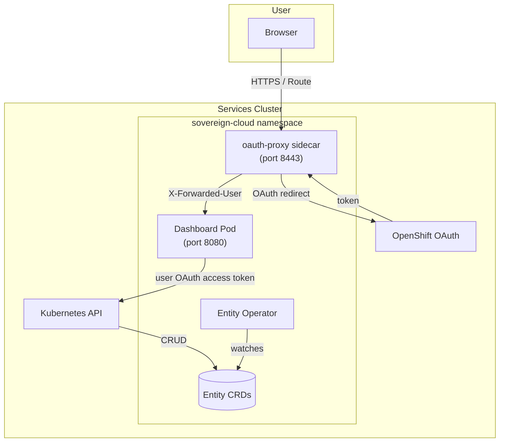

# Sovereign Cloud Dashboard

## Overview

The Sovereign Cloud Dashboard is a React/Node.js web application that provides a management interface for tenant entities in the Hybrid Sovereign Cloud platform. It authenticates users via OpenShift OAuth (oauth-proxy sidecar) and communicates with the Kubernetes API to manage `Entity` custom resources.

## Deployment

| Property | Value |
|---|---|
| Cluster | **Services** (deployed by central ArgoCD) |
| Namespace | `sovereign-cloud` (on services cluster) |
| Chart | `user_dashboard/helm/charts/dashboard` |
| OCI location | `oci://quay.example.com/hybrid-sovereign/sovereign-cloud-dashboard` |
| Make target | `make upload-chart` (from `user_dashboard/`) |
| ArgoCD App | `sovereign-cloud-dashboard` |

## Technology Stack

| Layer | Technology |
|---|---|
| Frontend | React 19, Material UI 9, Vite 8 |
| Backend | Node.js (Express 5) |
| Auth | OpenShift OAuth via `ose-oauth-proxy` sidecar |
| API | Kubernetes API (Entity CRD) using the logged-in user's OAuth access token |
| Security | Helmet.js, express-rate-limit, CSP, HSTS |
| Container | UBI9 Node.js 20 (multi-stage build) |
| Deployment | Helm chart, ArgoCD Application |
| Registry | Quay (OCI) |

## Architecture



## Authentication Flow

1. User navigates to the dashboard Route
2. `oauth-proxy` sidecar intercepts the request
3. If unauthenticated, proxy redirects to OpenShift OAuth server
4. User authenticates with OpenShift credentials
5. OAuth server redirects back; proxy validates the token
6. Proxy forwards request to Express backend with `X-Forwarded-User` and `X-Forwarded-Email` headers
7. The backend obtains the user's OAuth access token (via the OAuth proxy session) and uses it for all Kubernetes API calls
8. OpenShift RBAC evaluates that user identity on each API request (no static ServiceAccount token for user-driven API access)

## Configuration

The server targets the services-cluster Kubernetes API using the **`OCP_SERVICES_SERVER`** environment variable. Earlier deployments used `OCP_CENTRAL_SERVER`; that variable is no longer used for this dashboard.

## Security Hardening

| Control | Implementation |
|---|---|
| TLS | Route with `reencrypt` termination; serving cert auto-provisioned |
| Auth proxy | `ose-oauth-proxy` with `--cookie-secure`, `--cookie-httponly`, `--cookie-samesite=Strict` |
| HTTP headers | Helmet.js: CSP, HSTS, X-Frame-Options, Referrer-Policy, Permissions-Policy |
| Rate limiting | `express-rate-limit` on API endpoints |
| Input validation | Server-side validation for Entity name, billingID, description, websiteLink |
| Body limits | JSON body limited to 16KB |

## Pages

### Overview (`/overview`)

Cluster-wide **custom resource health** view (**no entity namespace filter**):

- **Donut chart** summarizing aggregate readiness across tracked kinds
- **Per-kind status tables** for quick scanning of failing or stale objects
- **Reconciliation alerts** highlighting recent errors or stalled controllers

Use this page for platform operators who need visibility across all Hybrid Sovereign CRs on the services cluster.

### Services (`/services`)

Lists **OpenShift Routes** relevant to the platform (discovery via Kubernetes API). Each route row runs **live health checks** (HTTP reachability against the route URL or configured probe target) so teams see green/red signal without opening the console.

### Entity List (`/entities`)

- Lists all `Entity` CRs from the `sovereign-cloud` namespace
- Collapsed view: name, namespace chip, billing ID
- Expanded view: full status fields, console URL link
- Delete button with confirmation dialog

### Entity Create (`/entities/create`)

- Form with client-side and server-side validation
- Fields: name, description (multiline), billingID, websiteLink
- Name: lowercase alphanumeric with hyphens
- BillingID: alphanumeric with `._-`, max 63 chars

## Directory Structure

```
user_dashboard/
├── hardeningchecks/     # Security hardening checks
├── helm/
│   └── charts/
│       ├── app/         # ArgoCD Application chart
│       └── dashboard/   # Dashboard Helm chart
├── make/                # Makefile modules
│   ├── build-dashboard.mk
│   ├── deploy-application.mk
│   └── upload-chart.mk
├── ui/
│   ├── src/             # React frontend
│   │   ├── components/  # Layout, sidebar
│   │   ├── pages/       # EntityList, EntityCreate
│   │   ├── services/    # API client (axios)
│   │   └── theme/       # Material UI theme (PatternFly palette)
│   ├── server/          # Express backend + K8s API proxy
│   ├── Dockerfile
│   └── package.json
├── Makefile
└── AGENTS.md
```
