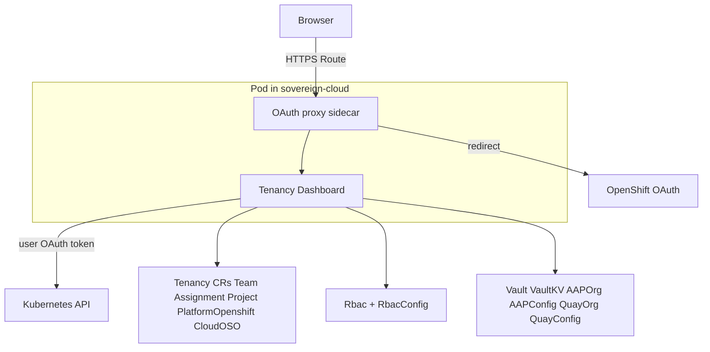

# Tenancy Dashboard

## Overview

The Tenancy Dashboard is a web UI on the services cluster. It drives tenancy and plugin custom resources using the **signed-in user’s OpenShift OAuth token** (no static ServiceAccount for user-facing API calls): `Team`, `Assignment`, `Project`, `PlatformOpenshift`, `CloudOSO`, `Rbac`, `RbacConfig`, `Vault`, `VaultKV`, `AAPOrg`, `AAPConfig`, `QuayOrg`, and `QuayConfig`.

## Deployment

| Property | Value |
|---|---|
| Cluster | **Services** (deployed by central ArgoCD) |
| Namespace | `sovereign-cloud` |
| Chart | `tenancy_dashboard/helm/charts/dashboard` |
| OCI location | `oci://quay.example.com/hybrid-sovereign/tenancy-dashboard` |
| Current chart version | 0.9.8 |
| Current image tag | 3.3.0 |

## Technology stack

| Layer | Technology |
|---|---|
| Frontend | React with MUI (Material UI) |
| Backend | Node.js (Express) |
| Auth | OpenShift OAuth via `ose-oauth-proxy` sidecar |
| Theme | Red Hat red palette (`#CC0000` primary) |

## Features

- **CRUD** for `Team`, `Assignment`, `Project`, `PlatformOpenshift`, and `CloudOSO`
- **Vault / AAP / Quay**: create and manage `Vault`, `VaultKV`, `AAPOrg`, `QuayOrg` against plugin configs; coordinate with [Plugin Vault](./21-plugin-vault.md), [Plugin AAP](./22-plugin-aap.md), [Plugin Quay](./23-plugin-quay.md)
- **RBAC**: list/create `Rbac` resources; `RbacConfig` picker from `sovereign-cloud-plugins`
- **YAML view** for resources; **Assignment** inline edit
- **Resource detail** pages with tabbed sections (overview, status, related objects)
- **Overview hub** (entity-scoped): **donut chart** and resource health for accessible namespaces — for **cluster-wide** CR health (no entity filter), use [Sovereign Cloud Dashboard](./15-sovereign-dashboard.md) → **Overview**
- **Searchable sidebar** for quick navigation
- Shared UX: **StatusBadge**, **EmptyState**, **CopyButton**

## Kubernetes API access

The server uses the **logged-in user's OAuth access token** for calls to the Kubernetes API. The creator’s username is captured from the `X-Forwarded-User` header and annotated on created resources where applicable.

## Entity namespaces

Namespaces with the label `hybridsovereign.redhat/entity` scope the UI. A searchable sidebar and dropdowns refresh from the API when opened.

## Architecture

## Related docs

- [Sovereign Cloud Dashboard](./15-sovereign-dashboard.md) — entity-focused UI
- [Plugin RBAC](./19-plugin-rbac.md)
- [Plugin Vault](./21-plugin-vault.md)
- [Plugin AAP](./22-plugin-aap.md)
- [Plugin Quay](./23-plugin-quay.md)
- [Tenancy operators](./24-tenancy-operators.md)
