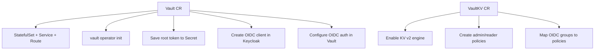

# Plugin Vault Operator

## Overview

The Plugin Vault Operator (`plugin_vault`) manages dedicated HashiCorp Vault instances and KV secrets engines for tenant entities in the Hybrid Sovereign Cloud platform. Each Vault instance is scoped to a single entity namespace, providing cryptographic isolation between tenants.

## Custom Resources

### Vault (`vaults.hybridsovereign.redhat`)

Deploys a dedicated Vault instance in an entity namespace.

| Field | Description |
|-------|-------------|
| `spec.ha` | Deploy in HA mode (default: true) |
| `spec.rbacConfig` | Reference to an RbacConfig in sovereign-cloud-plugins |
| `status.vaultUrl` | External route URL |
| `status.vaultInternalUrl` | In-cluster service URL |
| `status.adminSecretName` | Secret containing root token and unseal keys |
| `status.oidcClientId` | OIDC client registered in Keycloak |
| `status.entity` | Entity this Vault belongs to |

### VaultKV (`vaultkvs.hybridsovereign.redhat`)

Creates a KV v2 secrets engine with RBAC-based access policies.

| Field | Description |
|-------|-------------|
| `spec.vault` | Reference to a Vault CR in the same namespace |
| `spec.vaultAdminRbac` | Array of Rbac CR names for admin access |
| `spec.vaultReaderRbac` | Array of Rbac CR names for read-only access |
| `status.kvPath` | KV v2 engine mount path |
| `status.adminPolicy` | Vault policy name for admin access |
| `status.readerPolicy` | Vault policy name for reader access |
| `status.loginUrl` | OIDC login URL for accessing Vault |

## Architecture

## Operator Deployment

- **Namespace**: `sovereign-cloud-plugins` (services cluster)
- **Chart**: `plugin-vault` (OCI: `oci://quay.example.com/hybrid-sovereign/plugin-vault`)
- **Image**: `quay.example.com/hybrid-sovereign/plugin-vault:0.0.12`
- **Chart version**: 0.2.8

## OIDC Integration

For each Vault instance, the operator:
1. Creates a Keycloak OIDC client in the `sovereign-tenants` realm
2. Enables the OIDC auth method in the Vault instance
3. Configures a default OIDC role with `groups` claim
4. VaultKV creates external identity groups mapped to Keycloak RBAC groups

## Entity Isolation

- Each Vault runs in its own entity namespace
- OIDC clients are scoped per Vault with entity-specific redirect URIs
- Vault policies restrict access to specific KV paths
- Cross-entity access is prevented by separate Vault instances and OIDC clients

## Samples

| File | Description |
|------|-------------|
| `config/samples/vault-acme-corp.yaml` | Vault for acme-corp entity (HA) |
| `config/samples/vaultkv-acme-corp.yaml` | KV store with developers admin, viewers read |
| `config/samples/vault-globex.yaml` | Vault for globex entity (standalone) |
| `config/samples/vaultkv-globex.yaml` | KV store with different RBAC groups |
