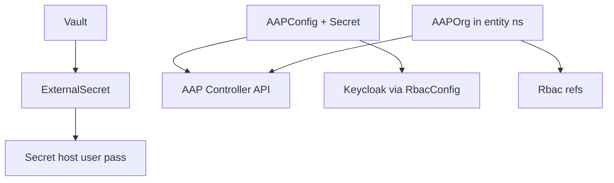

# Plugin AAP Operator

## Overview

The **Plugin AAP** operator (`plugin_aap`) reconciles **`AAPConfig`** and **`AAPOrg`** resources. **`AAPConfig`** (only in **`sovereign-cloud-plugins`**) connects to the **Ansible Automation Platform controller**, installs an OIDC authenticator backed by **`RbacConfig`**, and reports controller URL readiness. **`AAPOrg`** (per **entity namespace**) creates an **organization** in AAP and maps **Keycloak `Rbac` groups** to AAP roles.

## Deployment

| Property | Value |
|---|---|
| Cluster | **Services** (central ArgoCD `Application`) |
| Namespace | `sovereign-cloud-plugins` |
| Chart | **`plugin-aap`** (`oci://quay.example.com/hybrid-sovereign/plugin-aap`) |
| Chart version | **0.2.1** |
| Image tag | **0.0.8** |
| Scope | Cluster-scoped operator; watches entity namespaces |

## Custom resources

| Kind | API | Placement | Role |
|---|---|---|---|
| `AAPConfig` | `hybridsovereign.redhat/v1alpha1` | `sovereign-cloud-plugins` | Controller API + OIDC/auth method configuration |
| `AAPOrg` | `hybridsovereign.redhat/v1alpha1` | Entity namespaces | Create org; bind OIDC teams to admin / job-executor |

### `AAPConfig` spec (summary)

| Field | Required | Description |
|---|---|---|
| `spec.secret` | yes | Kubernetes `Secret` in `sovereign-cloud-plugins` with `host`, `username`, `password` for the controller API |
| `spec.rbacConfig` | yes | `RbacConfig` name used to wire Keycloak OIDC for the authenticator |

Status includes **`ready`**, **`aapControllerUrl`**, **`authMethodType`**, **`authMethodId`**, **`keycloakClientId`**, **`realm`**, and related diagnostics.

### `AAPOrg` spec (summary)

| Field | Required | Description |
|---|---|---|
| `spec.aapConfig` | yes | `AAPConfig` name in `sovereign-cloud-plugins` |
| `spec.aapAdminRbac` | no | `Rbac` CR names mapped to **org admin** |
| `spec.aapJobExecutorRbac` | no | `Rbac` CR names mapped to **job executor** |

Status includes **`ready`**, **`orgId`**, **`orgName`**, **`aapControllerUrl`**, OAuth role mapping fields, **`conditions`**, etc.

## ExternalSecret: AAP admin credentials

When enabled in Helm, an **`ExternalSecret`** (sync wave **3**) materializes **`aap-admin-credentials`** from Vault into `sovereign-cloud-plugins`:

| Vault property | Secret key |
|----------------|------------|
| `host` | `host` |
| `username` | `username` |
| `password` | `password` |

`AAPConfig.spec.secret` must reference this (or equivalent) **`Secret`** for API access.

## AAP Controller API integration

The operator drives the controller **REST API** (URL from secrets) to configure organizations, teams, RBAC projections, and the dedicated **OIDC authenticator** advertised by **`AAPConfig`** status (`aapControllerUrl`, `authMethodId`).

## Architecture

## Related docs

- [AAP workload](./10-aap.md)
- [Secrets flow](./18-secrets-flow.md)
- [Plugin RBAC](./19-plugin-rbac.md)
- [Tenancy Dashboard](./20-tenancy-dashboard.md)
