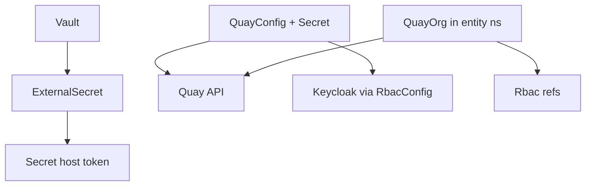

# Plugin Quay Operator

## Overview

The **Plugin Quay** operator (`plugin_quay`) reconciles **`QuayConfig`** and **`QuayOrg`**. **`QuayConfig`** (only in **`sovereign-cloud-plugins`**) connects to **Red Hat Quay**, configures **OIDC** using a **`RbacConfig`**, and tracks registry URL readiness. **`QuayOrg`** (per **entity namespace**) creates an **organization** and maps **Keycloak `Rbac` groups** to Quay roles (admin, creator, member).

## Deployment

| Property | Value |
|---|---|
| Cluster | **Services** (central ArgoCD `Application`) |
| Namespace | `sovereign-cloud-plugins` |
| Chart | **`plugin-quay`** (`oci://quay.example.com/hybrid-sovereign/plugin-quay`) |
| Chart version | **0.2.4** |
| Image tag | **0.0.7** |
| Scope | Cluster-scoped operator; watches entity namespaces |

## Custom resources

| Kind | API | Placement | Role |
|---|---|---|---|
| `QuayConfig` | `hybridsovereign.redhat/v1alpha1` | `sovereign-cloud-plugins` | Quay API endpoint + OIDC setup |
| `QuayOrg` | `hybridsovereign.redhat/v1alpha1` | Entity namespaces | Org + OIDC-backed team memberships |

### `QuayConfig` spec (summary)

| Field | Required | Description |
|---|---|---|
| `spec.secret` | yes | `Secret` in `sovereign-cloud-plugins` with `host`, `token` for Quay admin API |
| `spec.rbacConfig` | yes | `RbacConfig` for OIDC client / realm linkage |

Status includes **`ready`**, **`quayUrl`**, **`oidcConfigured`**, **`keycloakClientId`**, **`realm`**, **`message`**, etc.

### `QuayOrg` spec (summary)

| Field | Required | Description |
|---|---|---|
| `spec.quayConfig` | yes | `QuayConfig` name in `sovereign-cloud-plugins` |
| `spec.quayAdminRbac` | no | `Rbac` names → Quay **admin** |
| `spec.quayCreatorRbac` | no | `Rbac` names → **creator** |
| `spec.quayMemberRbac` | no | `Rbac` names → **member** |

Status includes **`ready`**, **`orgName`**, **`quayUrl`**, **`orgUrl`**, **`loginUrl`**, **`conditions`**, etc.

## ExternalSecret: Quay admin credentials

When enabled, **`ExternalSecret`** (sync wave **3**) syncs **`quay-admin-credentials`** from Vault:

| Vault property | Secret key |
|----------------|------------|
| `host` | `host` |
| `token` | `token` |

## Quay API integration

The operator uses Quay **application credentials** (`host` + `token`) from the synced secret to create organizations, OIDC-synced teams, and role bindings surfaced in **`QuayOrg`** status (**`orgUrl`**, **`loginUrl`**).

## Architecture

## Related docs

- [Quay registry](./12-quay.md)
- [Secrets flow](./18-secrets-flow.md)
- [Plugin RBAC](./19-plugin-rbac.md)
- [Tenancy Dashboard](./20-tenancy-dashboard.md)
