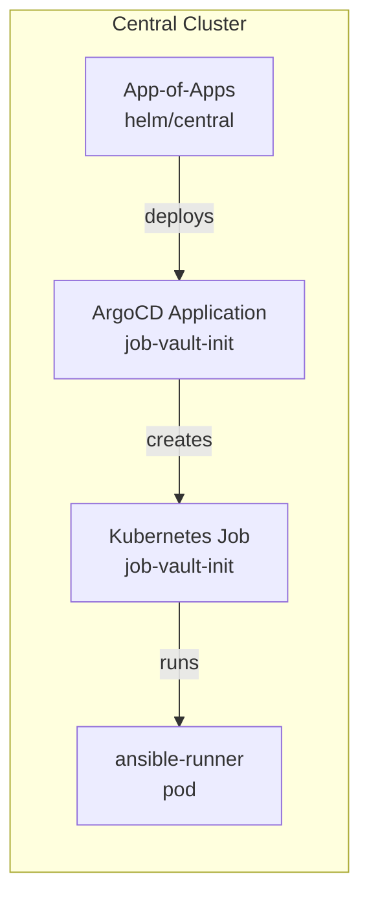

# App-of-Apps Structure

## Overview

Sovereign Cloud uses a single **App-of-Apps** Helm chart (`bootstrap/helm/central`) to manage all ArgoCD Applications for both the central and services clusters. There is **no separate `helm/services/` directory** — services cluster deployments use `destination.server` pointing to the services cluster URL.

## Template Directory Layout

```
bootstrap/helm/central/
├── Chart.yaml
├── values.yaml                    # Single source of truth for ALL app configurations
└── templates/
    ├── _helpers.tpl
    ├── centralCluster/            # Applications targeting central cluster
    │   ├── vault-application.yaml
    │   ├── rhbk-application.yaml
    │   ├── external-secrets-application.yaml
    │   ├── vault-secret-store-application.yaml
    │   ├── sovereign-namespaces-application.yaml
    │   ├── rhacm-application.yaml
    │   ├── acm-policy-spoke-eso.yaml
    │   ├── acm-policy-basechart.yaml           # Phase 1: ESO+GitOps on basechart:true clusters
    │   ├── odf-central-application.yaml
    │   ├── quay-central-application.yaml
    │   ├── crunchy-central-application.yaml
    │   ├── acs-central-application.yaml
    │   ├── rhbk-config-application.yaml
    │   ├── dns-forwarder.yaml
    │   ├── gitea-central-application.yaml
    │   ├── argocd-charts-repo.yaml
    │   ├── argocd-cluster-builds-repo.yaml
    │   ├── cluster-builds-appproject.yaml
    │   ├── cluster-builds-applicationset.yaml
    │   ├── appproject-central.yaml
    │   ├── vault-central-namespace-application.yaml
    │   └── sovereign-job-rbac-application.yaml
    ├── servicesCluster/           # Applications targeting services cluster
    │   ├── vault-services-application.yaml
    │   ├── vault-services-init-application.yaml
    │   ├── rhbk-services-application.yaml
    │   ├── external-secrets-services-application.yaml
    │   ├── vault-secret-store-services-application.yaml
    │   ├── sovereign-namespaces-services-application.yaml
    │   ├── aap-application.yaml
    │   ├── quay-services-application.yaml
    │   ├── odf-services-application.yaml
    │   ├── crunchy-services-application.yaml
    │   ├── gitea-application.yaml
    │   ├── acs-services-application.yaml
    │   ├── plugin-sdx-application.yaml
    │   └── appproject-services.yaml
    └── hybridSovereignOperators/  # Custom operators + dashboards (services cluster)
        ├── entity-operator-application.yaml
        ├── team-operator-application.yaml
        ├── assignment-operator-application.yaml
        ├── project-operator-application.yaml
        ├── platformopenshift-operator-application.yaml
        ├── plugin-rbac-application.yaml
        ├── plugin-vault-application.yaml
        ├── plugin-aap-application.yaml
        ├── plugin-quay-application.yaml
        ├── cloudoso-operator-application.yaml
        ├── cloudaws-operator-application.yaml
        ├── sovereign-dashboard-application.yaml
        ├── tenancy-dashboard-application.yaml
        └── sovereign-job-applications.yaml
```

## AppProject Separation

| Directory | ArgoCD Project | Cluster |
|-----------|---------------|---------|
| centralCluster/ | `project: central` | `https://kubernetes.default.svc` |
| servicesCluster/ | `project: services` | `<services-cluster-url>` |
| hybridSovereignOperators/ | `project: services` | `<services-cluster-url>` |

## Sovereign Jobs Pattern

Ansible job Applications are defined via a single template (`sovereign-job-applications.yaml`) that loops over `sovereignJobs.jobs` in `values.yaml`. Each job:
- Creates an ArgoCD Application pointing to the `sovereign-job` OCI chart
- Deploys a Kubernetes `Job` resource in the `sovereign-cloud-jobs` namespace
- Runs an Ansible playbook from the ansible-runner image



## values.yaml Structure

Each application block follows this pattern:
```yaml
appKeyName:
  enabled: true          # Set false to disable; ArgoCD will prune
  chartVersion: "x.y.z"  # OCI chart version to deploy
  syncWave: "N"          # ArgoCD sync wave for ordering
  destinationNamespace: "ns"  # Target namespace
  values:                # Helm values passed to the chart
    key: value
```

## Adding a New Application

1. Create a new Application YAML in the appropriate subdirectory
2. Add a corresponding key block in `values.yaml` under the appropriate section
3. Run `helm lint helm/central`
4. Bump `version:` in `helm/central/Chart.yaml`
5. Commit and push — ArgoCD picks up the change automatically

## Cluster Build ApplicationSets (Disabled — Phase 1/5)

> **As of Phase 1 (operator v0.5.6/v0.3.6):** `clusterBuilds.enabled=false` and all three Gitea init jobs are disabled. Operators deploy `mce-cluster-build` directly via Helm. The templates remain in the chart for reference/re-enablement.

Central-cluster templates under `bootstrap/helm/central/templates/centralCluster/` previously wired the ACM/Hive **cluster build GitOps spine**:

| File | Responsibility |
| ---- | ---------------- |
| `cluster-builds-applicationset.yaml` | `ApplicationSet/cluster-builds-clusters` (disabled, `clusterBuilds.enabled=false`) |
| `cluster-builds-appproject.yaml` | `AppProject: cluster-builds` — still deployed for namespace permissions |
| `argocd-cluster-builds-repo.yaml` | Argo repo credential ExternalSecret (disabled, `argocdClusterBuildsRepo.enabled=false`, Phase 5) |

Bootstrap jobs `giteaInit`, `giteaCreateRepo`, `giteaClusterBuildsRepo` are all `enabled: false` — their ArgoCD Applications have been pruned. The `cluster-builds-gitea-repo` ArgoCD repo credential ExternalSecret is also disabled (`argocdClusterBuildsRepo.enabled=false`) so ArgoCD (prune=true) removes it from the cluster.

See [`33-cluster-builds-appset.md`](33-cluster-builds-appset.md) for historical context.
