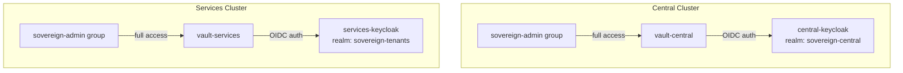
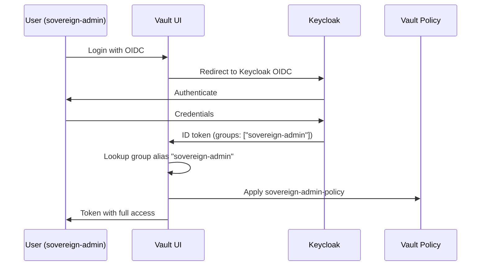

# Keycloak–Vault OIDC Integration

## Overview

Both Vault instances (vault-central and vault-services) are configured with Keycloak OIDC as the primary authentication method for human access. The `sovereign-admin` group in each Keycloak realm maps to full admin access on its respective Vault instance.



## Configuration

### Central Vault + Central Keycloak

| Parameter | Value |
|-----------|-------|
| Auth mount | `oidc` |
| OIDC discovery URL | `https://rhbk-central.apps.central.lab.example.com/realms/sovereign-central` |
| Client ID | `vault` |
| Client secret | Vault KV `central/data/keycloak-clients` → `vault` |
| Admin group | `sovereign-admin` |
| Admin policy | `sovereign-admin-policy` (full access to `*`) |
| Default role | `sovereign-admin` |

### Services Vault + Services Keycloak

| Parameter | Value |
|-----------|-------|
| Auth mount | `oidc` |
| OIDC discovery URL | `https://rhbk-services.apps.services.lab.example.com/realms/sovereign-tenants` |
| Client ID | `vault` |
| Client secret | Vault KV `central/data/vault-services-client` → `client_secret` |
| Admin group | `sovereign-admin` |
| Admin policy | `sovereign-admin-policy` (full access to `*`) |
| Default role | `sovereign-admin` |

## Setup Sequence

The OIDC integration is configured automatically by the `vaultOidcAuth` sovereign-job at sync wave 29:

```
Wave 27: keycloakClients job creates 'vault' client in sovereign-central
         and pushes client_secret to central/data/keycloak-clients
Wave 28: keycloakServicesRealms job creates sovereign-tenants realm
Wave 29: vaultOidcAuth job:
  1. Reads vault client secret from central/data/keycloak-clients
  2. Enables OIDC auth on vault-central → central-keycloak
  3. Creates sovereign-admin OIDC role + group alias
  4. Creates 'vault' client on services-keycloak
  5. Enables OIDC auth on vault-services → services-keycloak
  6. Creates sovereign-admin OIDC role + group alias
```

## Kubernetes Auth for ESO

In addition to OIDC for humans, vault-central has two Kubernetes auth mounts for the External Secrets Operator:

| Mount | Cluster | Purpose |
|-------|---------|---------|
| `kubernetes-central` | Central | Central cluster ESO reads platform secrets |
| `kubernetes-services` | Services | Services cluster ESO reads platform secrets |

Both mounts use the `external-secrets-vault-sa` ServiceAccount in the `external-secrets` namespace with the `external-secrets-policy` (read on `central/*`).

**Setup:** Configured by the `vaultK8sAuth` sovereign-job at sync wave 26.

## Vault Policy Reference

| Policy | Applies To | Capabilities |
|--------|-----------|--------------|
| `external-secrets-policy` | ESO ServiceAccount | read, list on `central/*` |
| `sovereign-admin-policy` | sovereign-admin OIDC group | create, read, update, delete, list, sudo on `*` |

## Identity Group Mapping

Vault uses an **external identity group** to map the Keycloak `sovereign-admin` group claim to the `sovereign-admin-policy`. On first successful OIDC login by a member of `sovereign-admin`, Vault creates an entity + alias bound to this group.



## Client Configuration in Keycloak

The `vault` client in each Keycloak realm must have:
- **Grant types**: standard flow (authorization code)
- **Redirect URIs**: `http://localhost:8250/oidc/callback` (Vault CLI), `https://vault.../ui/vault/auth/oidc/oidc/callback` (Vault UI)
- **Groups claim**: enabled (mapper that includes user groups in the token)

The Vault client for central keycloak is created by the `keycloakClients` job. The services keycloak client is created by the `vaultOidcAuth` job.
