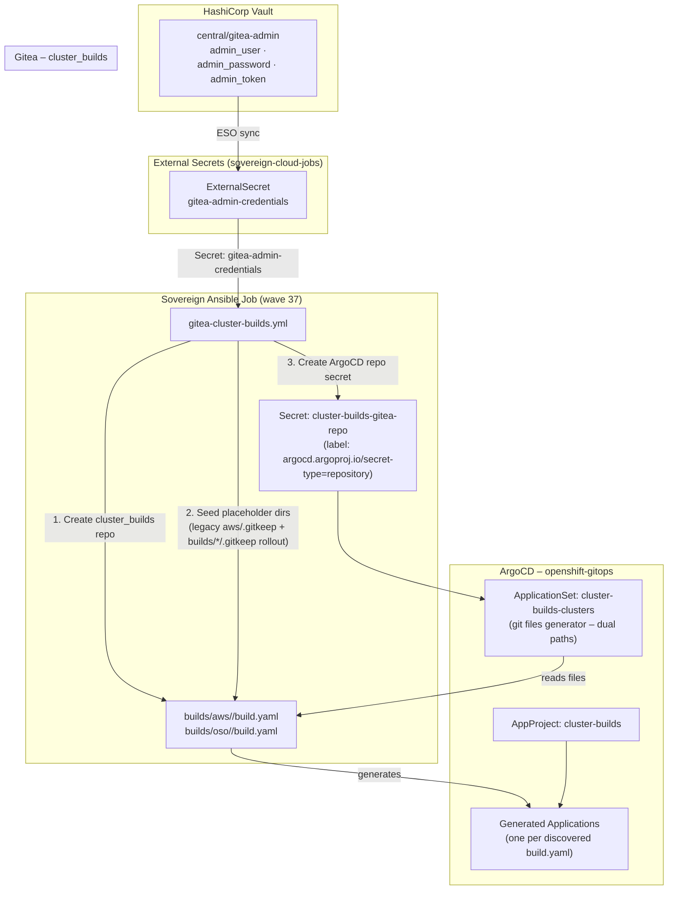

# Cluster Builds ApplicationSet

> **DEPRECATED (Phase 1 / Phase 5):** The `cluster-builds-clusters` ApplicationSet and the Gitea `cluster_builds` repo are **no longer used** for cluster provisioning as of operator v0.5.6 (OSO) / v0.3.6 (AWS). Both operators now deploy the `mce-cluster-build` Helm chart **directly** to the central cluster. `clusterBuilds.enabled=false` in `bootstrap/helm/central/values.yaml` prevents the ApplicationSet from being rendered. The associated Gitea init jobs (`giteaInit`, `giteaCreateRepo`, `giteaClusterBuildsRepo`) are also disabled.

## Overview (Historical)

The `cluster-builds-clusters` `ApplicationSet` (Helm-rendered manifest in `bootstrap/helm/central/templates/centralCluster/cluster-builds-applicationset.yaml`) provided GitOps-triggered provisioning of ACM/Hive `ClusterDeployments` sourced from `cluster_builds` in Gitea. Parameters lived under **`builds/aws/*/build.yaml`** (AWS hyperscaler flows) plus **`builds/oso/*/build.yaml`** for OpenStack. Removing a qualifying `build.yaml` pruned the generated Argo Application, which cascaded cluster teardown consistent with Hive settings.

Legacy generic Application examples under a flat top-level `aws/*.yaml` are **not** the shape modern helpers emit; workloads are nested per cluster (`builds/{provider}/{name}/`).

## Architecture



## Components

### Sovereign Job: `giteaClusterBuildsRepo` (wave 37)

- **Playbook**: `bootstrap/ansible/project/gitea-cluster-builds.yml`
- **Runs via**: `job-gitea-cluster-builds-repo` ArgoCD Application
- **Idempotent**: All tasks guard against double-creation

Tasks performed:
1. Wait for Gitea to be reachable
2. Create `cluster_builds` repository (skipped if exists)
3. Create `aws/.gitkeep` placeholder at repo root (skipped if exists) — **legacy sentinel** tracked in `bootstrap/ansible/project/gitea-cluster-builds.yml`
4. Read `admin_token` from `gitea-admin-credentials` K8s Secret (ESO-managed from Vault)
5. Create/update `cluster-builds-gitea-repo` Secret in `openshift-gitops` with `argocd.argoproj.io/secret-type: repository` and `insecure: "true"` for the cluster-internal CA

Rolling OSO/AWS alignment adds `builds/aws/.gitkeep` and `builds/oso/.gitkeep` (or equivalent scaffolding) via the same job when extended to keep empty directories tracked for git generators—see playbook history.

### AppProject: `cluster-builds`

- **Allows**: Any source repository, any destination namespace, any resource kind
- **Destinations**: Both central cluster (`https://kubernetes.default.svc`) and services cluster
- **Sync wave**: `-1` (created before any Applications)

### ApplicationSet: `cluster-builds-clusters` (wave 50 via `bootstrap/helm/central/values.yaml` `clusterBuilds.syncWave`)

- **Helm manifest**: `bootstrap/helm/central/templates/centralCluster/cluster-builds-applicationset.yaml`
- **Generators**: Git file generator watches **`builds/aws/*/build.yaml`** and **`builds/oso/*/build.yaml`** in the single `cluster_builds` repo checkout (see `bootstrap/helm/central/templates/centralCluster/cluster-builds-applicationset.yaml`)
- **Mode**: `goTemplate: true` with `goTemplateOptions.missingkey=zero`
- **Template**: Multi-source Helm release (`charts/charts/mce-cluster-build` + `$values/...`) targeting `openshift-gitops`; `valueFiles` resolves via `{ index .path.segments 0..2 }` so both `builds/aws/<name>/` and `builds/oso/<name>/` trees share one template block
- **Sync policy**: Automated prune + selfHeal, CreateNamespace, ServerSideApply, SkipDryRunOnMissingResource, bounded retries

**Path reality check:** Operators commit **`builds/aws/<cluster>/build.yaml`** and **`builds/oso/<cluster>/build.yaml`**, never legacy flat `aws/<cluster>.yaml` files—the ApplicationSet derives `$values/...` paths from git generator `path.segments` so directory layout must mirror `builds/<provider>/<cluster>/helm_values/build-values.yaml`.

## Application File Schema

Each `build.yaml` discovered by the ApplicationSet (under `builds/aws/<name>/` or `builds/oso/<name>/`) must expose at minimum:

```yaml
app:
  name: <string>                  # unique Argo Application + Hive release name, e.g. ocp-qwert
  chartsTargetRevision: <string>  # charts repo branch/tag for mce-cluster-build chart
```

Helm values for the release live beside the file at `helm_values/build-values.yaml` within the same directory and are referenced through the multi-source `$values` ref.

`chartsTargetRevision` is echoed for Git provenance. The Helm chart semver applied by Argo still comes from `bootstrap/helm/central/values.yaml` → `clusterBuilds.mceChartVersion` (`cluster-builds-applicationset.yaml`), unless templating later wires `chartsTargetRevision` directly into `targetRevision`.

### Example

```yaml
# builds/aws/ocp-qwert/build.yaml
app:
  name: ocp-qwert
  chartsTargetRevision: main
```

```yaml
# builds/oso/ocp-acme/build.yaml
app:
  name: ocp-acme
  chartsTargetRevision: main
```

## Secret Management

| Secret | Namespace | Source | Managed By |
|--------|-----------|--------|------------|
| `gitea-admin-credentials` | `sovereign-cloud-jobs` | Vault `central/gitea-admin` | ESO ExternalSecret (giteaInit job) |
| `cluster-builds-gitea-repo` | `openshift-gitops` | Derived from `gitea-admin-credentials.admin_token` | Ansible job (`gitea-cluster-builds.yml`) |

No credentials are stored in Git. The token flow is: **Vault → ESO → K8s Secret → Ansible Job → ArgoCD Repo Secret**.

## Deployment Notes

- **Wave ordering**: Job (37) → AppProject+ApplicationSet (50 via sovereign-central-apps sync)
- **TLS**: The ArgoCD repo secret includes `insecure: "true"` because Gitea uses an OpenShift internal CA not in ArgoCD's trust bundle. This is acceptable for an internal cluster-local registry.
- **Empty repo**: Until operators add real cluster directories, keep placeholder files such as `builds/aws/.gitkeep` **and** `builds/oso/.gitkeep` so both generator globs remain valid git paths. The legacy job still seeds `aws/.gitkeep`; harmonize with `builds/*` when modernizing the playbook.
- **Prune**: Deleting a `build.yaml` removes the ApplicationSet parameter, prunes the Argo Application, and (with Hive defaults) cascades cloud teardown.

## Issue Log

| # | Issue | Fix |
|---|-------|-----|
| 23 | ApplicationSet YAML parse error — `{{.app.name}}` parsed as YAML flow map key | Quoted all go-template vars with `"{{.app.name}}"` in Helm template using `{{ "{{" }}..{{ "}}" }}` escaping |
| 24 | ApplicationSet TLS error — Gitea internal CA not trusted by ArgoCD | Added `insecure: "true"` to `cluster-builds-gitea-repo` ArgoCD repo secret |
