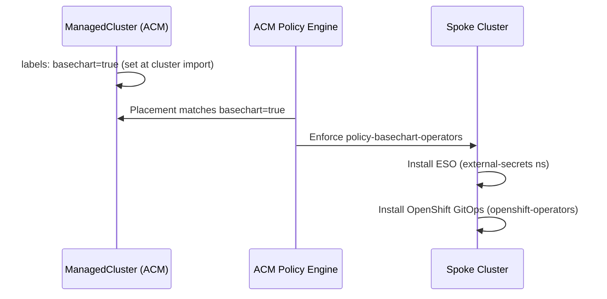

# ocp-base Chart — Base Configuration for Provisioned Clusters

## Overview

`ocp-base` is a Helm chart that delivers baseline operator prerequisites to every OpenShift cluster provisioned by the Sovereign Cloud platform. It is deployed automatically via an ACM `ConfigurationPolicy` (`policy-basechart-operators`) that targets any `ManagedCluster` labeled `basechart: "true"`.

**OCI location**: `oci://quay.example.com/hybrid-sovereign/ocp-base` (public visibility)  
**Chart version**: `0.2.0`  
**Deployed to**: ocp-sdx-oso1, ocp-sdx-oso2, ocp-sdx-aws1 (and all future built clusters). Legacy clusters `ocp-ses8`–`ocp-ses12` are deprecated.

## Components Installed

| Component | Namespace | Source |
|---|---|---|
| External Secrets Operator | `external-secrets` | `community-operators` / `stable` channel |
| OpenShift GitOps Operator | `openshift-operators` | `redhat-operators` / `latest` channel |

## Delivery Flow



## Label Injection Points

`basechart: "true"` is applied at cluster import via the **mce-cluster-build chart** (`managed-cluster.yaml`) — label is present from initial cluster registration into ACM.

## ACM Policy Structure

The policy `policy-basechart-operators` in namespace `openshift-gitops` on central cluster:

```
policy-basechart-operators
├── policy-basechart-eso-namespace          (Namespace: external-secrets)
├── policy-basechart-eso-operatorgroup      (OperatorGroup: external-secrets)
├── policy-basechart-eso-subscription       (Subscription: external-secrets-operator)
└── policy-basechart-gitops-subscription    (Subscription: openshift-gitops-operator)

Placement: placement-policy-basechart-operators
  matchLabels: {basechart: "true"}

PlacementBinding: binding-policy-basechart-operators
```

## Chart Values

```yaml
externalSecrets:
  enabled: true          # set false to skip ESO install
  channel: stable
  installPlanApproval: Automatic
  source: community-operators
  sourceNamespace: openshift-marketplace

gitopsOperator:
  enabled: true          # set false to skip GitOps operator install
  channel: latest
  installPlanApproval: Automatic
  source: redhat-operators
  sourceNamespace: openshift-marketplace

vault:
  enabled: false         # future: ClusterSecretStore wiring per spoke
  url: ""
  authPath: ""
  role: ""
  secretStoreName: vault-backend
```

## Upload Procedure

```bash
# From charts repo root
export OCI_REGISTRY_TOKEN=<token>
make upload-ocp-base-chart
```

The upload target:
1. Creates/verifies the `ocp-base` repository in Quay with **public** visibility
2. Packages the chart via `helm package`
3. Pushes to `oci://quay.example.com/hybrid-sovereign/ocp-base`

## Hardening

See `architecture/hardeningcheck/ocp-base.md`.

## Deviations

None. ESO is installed via `community-operators` (same as central). GitOps uses `redhat-operators`. Both are standard OCP catalog sources available on all provisioned clusters.

## Related Components

- [`mce-cluster-build`](33-cluster-builds-appset.md) — sets `basechart: true` label on `ManagedCluster` at provision time
- Bootstrap `acm-policy-basechart.yaml` — ACM policy deploying this chart's content to spoke clusters
