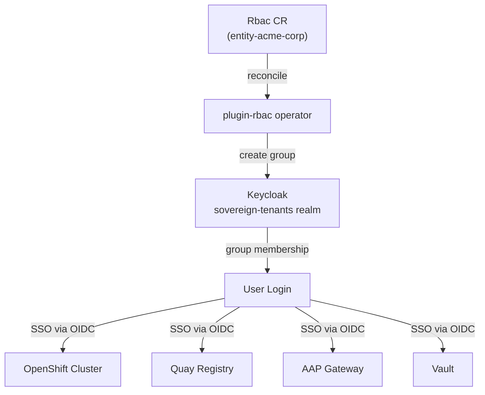

# Two-Layer RBAC Design

## Overview

The Sovereign Cloud RBAC model uses two complementary layers of Keycloak groups to control both **who can manage resources** in the platform and **what role users get inside the tools**.

```
Layer 1 (Namespace/Platform level)     Layer 2 (Tool level)
─────────────────────────────────      ──────────────────────
acme-entity-admins   → create any CR   acme-devops        → cluster-admin + OS admin
acme-cloud-admins    → create cloud     acme-developers    → member + dev access
acme-platform-admins → create clusters  acme-operators     → operator roles
acme-vault-admins    → create Vault KV  acme-quay-admins   → Quay org admin
acme-team-admins     → create Teams     acme-aap-admins    → AAP org admin
acme-project-admins  → create Projects  acme-aap-executors → run AAP jobs
acme-assignment-admins → create Assigns acme-viewers       → read-only
```

## Rbac CR

Every group is created via an `Rbac` CR in the entity namespace:

```yaml
apiVersion: hybridsovereign.redhat/v1alpha1
kind: Rbac
metadata:
  name: acme-entity-admins
  namespace: entity-acme-corp
spec:
  config: keycloak-sovereign-tenants-services
  description: "Full entity administrators for Acme Corp"
```

When the `plugin-rbac` operator reconciles this CR, it:
1. Looks up the `RbacConfig` named `keycloak-sovereign-tenants-services`
2. Gets Keycloak admin credentials from the associated secret
3. Creates a Keycloak group `acme-corp/acme-entity-admins` in the `sovereign-tenants` realm
4. Sets `status.ready: true` and stores the Keycloak `groupId` in status

## Group Hierarchy

All groups are created as sub-groups of the entity's top-level Keycloak group:

```
sovereign-tenants realm
└── acme-corp/
    ├── acme-entity-admins        (Layer 1 - namespace admin)
    ├── acme-cloud-admins         (Layer 1)
    ├── acme-cloud-viewers        (Layer 1)
    ├── acme-platform-admins      (Layer 1)
    ├── acme-platform-viewers     (Layer 1)
    ├── acme-vault-admins         (Layer 1)
    ├── acme-vault-viewers        (Layer 1)
    ├── acme-project-admins       (Layer 1)
    ├── acme-team-admins          (Layer 1)
    ├── acme-assignment-admins    (Layer 1)
    ├── acme-devops               (Layer 2 - cloud power user)
    ├── acme-developers           (Layer 2 - developer access)
    ├── acme-operators            (Layer 2 - ops role)
    ├── acme-viewers              (Layer 2 - read-only)
    ├── acme-quay-admins          (Layer 2 - Quay admin)
    ├── acme-aap-admins           (Layer 2 - AAP admin)
    └── acme-aap-executors        (Layer 2 - AAP job executor)
```

## Test Users

| Username | Groups | Description |
|---|---|---|
| `admin@acme.test` | `acme-entity-admins` | Full platform admin |
| `cloud-admin@acme.test` | `acme-cloud-admins`, `acme-devops` | Cloud env admin, cluster-admin |
| `platform-admin@acme.test` | `acme-platform-admins`, `acme-devops` | Cluster admin |
| `developer@acme.test` | `acme-developers`, `acme-cloud-viewers`, `acme-platform-viewers` | Developer |
| `ops@acme.test` | `acme-operators`, `acme-platform-viewers` | Operations |
| `viewer@acme.test` | `acme-viewers`, `acme-cloud-viewers`, `acme-platform-viewers` | Read-only |
| `vault-admin@acme.test` | `acme-vault-admins` | Vault management |
| `team-admin@acme.test` | `acme-team-admins`, `acme-project-admins`, `acme-assignment-admins` | Org management |

All test users have password `Test1234!` (non-production).

## RBAC Flow



## OIDC per OpenShift Cluster

Each cluster provisioned by `PlatformOpenshift` gets its own Keycloak OIDC client:

1. Operator creates client `{cluster-name}-keycloak-oidc` in Keycloak
2. Adds `groups` protocol mapper to propagate group membership in JWT
3. Creates ACM `Policy` + `Placement` + `PlacementBinding` on central cluster
4. ACM pushes `OAuth` config with OIDC identity provider to the spoke cluster

The OAuth config uses `groups` claim to map Keycloak group membership to OpenShift group membership.

## Hardening Checklist

- [x] OIDC client secrets stored in K8s Secrets (not ConfigMaps)
- [x] Vault credentials pulled via ExternalSecrets only (no secrets in Git)
- [x] Keycloak admin password in Vault, rotated via ESO refresh
- [x] Groups created per entity, scoped to entity namespace
- [x] `no_log: true` on all tasks handling credentials
- [ ] Audit logging for group membership changes (future)
- [ ] Periodic group sync verification job (future)
