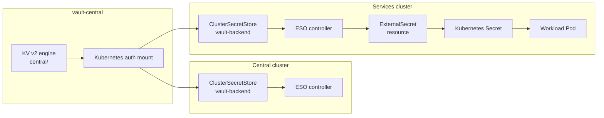
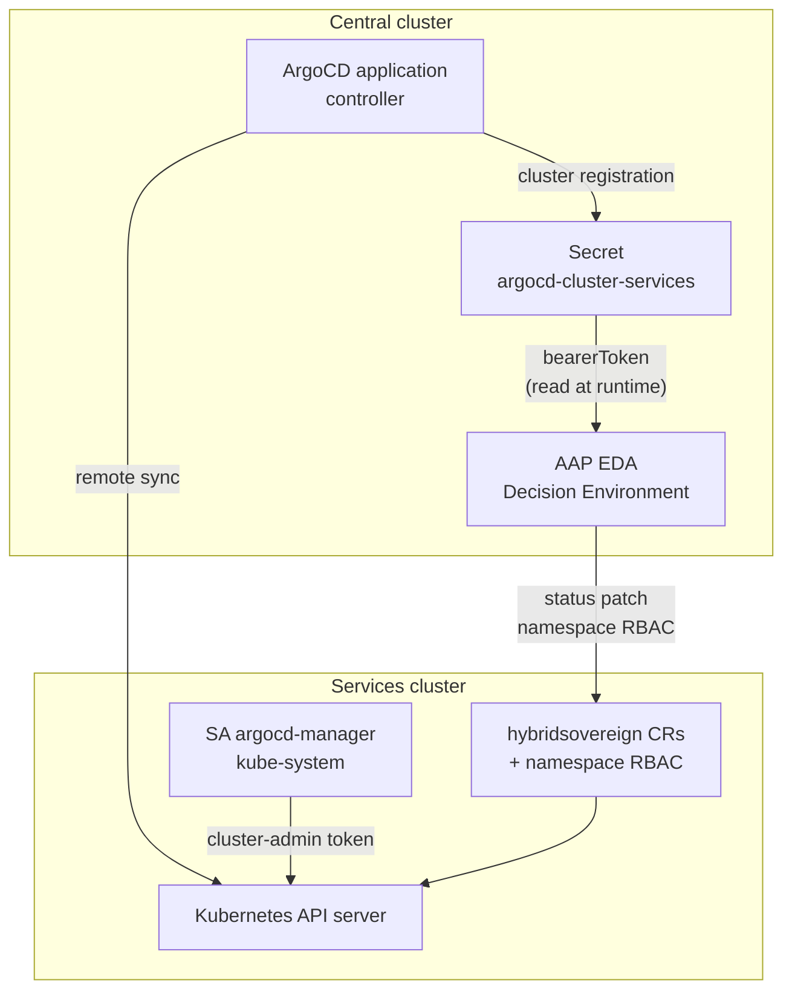
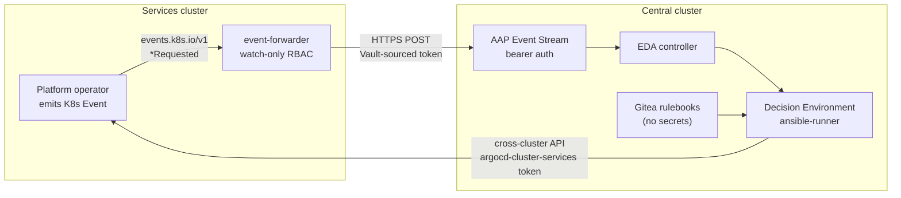
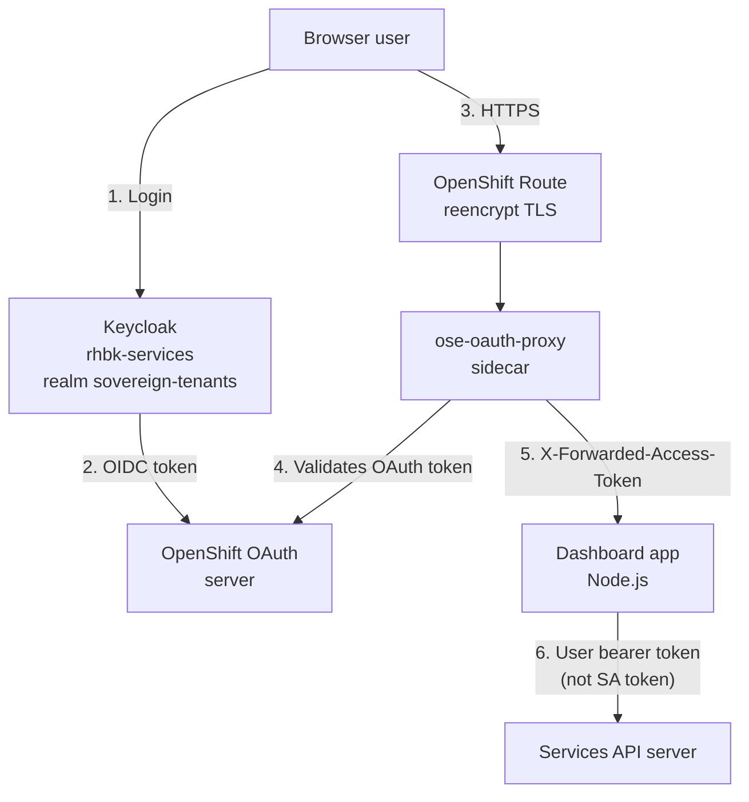

# Security Interaction Diagrams

**Date:** 2026-06-16  
**Purpose:** Visual reference for security boundaries — secrets flow, cross-cluster auth, EDA events, and OIDC chain.

Each diagram is intentionally small (≤15 nodes). No styling/colors applied per documentation standards.

---

## 1. Secrets Flow — Vault → ESO → Kubernetes Secret → Pod

**Notes:**

- vault-central is the single source of truth for platform credentials.
- ESO authenticates via Kubernetes auth — not the Vault root token.
- PushSecret (not shown) flows operator-generated secrets back to Vault KV.

---

## 2. Cross-Cluster Auth — Central ArgoCD SA → Services API Bearer Token

**Security boundary:** The ArgoCD cluster secret token currently grants cluster-admin on the services cluster. EDA decision environments read this token to write CR status and provision namespace Roles.

---

## 3. EDA Event Security Boundaries

**Boundaries:**

- Forwarder: read-only ClusterRole (events + namespaces).
- Event Stream: bearer token from Vault via ExternalSecret.
- EE: credentials at runtime only; `no_log` on token extraction tasks.

---

## 4. OIDC Chain — Keycloak → OpenShift OAuth → Dashboard oauth-proxy → User

**Notes:**

- OAuth client secrets stored in Vault (`central/dashboard-oauth`, `central/tenancy-dashboard-oauth`).
- Cookie flags: httponly, secure, samesite enforced on dashboard routes.
- Dashboard SA has impersonation rights but mutations use the forwarded user token.

---

## Related Documentation

- [18-secrets-flow.md](./18-secrets-flow.md) — full path inventory and sync waves
- [06-keycloak.md](./06-keycloak.md) — realm and client configuration
- [006-eda-architecture.md](./006-eda-architecture.md) — event-driven automation topology
- [security-state-2026.md](../../hardeningcheck/security-state-2026.md) — current findings
