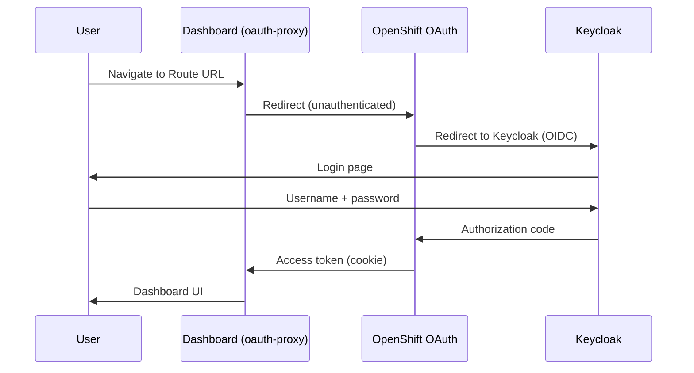

# Tutorial: Sovereign Cloud Dashboard (User Dashboard)

## Overview

The Sovereign Cloud Dashboard is the management UI for platform administrators to manage tenant `Entity` custom resources. It runs on the services cluster and authenticates users via OpenShift OAuth.

**URL:** `https://sovereign-cloud-dashboard.apps.services.lab.example.com`

---

## 1. Login Flow



1. Navigate to the dashboard Route URL
2. If not logged in, you are redirected to OpenShift OAuth
3. OpenShift OAuth uses Keycloak (`sovereign-tenants` realm) as the identity provider
4. After successful Keycloak login, the `oauth-proxy` sidecar validates the token
5. The dashboard receives your identity via `X-Forwarded-User` header
6. All Kubernetes API calls from the dashboard use **your OAuth access token** — OpenShift RBAC controls what you can see and do

---

## 2. Features

### Overview Page (`/overview`)

Cluster-wide health view of all Hybrid Sovereign custom resources:
- Donut chart: aggregate readiness across Entity, Team, Assignment, Project, PlatformOpenshift, CloudOSO
- Per-kind status tables with individual CR health
- Reconciliation alerts for failing or stalled controllers

Use this page for platform-wide health monitoring. It shows **all** CRs across all entity namespaces.

### Services Page (`/services`)

Live health checks for all OpenShift Routes on the services cluster. Each row shows:
- Route name and URL
- HTTP health check status (green = reachable, red = down)

### Entity List (`/entities`)

Lists all `Entity` CRs in the `sovereign-cloud` namespace:
- Collapsed view: name, namespace, billing ID
- Expanded view: full status fields, OpenShift console link
- Delete entity (with confirmation dialog)

### Entity Create (`/entities/create`)

Form to create a new tenant entity:

| Field | Constraints |
|-------|------------|
| Name | Lowercase alphanumeric with hyphens, max 63 chars |
| Description | Freeform text |
| Billing ID | Alphanumeric with `._-`, max 63 chars |
| Website Link | Valid URL |

Validation is enforced both client-side and server-side.

---

## 3. Creating a Tenant Entity

1. Navigate to `/entities/create`
2. Fill in the form:
   - **Name:** `acme-corp` (this becomes the namespace `entity-acme-corp`)
   - **Description:** "Acme Corporation"
   - **Billing ID:** `ACME-001`
   - **Website Link:** `https://acme.example.com`
3. Click **Create**
4. The Entity operator creates the namespace `entity-acme-corp` with the required labels
5. Navigate back to `/entities` to verify the entity appears with `ready: True`

---

## 4. OAuth Proxy Configuration

The dashboard uses `ose-oauth-proxy` as a sidecar:

| Setting | Value |
|---------|-------|
| Port | 8443 (HTTPS, TLS reencrypt) |
| Cookie | `--cookie-secure`, `--cookie-httponly`, `--cookie-samesite=Strict` |
| Scope | `user:full` (required for token forwarding) |
| Cookie secret | Delivered via ExternalSecret from Vault path `central/data/dashboard-oauth` |
| Client secret | Delivered via ExternalSecret from Vault path `central/data/dashboard-oauth` |

OAuth secrets are **never stored in Git**. They are provisioned to Vault before deploying the dashboard.

### Pre-populating Vault with OAuth secrets

Before enabling the dashboard Application in ArgoCD:

```bash
# Generate cookie secret (must be 16, 24, or 32 bytes, base64-encoded)
COOKIE_SECRET=$(openssl rand -base64 32)

# Get the OAuth client secret from OpenShift
CLIENT_SECRET=$(oc get oauthclient sovereign-cloud-dashboard \
  -o jsonpath='{.secret}' 2>/dev/null || openssl rand -base64 24)

# Write to Vault
vault kv put central/data/dashboard-oauth \
  cookie-secret="$COOKIE_SECRET" \
  client-secret="$CLIENT_SECRET"
```

---

## 5. Troubleshooting

### Dashboard shows "403 Forbidden"

Your OpenShift user does not have RBAC access to `Entity` resources. Contact a platform admin to grant the appropriate role.

```bash
# Check current permissions (from your user context)
oc auth can-i list entities -n sovereign-cloud
oc auth can-i create entities -n sovereign-cloud
```

### Dashboard shows blank page after login

The OAuth proxy is working but the dashboard backend failed to start.

```bash
# Check dashboard pod status
oc get pods -n sovereign-cloud -l app=sovereign-cloud-dashboard

# Check backend logs
oc logs -n sovereign-cloud -l app=sovereign-cloud-dashboard -c dashboard

# Common cause: OCP_SERVICES_SERVER env var not set
oc describe pod -n sovereign-cloud -l app=sovereign-cloud-dashboard \
  | grep OCP_SERVICES_SERVER
```

### Login redirect loop

The `OAuthClient` secret does not match Vault. Check:
1. The ExternalSecret for `oauth-externalsecret` is synced: `oc get externalsecret -n sovereign-cloud`
2. The Vault path `central/data/dashboard-oauth` has both `client-secret` and `cookie-secret`
3. Force ExternalSecret sync: `oc annotate externalsecret oauth-externalsecret -n sovereign-cloud force-sync=$(date +%s) --overwrite`

### "x509: certificate signed by unknown authority"

The dashboard backend cannot reach the Kubernetes API due to a certificate issue.

```bash
# Check that the serving cert is mounted
oc get pod -n sovereign-cloud -l app=sovereign-cloud-dashboard \
  -o jsonpath='{.items[0].spec.volumes}' | jq .
```

---

## Related Documentation

- [15-sovereign-dashboard.md](../technical/15-sovereign-dashboard.md) — Architecture reference
- [17-entity-operator.md](../technical/17-entity-operator.md) — Entity operator
- [18-secrets-flow.md](../technical/18-secrets-flow.md) — OAuth secret delivery via Vault
