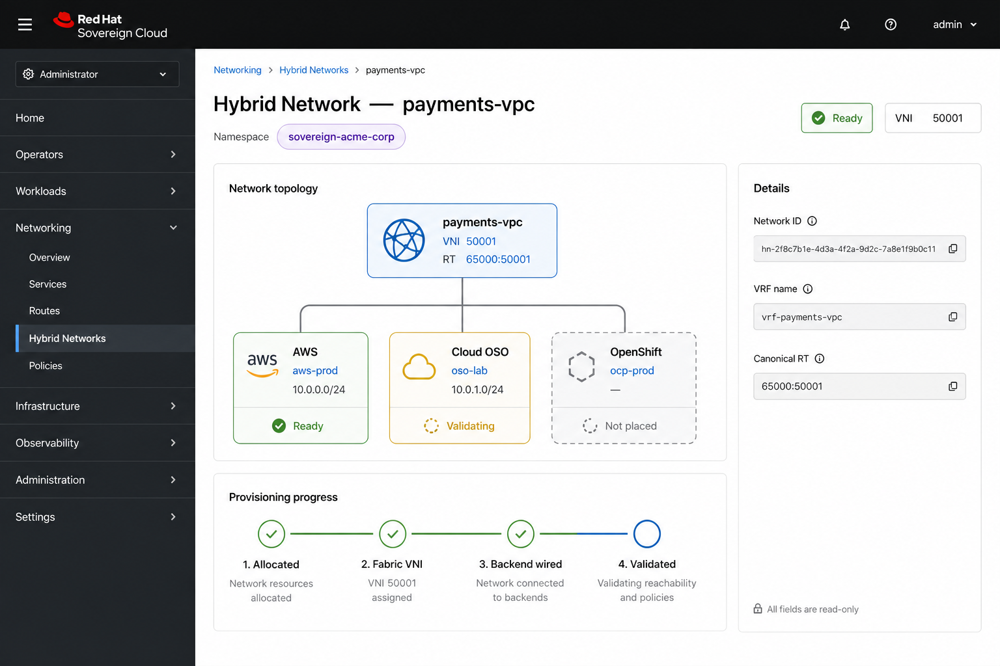
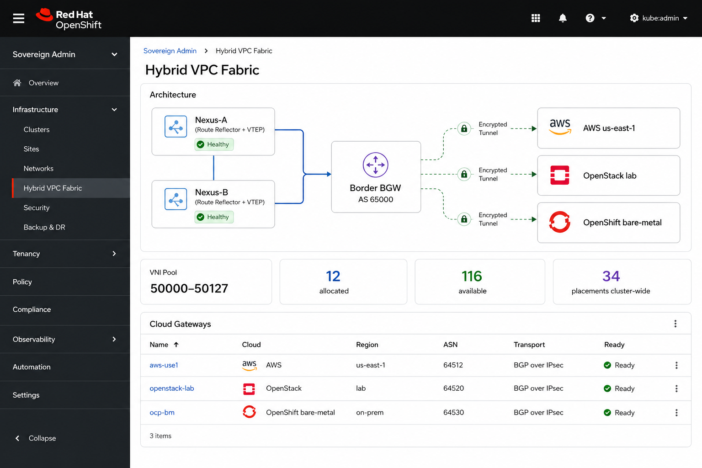
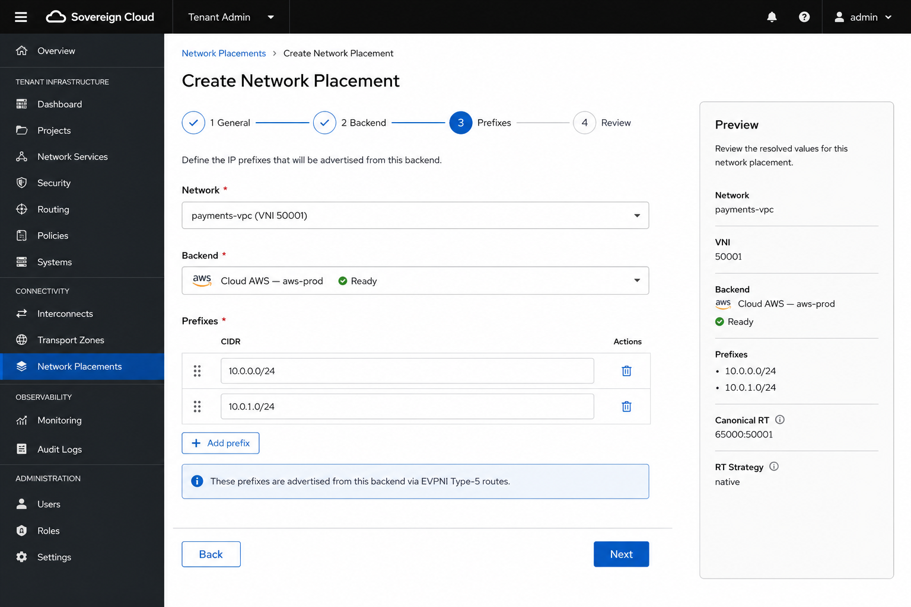
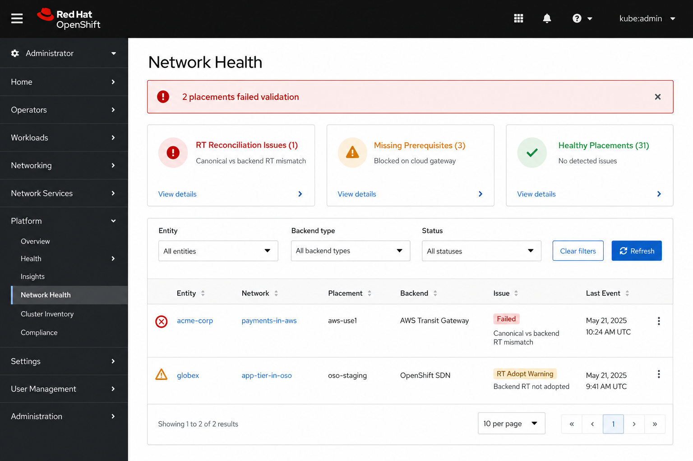
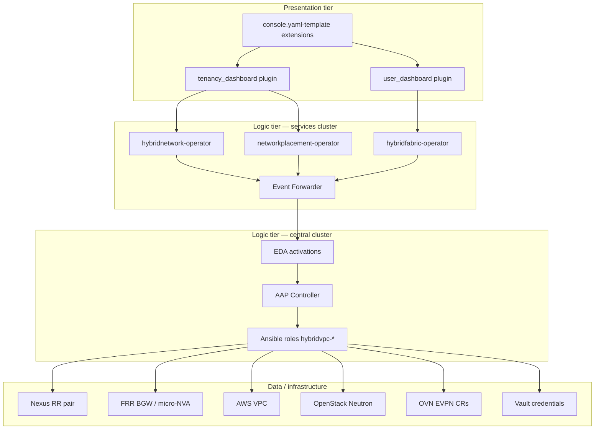
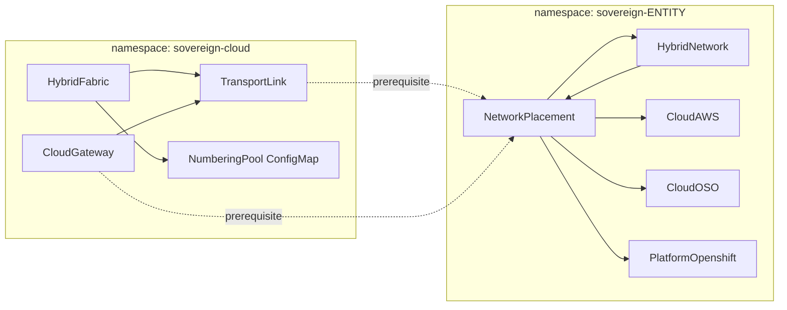
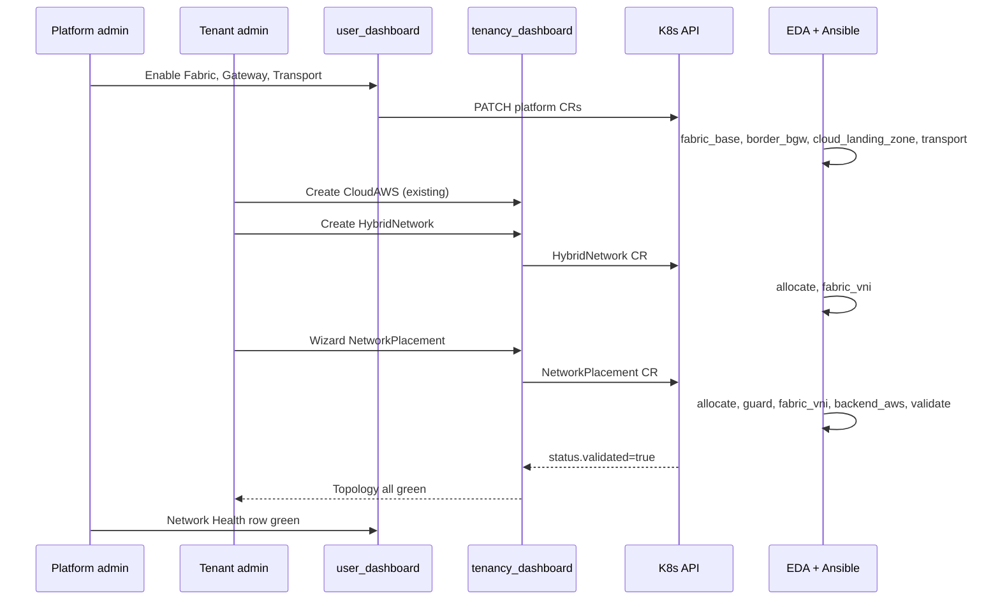
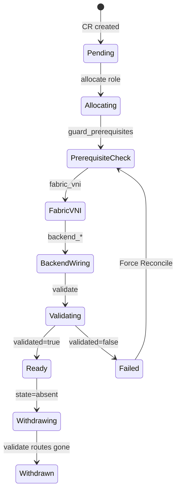

# Hybrid VPC — UI, Operator, and Automation Design

**Source networking spec:** [DESIGN.md](./DESIGN.md)  
**Audience:** Operator developers, Ansible/EDA authors, console plugin engineers  
**Status:** Design target (not implemented)

This document is the **implementation blueprint** for Hybrid VPC on Sovereign Cloud: operator CRDs deployed as `hybridsovereign.redhat` plugins, OpenShift Console dynamic-plugin surfaces, YAML templates, sample CRs, EDA/Ansible automation, and the full UI experience in `user_dashboard` and `tenancy_dashboard`.

---

## Table of contents

1. [Executive summary](#1-executive-summary)
2. [Product architecture](#2-product-architecture)
3. [Operator repositories and packaging](#3-operator-repositories-and-packaging)
4. [Custom resource specifications](#4-custom-resource-specifications)
5. [Console plugin and YAML template strategy](#5-console-plugin-and-yaml-template-strategy)
6. [Sample CR catalog](#6-sample-cr-catalog)
7. [Operator reconcile logic (event emitters)](#7-operator-reconcile-logic-event-emitters)
8. [EDA rulebooks and event contract](#8-eda-rulebooks-and-event-contract)
9. [Ansible roles and task logic](#9-ansible-roles-and-task-logic)
10. [Numbering authority](#10-numbering-authority)
11. [Global admin UI — `user_dashboard`](#11-global-admin-ui--user_dashboard)
12. [Tenant admin UI — `tenancy_dashboard`](#12-tenant-admin-ui--tenancy_dashboard)
13. [Dashboard interactions and journeys](#13-dashboard-interactions-and-journeys)
14. [RBAC, personas, and security](#14-rbac-personas-and-security)
15. [Status, conditions, and error UX](#15-status-conditions-and-error-ux)
16. [Observability and operations](#16-observability-and-operations)
17. [Phased delivery](#17-phased-delivery)
18. [Appendices](#18-appendices)

---

## 1. Executive summary

### 1.1 What we are building

A **hybrid VPC** capability where tenants define isolated logical networks (`HybridNetwork`) and place them on cloud backends (`NetworkPlacement` → `CloudAWS` | `CloudOSO` | `PlatformOpenshift`). Platform operators configure day-0 fabric (`HybridFabric`, `CloudGateway`, `TransportLink`) once; EDA drives Ansible roles from [DESIGN.md](./DESIGN.md) (`allocate`, `fabric_vni`, `backend_*`, `validate`).

### 1.2 Design decisions (locked)

| Decision | Choice | Why |
|----------|--------|-----|
| CR count | 5 kinds in `hybridsovereign.redhat/v1alpha1` | Separates tenant intent from platform infra; mirrors `Assignment` cross-CR pattern |
| Automation location | EDA on central cluster | Matches platform EDA rebuild; operators stay thin emitters |
| UI delivery | Extend existing console plugins + `console.yaml-template` | Same auth model; YAML escape hatch for power users |
| Numbering | Platform-owned VNI pool on `HybridFabric` | Tenants never pick VNI; overlapping IP safe per VNI |
| Backend coupling | Reference existing backend CRs | No duplicate AWS/OSO/OCP config |
| Decommission | `spec.state: absent` on placement | Idempotent withdraw per backend without touching siblings |

### 1.3 UI mockups (generated reference)

| Screen | Image |
|--------|-------|
| Tenant — Hybrid Network detail + topology |  |
| Global — Fabric admin |  |
| Tenant — Placement wizard (prefixes step) |  |
| Global — Network Health |  |

---

## 2. Product architecture

### 2.1 Three-tier mapping



### 2.2 CR dependency graph



---

## 3. Operator repositories and packaging

Three new operator directories follow the existing `CloudAWS/` / `Team/` layout. Each ships: CRD Helm chart, Ansible Operator SDK controller, `config/samples/`, EDA subtree under `eda/hybridvpc/`, and console template fragments consumed by dashboard plugins.

### 3.1 Repository layout

```
HybridNetwork/                    # Tenant-scoped network identity
├── api/                          # (optional future) Go types; CRD lives in helm
├── config/samples/
│   ├── hybridnetwork-payments.yaml
│   └── hybridnetwork-disabled.yaml
├── helm/
│   ├── Chart.yaml
│   ├── templates/
│   │   ├── crd.yaml
│   │   ├── deployment.yaml
│   │   ├── samples.yaml          # ArgoCD-safe samples (enabled: false default)
│   │   └── console-templates.yaml  # ConfigMap → plugin mount OR documented snippet
│   └── values.yaml
├── operator/
│   ├── watches.yaml
│   └── roles/hybridnetwork/
└── Makefile

NetworkPlacement/                 # Tenant-scoped backend placement
├── (same structure)
└── operator/roles/networkplacement/

HybridFabric/                     # Platform-scoped fabric + gateways + transport
├── config/samples/
│   ├── hybridfabric-lab.yaml
│   ├── cloudgateway-aws-use1.yaml
│   └── transportlink-onprem-aws.yaml
└── operator/roles/
    ├── hybridfabric/
    ├── cloudgateway/
    ├── transportlink/
    └── hybridfabric_delete/

eda/hybridvpc/                    # Shared EDA decision environment
├── Makefile
├── decision-environment.yml
├── rulebooks/
│   ├── hybridnetwork-create.yml
│   ├── hybridnetwork-delete.yml
│   ├── networkplacement-create.yml
│   ├── networkplacement-delete.yml
│   ├── hybridfabric-create.yml
│   ├── cloudgateway-create.yml
│   └── transportlink-create.yml
└── roles/
    ├── allocate/
    ├── fabric_vni/
    ├── fabric_base/
    ├── border_bgw/
    ├── cloud_landing_zone/
    ├── transport/
    ├── backend_aws/
    ├── backend_openstack/
    ├── backend_openshift/
    └── validate/
```

### 3.2 Helm chart values (operator plugin template pattern)

Each operator chart exposes a **samples** block safe for GitOps (matches `CloudAWS/helm/templates/samples.yaml`):

```yaml
# HybridNetwork/helm/values.yaml (excerpt)
samples:
  enabled: false          # NEVER true in prod app-of-apps
  items: []

consoleTemplates:
  enabled: true
  # Bundled into dashboard plugin at build time via copy step OR ConfigMap
  registerYamlTemplates: true

operator:
  reconcileInterval: 300s
  maxConcurrentReconciles: 20

eda:
  activationPrefix: hybridvpc
```

### 3.3 ArgoCD app-of-apps entries

| Application | Chart | Namespace | Sync wave |
|-------------|-------|-----------|-----------|
| `hybridnetwork-operator` | `oci://.../hybridnetwork-operator` | `sovereign-cloud` | 38 |
| `networkplacement-operator` | `oci://.../networkplacement-operator` | `sovereign-cloud` | 38 |
| `hybridfabric-operator` | `oci://.../hybridfabric-operator` | `sovereign-cloud` | 37 |
| `eda-hybridvpc` | activations via `manage_activations.py` | central `aap` | after DE push |

Platform CR operators sync **before** tenant CR operators so prerequisites exist.

---

## 4. Custom resource specifications

All CRs use `apiVersion: hybridsovereign.redhat/v1alpha1`, `scope: Namespaced`, `subresources.status: {}`, and the shared status fields: `ready`, `status`, `message`, `lastReconciledAt`, `observedGeneration`, `edaJobs[]`, `conditions[]`.

### 4.1 `HybridNetwork`

**Plural:** `hybridnetworks` · **Short name:** `hnet` · **Namespace:** entity (`sovereign-*`)

#### Spec schema (OpenAPI)

```yaml
spec:
  type: object
  properties:
    description:
      type: string
      maxLength: 512
      description: Human-readable purpose; shown in UI only.
    networkViewerRbac:
      type: array
      items:
        type: string
      description: Optional Rbac CR names for per-CR view access (per-cr-rbac pattern).
  # No VNI, VRF, RT, or prefixes in spec — numbering is platform-owned.
```

#### Status schema

```yaml
status:
  type: object
  properties:
    entity:
      type: string
    billingId:
      type: string
    networkId:
      type: string
      description: Stable UUID for day-2 idempotency (allocate role).
    vni:
      type: integer
      minimum: 1
      maximum: 16777215
    vrfName:
      type: string
      pattern: '^[a-z0-9][a-z0-9-]{0,62}[a-z0-9]$'
    canonicalRt:
      type: string
      pattern: '^\d+:\d+$'
      description: "Route-target topic: AS:VNI or platform convention."
    fabric:
      type: string
      description: HybridFabric name in sovereign-cloud that owns the pool.
    placementCount:
      type: integer
    placementsReady:
      type: integer
    allocated:
      type: boolean
    fabricVniReady:
      type: boolean
    ready:
      type: boolean
    status:
      type: string
      enum: [pending, reconciling, ready, failed, deleting]
    # + edaJobs, conditions, observedGeneration, lastReconciledAt, message
```

#### Printer columns

| Column | jsonPath |
|--------|----------|
| Entity | `.status.entity` |
| VNI | `.status.vni` |
| VRF | `.status.vrfName` |
| Placements | `.status.placementsReady` / `.status.placementCount` |
| Ready | `.status.ready` |
| Age | `.metadata.creationTimestamp` |

### 4.2 `NetworkPlacement`

**Plural:** `networkplacements` · **Short name:** `nplace` · **Namespace:** entity

#### Spec schema

```yaml
spec:
  type: object
  required: [network, backend, state]
  properties:
    network:
      type: string
      description: HybridNetwork metadata.name in same namespace.
    backend:
      type: object
      required: [kind, name]
      properties:
        kind:
          type: string
          enum: [CloudAWS, CloudOSO, PlatformOpenshift]
        name:
          type: string
          minLength: 1
    prefixes:
      type: array
      items:
        type: string
        pattern: '^([0-9]{1,3}\.){3}[0-9]{1,3}/[0-9]{1,2}$'
      minItems: 1
      description: Required when state=present. CIDRs originated at this backend.
    state:
      type: string
      enum: [present, absent]
      default: present
```

#### Status schema

```yaml
status:
  properties:
    entity: { type: string }
    networkId: { type: string }
    targetBackend:
      type: string
      enum: [aws, openstack, openshift]
    vni: { type: integer }
    vrfName: { type: string }
    canonicalRt: { type: string }
    backendRt: { type: string }
    rtStrategy:
      type: string
      enum: [native, adopt, rewrite]
    domainAsn: { type: integer }
    backendReady: { type: boolean }
    prerequisiteReady: { type: boolean }
    fabricApplied: { type: boolean }
    backendApplied: { type: boolean }
    validated: { type: boolean }
    lastValidatedAt: { type: string, format: date-time }
    realizedPrefixes:
      type: array
      items: { type: string }
    microNvaName:          # AWS only
      type: string
    cloudGatewayRef:       # resolved platform CR name
      type: string
    transportLinkRef:
      type: string
    ready: { type: boolean }
```

#### Printer columns

| Column | jsonPath |
|--------|----------|
| Network | `.spec.network` |
| Backend | `.spec.backend.kind` |
| Prefixes | `.spec.prefixes` (truncated) |
| Strategy | `.status.rtStrategy` |
| Validated | `.status.validated` |
| Ready | `.status.ready` |

### 4.3 `HybridFabric` (platform)

**Plural:** `hybridfabrics` · **Namespace:** `sovereign-cloud` only

#### Spec schema

```yaml
spec:
  type: object
  required: [enabled, domainAsn, vniPool]
  properties:
    enabled:
      type: boolean
      default: false
    domainAsn:
      type: integer
      minimum: 1
      maximum: 4294967295
    routeReflectors:
      type: array
      minItems: 1
      items:
        type: object
        required: [name, address]
        properties:
          name: { type: string }
          address:
            type: string
            format: ipv4
    vniPool:
      type: object
      required: [start, end]
      properties:
        start: { type: integer }
        end: { type: integer }
    borderGateway:
      type: object
      properties:
        name: { type: string }
        loopback: { type: string, format: ipv4 }
        vaultCredentialRef:
          type: string
          description: Vault path for FRR/Nexus API credentials (not inline secrets).
    transportDefaults:
      type: object
      properties:
        mtu: { type: integer, default: 9000 }
        innerMssClamp: { type: integer, default: 1360 }
        defaultTunnelType:
          type: string
          enum: [wireguard, ipsec, macsec, none]
          default: wireguard
    numberingAuthority:
      type: object
      properties:
        rtFormat:
          type: string
          default: "{domainAsn}:{vni}"
        vrfNameFormat:
          type: string
          default: "{networkName}"
```

#### Status schema

```yaml
status:
  properties:
    fabricBaseReady: { type: boolean }
    borderBgwReady: { type: boolean }
    allocatedVniCount: { type: integer }
    availableVniCount: { type: integer }
    ready: { type: boolean }
```

### 4.4 `CloudGateway` (platform)

```yaml
spec:
  type: object
  required: [enabled, cloud, domainAsn]
  properties:
    enabled: { type: boolean, default: false }
    cloud:
      type: string
      enum: [aws, openstack, openshift]
    region: { type: string }
    domainAsn: { type: integer }
    landingZoneTemplate:
      type: string
      default: default
    fabricRef:
      type: string
      description: HybridFabric name in sovereign-cloud.
    transport:
      type: object
      properties:
        type:
          type: string
          enum: [wireguard, ipsec, macsec, none]
        vaultPeerConfigRef:
          type: string
          description: Vault path for tunnel peer material.
    awsAccountId:        # when cloud=aws
      type: string
    openstackCloudOSORef:  # when cloud=openstack — optional link to template
      type: string
status:
  properties:
    landingZoneReady: { type: boolean }
    gatewayAddress: { type: string }
    transportReady: { type: boolean }
    peerCount: { type: integer }
    ready: { type: boolean }
```

### 4.5 `TransportLink` (platform)

```yaml
spec:
  type: object
  required: [enabled, fabricRef, cloudGatewayRef]
  properties:
    enabled: { type: boolean, default: false }
    fabricRef: { type: string }
    cloudGatewayRef: { type: string }
    tunnelType:
      type: string
      enum: [wireguard, ipsec, macsec, none]
    vaultConfigRef:
      type: string
status:
  properties:
    tunnelUp: { type: boolean }
    borderEndpoint: { type: string }
    cloudEndpoint: { type: string }
    lastHandshakeAt: { type: string, format: date-time }
    ready: { type: boolean }
```

### 4.6 Shared variable contract (Ansible)

Every day-2 role receives this structure from `allocate` (DESIGN.md §5). The **operator patches it into `NetworkPlacement.status`**; roles read CR status + spec rather than recomputing.

```yaml
tenant_id: "{{ status.entity }}"
network_id: "{{ status.networkId }}"
target_backend: "{{ status.targetBackend }}"
state: "{{ spec.state }}"
vni: "{{ status.vni }}"
vrf_name: "{{ status.vrfName }}"
prefixes: "{{ spec.prefixes | default([]) }}"
canonical_rt: "{{ status.canonicalRt }}"
backend_rt: "{{ status.backendRt }}"
rt_strategy: "{{ status.rtStrategy }}"
domain_asn: "{{ status.domainAsn }}"
```

---

## 5. Console plugin and YAML template strategy

Sovereign Cloud uses **OpenShift Console dynamic plugins** (`user_dashboard/plugin`, `tenancy_dashboard/plugin`). Hybrid VPC extends them with:

1. **Custom React pages** (primary UX) — wizards, topology, health views  
2. **`console.yaml-template` extensions** (power-user / GitOps parity) — registered per CR kind  
3. **Helm-bundled sample CRs** — `config/samples/` + optional `samples.enabled` in operator chart  

### 5.1 Dual-path UX principle

| User type | Path | Entry |
|-----------|------|-------|
| Tenant admin | Guided forms | Tenancy plugin nav |
| Platform admin | Guided forms + topology | Admin plugin nav |
| GitOps engineer | YAML in console or Git | `+` → Import YAML → template picker |
| Auditor | Read-only detail + YAML tab | List → detail |

Forms and YAML templates **must produce identical spec shapes** so the same EDA path runs regardless of entry point.

### 5.2 `console.yaml-template` extensions

Add to `tenancy_dashboard/plugin/console-extensions.json`:

```json
{
  "type": "console.yaml-template",
  "properties": {
    "name": "default",
    "model": {
      "group": "hybridsovereign.redhat",
      "version": "v1alpha1",
      "kind": "HybridNetwork"
    },
    "template": { "$codeRef": "yamlTemplates.hybridNetworkDefault" }
  }
}
```

Add to `user_dashboard/plugin/console-extensions.json` for `HybridFabric`, `CloudGateway`, `TransportLink`.

#### Template: `hybridNetworkDefault.ts`

```typescript
export const hybridNetworkDefault = `
apiVersion: hybridsovereign.redhat/v1alpha1
kind: HybridNetwork
metadata:
  name: app-tier
  namespace: sovereign-acme-corp
spec:
  description: Application tier network
`.trim();
```

#### Template: `networkPlacementDefault.ts`

```typescript
export const networkPlacementDefault = `
apiVersion: hybridsovereign.redhat/v1alpha1
kind: NetworkPlacement
metadata:
  name: app-tier-aws-prod
  namespace: sovereign-acme-corp
spec:
  network: app-tier
  backend:
    kind: CloudAWS
    name: aws-prod
  prefixes:
    - 10.50.0.0/24
  state: present
`.trim();
```

#### Template: `hybridFabricLab.ts` (admin)

```typescript
export const hybridFabricLab = `
apiVersion: hybridsovereign.redhat/v1alpha1
kind: HybridFabric
metadata:
  name: lab-fabric
  namespace: sovereign-cloud
spec:
  enabled: true
  domainAsn: 65000
  routeReflectors:
    - name: nexus-a
      address: 10.255.0.1
    - name: nexus-b
      address: 10.255.0.2
  vniPool:
    start: 50000
    end: 50127
  transportDefaults:
    mtu: 9000
    innerMssClamp: 1360
    defaultTunnelType: wireguard
`.trim();
```

### 5.3 Build-time template sync from operators

Makefile target in each operator (mirrors chart push):

```makefile
# HybridNetwork/Makefile
sync-console-templates:
	cp config/samples/hybridnetwork-payments.yaml \
	   ../tenancy_dashboard/plugin/src/yaml-templates/hybridnetwork-payments.yaml
```

Dashboard plugin build imports samples as **named templates** in the Import YAML dropdown:

| Template name | Source sample | Safe default |
|---------------|---------------|--------------|
| `HybridNetwork (empty)` | generated default | yes |
| `HybridNetwork (payments example)` | `config/samples/hybridnetwork-payments.yaml` | `enabled: false` in cluster |
| `NetworkPlacement (AWS)` | `config/samples/networkplacement-aws.yaml` | requires backends |
| `HybridFabric (lab)` | `config/samples/hybridfabric-lab.yaml` | admin only |

### 5.4 Navigation extensions (summary)

**tenancy_dashboard** — add to `console-extensions.json`:

| id | href | component |
|----|------|-----------|
| `sovereign-hybridnetworks` | `/sovereign-tenant/networks` | `HybridNetworkListPage` |
| `sovereign-networkplacements` | `/sovereign-tenant/placements` | `NetworkPlacementListPage` |

**user_dashboard**:

| id | href | component |
|----|------|-----------|
| `sovereign-fabric` | `/sovereign-admin/networking/fabric` | `FabricPage` |
| `sovereign-gateways` | `/sovereign-admin/networking/gateways` | `CloudGatewayListPage` |
| `sovereign-transport` | `/sovereign-admin/networking/transport` | `TransportLinkListPage` |
| `sovereign-vni-pool` | `/sovereign-admin/networking/vni-pool` | `VniPoolPage` |
| `sovereign-net-health` | `/sovereign-admin/networking/health` | `NetworkHealthPage` |

### 5.5 Optional: CRD-driven list via console (future)

Long term, register `console.page/resource/list` for each kind so power users see Hybrid VPC CRs under **Administration → CustomResourceDefinitions**. Phase 1 relies on Sovereign nav pages only to keep RBAC and UX consistent.

---

## 6. Sample CR catalog

All samples use **`metadata.annotations.hybridsovereign.redhat/sample: "true"`** and ship with `enabled: false` in Helm unless explicitly enabled in a dev overlay.

### 6.1 `HybridNetwork/config/samples/hybridnetwork-payments.yaml`

```yaml
apiVersion: hybridsovereign.redhat/v1alpha1
kind: HybridNetwork
metadata:
  name: payments-vpc
  namespace: sovereign-acme-corp
  annotations:
    hybridsovereign.redhat/sample: "true"
spec:
  description: Isolated payments workload network (overlapping IP safe).
```

### 6.2 `NetworkPlacement/config/samples/networkplacement-payments-aws.yaml`

```yaml
apiVersion: hybridsovereign.redhat/v1alpha1
kind: NetworkPlacement
metadata:
  name: payments-in-aws-prod
  namespace: sovereign-acme-corp
  annotations:
    hybridsovereign.redhat/sample: "true"
spec:
  network: payments-vpc
  backend:
    kind: CloudAWS
    name: aws-prod          # must exist; sample documents coupling
  prefixes:
    - 10.0.0.0/24
  state: present
```

### 6.3 `HybridFabric/config/samples/hybridfabric-lab.yaml`

```yaml
apiVersion: hybridsovereign.redhat/v1alpha1
kind: HybridFabric
metadata:
  name: lab-fabric
  namespace: sovereign-cloud
  annotations:
    hybridsovereign.redhat/sample: "true"
spec:
  enabled: false            # safe default — operator no-ops until enabled
  domainAsn: 65000
  routeReflectors:
    - name: nexus-a
      address: 10.255.0.1
    - name: nexus-b
      address: 10.255.0.2
  vniPool:
    start: 50000
    end: 50127
```

### 6.4 Sample enable matrix

| Sample | Cluster | `spec.enabled` | Requires |
|--------|---------|----------------|----------|
| hybridfabric-lab | services | `false` | — |
| cloudgateway-aws-use1 | services | `false` | fabric |
| transportlink-onprem-aws | services | `false` | fabric + gateway |
| hybridnetwork-payments | services | n/a | entity ns |
| networkplacement-payments-aws | services | n/a | network + CloudAWS |

---

## 7. Operator reconcile logic (event emitters)

Operators follow the **006 EDA rebuild** pattern: validate → patch `status: reconciling` → emit Event → exit. Heavy work is **only** in Ansible.

### 7.1 `hybridnetwork` operator tasks (pseudo-flow)

```yaml
# operator/roles/hybridnetwork/tasks/main.yml (conceptual)
- Read Namespace → set status.entity, status.billingId
- If deletionTimestamp:
    emit HybridNetworkDeleteRequested
    wait for status.deletionComplete
    remove finalizer
- Else if generation > observedGeneration OR reconcileNow annotation:
    emit HybridNetworkCreateRequested
- Else:
    no-op
```

**Does not** call Nexus or allocate VNI locally — `allocate` role patches status.

### 7.2 `networkplacement` operator — cross-CR validation before emit

```yaml
- get HybridNetwork(spec.network) → fail condition if missing
- get backend CR → set status.backendReady from .status.ready
- map backend.kind → status.targetBackend (aws|openstack|openshift)
- resolve CloudGateway for region/cloud → set status.prerequisiteReady
- If spec.state == absent:
    emit NetworkPlacementDeleteRequested
- Else:
    emit NetworkPlacementCreateRequested
```

### 7.3 `hybridfabric` operator

Watches three kinds via separate roles in `watches.yaml`:

```yaml
---
- version: v1alpha1
  group: hybridsovereign.redhat
  kind: HybridFabric
  role: hybridfabric
  reconcileInterval: 300s
- version: v1alpha1
  group: hybridsovereign.redhat
  kind: CloudGateway
  role: cloudgateway
- version: v1alpha1
  group: hybridsovereign.redhat
  kind: TransportLink
  role: transportlink
```

Emit `HybridFabricCreateRequested`, `CloudGatewayCreateRequested`, `TransportLinkCreateRequested` respectively. Skip emit when `spec.enabled: false` (patch status message: "Disabled").

### 7.4 Finalizers

| CR | Finalizer | Teardown role |
|----|-----------|---------------|
| HybridNetwork | `hybridsovereign.redhat/hybridnetwork-cleanup` | Withdraw all placements first (block delete if any placement present unless `force` annotation) |
| NetworkPlacement | `hybridsovereign.redhat/networkplacement-cleanup` | `backend_*` absent + validate |
| HybridFabric | `hybridsovereign.redhat/hybridfabric-cleanup` | Platform admin only; blocked if allocations exist |

---

## 8. EDA rulebooks and event contract

### 8.1 Rulebook: `hybridnetwork-create.yml`

```yaml
---
- name: HybridNetwork Create Rulebook
  hosts: all
  sources:
    - ansible.eda.event_stream:
        event_stream_name: sovereign-operator-events
  rules:
    - name: Handle HybridNetwork Create
      condition: >
        event.payload.reason in ["HybridNetworkCreateRequested", "HybridNetworkReconcileRequested"]
        and event.payload.regarding.kind == "HybridNetwork"
      action:
        run_playbook:
          name: hybridnetwork-provision-playbook.yml
          extra_vars:
            event_payload: "{{ event.payload }}"
```

### 8.2 Rulebook: `networkplacement-create.yml`

```yaml
    - name: Handle NetworkPlacement Create
      condition: >
        event.payload.reason in ["NetworkPlacementCreateRequested", "NetworkPlacementReconcileRequested"]
        and event.payload.regarding.kind == "NetworkPlacement"
      action:
        run_playbook:
          name: networkplacement-provision-playbook.yml
          extra_vars:
            event_payload: "{{ event.payload }}"
```

### 8.3 Provision playbook chain (`networkplacement-provision-playbook.yml`)

```yaml
---
- hosts: localhost
  roles:
    - role: hybridvpc/allocate
    - role: hybridvpc/guard_prerequisites    # cloud_landing_zone + transport first-use
    - role: hybridvpc/fabric_vni
    - role: hybridvpc/backend_dispatch       # includes backend_aws|openstack|openshift
    - role: hybridvpc/validate
```

`backend_dispatch` is a meta-role:

```yaml
# roles/backend_dispatch/tasks/main.yml
- include_role:
    name: hybridvpc/backend_aws
  when: target_backend == 'aws'
- include_role:
    name: hybridvpc/backend_openstack
  when: target_backend == 'openstack'
- include_role:
    name: hybridvpc/backend_openshift
  when: target_backend == 'openshift'
```

### 8.4 Delete playbooks

Mirror provision with `state: absent` — roles run in reverse: `backend_*` → `validate` (confirm withdrawn). **Do not** remove `HybridNetwork` VNI from fabric until last placement for that network is gone.

---

## 9. Ansible roles and task logic

All roles live under `eda/hybridvpc/roles/`. They use `resolve_services_cluster_connection.yml` and `patch_cr_status.yml` from `eda/common/tasks/`.

### 9.1 Role: `allocate`

**Purpose:** Resolve or create numbering; patch both `HybridNetwork` and `NetworkPlacement` status.

```yaml
# tasks/main.yml (detailed logic)
- Read HybridNetwork CR by network name from placement (or self for network-only create)
- Read HybridFabric where spec.enabled=true (expect single lab-fabric)
- Read ConfigMap hybridvpc-numbering-pool (atomic allocation via kubernetes.core.k8s with resourceVersion)

- when: HybridNetwork.status.networkId is not defined:
    - Compute next free VNI in [vniPool.start, vniPool.end]
    - network_id: "{{ lookup('pipe', 'uuidgen') | lower }}"
    - vrf_name: "{{ spec naming convention }}"
    - canonical_rt: "{{ fabric.domainAsn }}:{{ vni }}"
    - Patch HybridNetwork status (allocated, vni, vrfName, canonicalRt, networkId)
    - Increment HybridFabric.status.allocatedVniCount

- when: NetworkPlacement reconcile:
    - Copy numbering fields from HybridNetwork → placement status
    - Resolve backend CR → domain ASN, backend RT, rt_strategy:
        CloudAWS:       rt_strategy=native, backend_rt=canonical_rt
        CloudOSO:       rt_strategy=adopt|rewrite (from ovn-bgp-agent capability probe)
        PlatformOpenshift: rt_strategy per OVN EVPN CR capability
    - Patch NetworkPlacement status
```

**Idempotency:** Keyed on `network_id`; re-run is no-op if VNI already assigned.

### 9.2 Role: `guard_prerequisites`

```yaml
- Resolve CloudGateway for placement's backend (match cloud + region from CloudAWS.status.awsRegion etc.)
- Resolve TransportLink where spec.cloudGatewayRef matches
- when: first placement targeting this cloudGateway and not landingZoneReady:
    include_role: cloud_landing_zone
- when: transport not ready:
    include_role: transport
- Patch placement status.prerequisiteReady
```

### 9.3 Role: `fabric_vni`

```yaml
- Load Nexus connection from Vault (no secrets in logs; no_log: true)
- Ensure VRF exists for vrf_name + VNI on Nexus pair
- Apply RT reconciliation per rt_strategy:
    native:  import/export canonical_rt only
    adopt:   add backend_rt to import/export list on VRF
    rewrite: configure border BGW translation rule (include border_bgw snippet)
- Patch status.fabricApplied / HybridNetwork.fabricVniReady
```

### 9.4 Role: `backend_aws`

```yaml
- when: state == present:
    - Terraform/Ansible modules: VPC, subnets for prefixes (or attach existing)
    - Deploy/update micro-NVA (FRR) in VPC
    - Configure FRR VRF/VNI, originate Type-5 routes for prefixes
    - Set route-target to backend_rt
    - Peer micro-NVA ↔ CloudGateway FRR (iBGP EVPN)
    - Patch status.microNvaName, backendApplied
- when: state == absent:
    - Withdraw routes, destroy micro-NVA, release VPC resources (idempotent on network_id)
```

### 9.5 Role: `backend_openstack`

```yaml
- when: state == present:
    - Resolve CloudOSO → project/domain IDs from status
    - Map Neutron network to VRF/VNI via ovn-bgp-agent API/module
    - Reconcile RT per rt_strategy (adopt likely)
    - Ensure compute node peers fabric
- when: state == absent:
    - Unmap network from BGP export
```

### 9.6 Role: `backend_openshift`

```yaml
- when: state == present:
    - Resolve PlatformOpenshift → cluster API
    - Apply OVN user-defined network + EVPN CRs (cluster-specific module)
    - Reconcile RT
- when: state == absent:
    - Remove EVPN export CRs
```

### 9.7 Role: `validate` (gates `ready`)

```yaml
- Confirm routes for prefixes appear on:
    - on-prem Nexus (show bgp evpn)
    - backend side (FRR on micro-NVA / ovn-bgp / OVN)
- Confirm RT import/export match (ping RT reconciliation failures)
- Optional: controlled reachability probe (Ansible wait_for from jump host — not from operator pod)
- Patch status.validated, lastValidatedAt, ready=true|false
- On failure: condition type Validated=False, message with actionable RT mismatch text for UI
```

### 9.8 Day-0 roles (platform CRs)

| Role | Triggered by | Core tasks |
|------|--------------|------------|
| `fabric_base` | HybridFabric enabled | Nexus underlay, VTEP, RR config |
| `border_bgw` | HybridFabric enabled | FRR on border, eBGP to cloud, iBGP to Nexus |
| `cloud_landing_zone` | CloudGateway enabled | Transit VPC/network, cloud-side FRR RR |
| `transport` | TransportLink enabled | WireGuard/IPsec peers, routes, BFD |

### 9.9 Status patching convention

Every role patches via shared task with **EDA job correlation**:

```yaml
- include_tasks: patch_cr_status.yml
  vars:
    cr_plural: networkplacements
    cr_status_body:
      status: reconciling
      message: "fabric_vni: ensuring VRF on Nexus"
      edaJobs:
        - name: fabric_vni
          jobId: "{{ lookup('env', 'TOWER_JOB_ID') }}"
          url: "{{ lookup('env', 'JOB_URL') }}"
          status: running
```

---

## 10. Numbering authority

### 10.1 Storage

| Artifact | Location | Owner |
|----------|----------|-------|
| Pool bounds | `HybridFabric.spec.vniPool` | Platform admin |
| Allocations | ConfigMap `hybridvpc-numbering` keys `vni-{vni}` → JSON | `allocate` role |
| Reverse index | `HybridNetwork.status.networkId` | CR status |

ConfigMap entry example (no secrets):

```json
{
  "networkId": "net-a1b2c3d4",
  "vni": 50001,
  "entity": "acme-corp",
  "namespace": "sovereign-acme-corp",
  "hybridNetwork": "payments-vpc"
}
```

### 10.2 Allocation algorithm

1. List ConfigMap keys matching `vni-*` OR read `allocatedVniCount` + bitmap (implementation choice).  
2. Scan `[start, end]` for lowest free VNI.  
3. Optimistic lock: patch ConfigMap with `resourceVersion`; on conflict, retry (max 5).  
4. Exhaustion → patch CR condition `Allocated=False`, message for UI: "VNI pool exhausted — contact platform admin."

### 10.3 UI surfacing

| Dashboard | Page | Shows |
|-----------|------|-------|
| user_dashboard | VNI Pool | Pool bounds, utilization bar, allocation table |
| tenancy_dashboard | Network detail | VNI, VRF, RT read-only cards |
| tenancy_dashboard | Placement wizard step 4 | Preview before submit |

---

## 11. Global admin UI — `user_dashboard`

**Plugin section:** Sovereign Admin · **Routes:** `/sovereign-admin/networking/*`  
**Mockup:** [Fabric admin](./ui-mockups/ui-mockup-fabric-admin.png)

### 11.1 Page: Fabric (`FabricPage`)

**Purpose:** Single pane for day-0 on-prem hub health.

**Layout zones:**

| Zone | Content |
|------|---------|
| Hero topology | Nexus pair ↔ Border BGW ↔ transport links ↔ gateway tiles (interactive, click → drill down) |
| Metrics strip | VNI pool used/available, fabricBaseReady, borderBgwReady |
| CR card | HybridFabric spec summary, Edit, YAML, Force Reconcile |
| Related links | Gateways, Transport, VNI Pool |

**Form fields (create/edit HybridFabric):**

| UI field | CR path | Validation |
|----------|---------|------------|
| Name | `metadata.name` | DNS-1123 subdomain |
| Enabled | `spec.enabled` | confirm dialog when disabling |
| Domain ASN | `spec.domainAsn` | 1–4294967295 |
| Route reflectors | `spec.routeReflectors[]` | ≥1, valid IPv4 |
| VNI start / end | `spec.vniPool` | end > start, span ≤ 512 prod |
| MTU | `spec.transportDefaults.mtu` | 1500–9216 |
| MSS clamp | `spec.transportDefaults.innerMssClamp` | helper tooltip (DESIGN.md §8) |
| Default tunnel | `spec.transportDefaults.defaultTunnelType` | enum select |
| Vault credential ref | `spec.borderGateway.vaultCredentialRef` | path prefix `central/` |

### 11.2 Page: Cloud Gateways (`CloudGatewayListPage`)

**List columns:** Name, Cloud icon, Region, ASN, Landing zone template, Transport type, Landing ready, Ready, Age

**Create wizard steps:**

1. Identity — name, cloud provider, region  
2. Routing — domain ASN, `fabricRef` dropdown, landing zone template  
3. Transport — tunnel type, `vaultPeerConfigRef` (path only)  
4. Cloud-specific — AWS account ID **or** OSO template ref **or** OCP cluster label  
5. Review + YAML preview  

### 11.3 Page: Transport Links (`TransportLinkListPage`)

**Create form:** `fabricRef`, `cloudGatewayRef`, `tunnelType`, `vaultConfigRef`, enabled

**Row detail:** Endpoints, last handshake, tunnel up indicator, link to both parent CRs

### 11.4 Page: VNI Pool (`VniPoolPage`)

Read-only table:

| VNI | Network | Entity | Namespace | Placements | Allocated at |
|-----|---------|--------|-----------|------------|--------------|

Export CSV for capacity planning.

### 11.5 Page: Network Health (`NetworkHealthPage`)

**Mockup:** [Network health](./ui-mockups/ui-mockup-network-health.png)

**Alert groups:**

| Group | Query |
|-------|-------|
| Validation failures | `NetworkPlacement.status.validated == false && ready == false` |
| RT reconciliation | `conditions.type==RTReconcile && status==False` |
| Prerequisites | `prerequisiteReady == false` |
| Stale reconcile | `lastReconciledAt` > 30m and not ready |

**Row actions:** Force Reconcile, Open placement (deep link), Open entity overview

### 11.6 Overview extensions

Add networking kinds to `overviewRows.ts`:

```typescript
export const NETWORKING_ROWS = [
  { kind: 'HybridFabric', label: 'Hybrid Fabric' },
  { kind: 'CloudGateway', label: 'Cloud Gateway' },
  { kind: 'TransportLink', label: 'Transport Link' },
  { kind: 'HybridNetwork', label: 'Hybrid Network' },
  { kind: 'NetworkPlacement', label: 'Network Placement' },
];
```

---

## 12. Tenant admin UI — `tenancy_dashboard`

**Plugin section:** Sovereign Cloud · **Routes:** `/sovereign-tenant/networks/*`, `/sovereign-tenant/placements/*`  
**Requires:** `NamespacePicker` selection

### 12.1 Page: Hybrid Networks — List

| Column | Source |
|--------|--------|
| Name | metadata.name |
| VNI | status.vni (pending → "—") |
| VRF | status.vrfName |
| Canonical RT | status.canonicalRt |
| Placements | placementsReady/placementCount |
| Ready | StatusBadge |

**Empty state:** "No hybrid networks. Create a network to span clouds with overlapping IP isolation."

**Primary action:** Create Network → `/networks/create`

### 12.2 Page: Hybrid Network — Create

| Field | Maps to | Notes |
|-------|---------|-------|
| Name | metadata.name | Pattern `^[a-z0-9]([-a-z0-9]*[a-z0-9])?$` |
| Description | spec.description | Optional textarea |

Post-create redirect → detail with CTA "Add placement"

### 12.3 Page: Hybrid Network — Detail

**Mockup:** [Hybrid Network detail](./ui-mockups/ui-mockup-hybrid-network-detail.png)

**Components:**

| Component | Data |
|-----------|------|
| `NetworkTopologyCard` | Center: network + VNI/RT; children: placements by backend |
| `PlacementProgressStepper` | Derived from conditions: Allocated → FabricVNI → Backend → Validated |
| Read-only numbering cards | networkId, vni, vrfName, canonicalRt |
| Placements tab | Filtered NetworkPlacement list + Add button |
| YAML tab | Full CR |

### 12.4 Page: Network Placements — List

Filters: network name, backend kind, ready, validated

Bulk action (future): none in phase 1

### 12.5 Page: Network Placement — Create wizard

**Mockup:** [Placement wizard](./ui-mockups/ui-mockup-placement-wizard.png)

| Step | Title | Fields | Validation |
|------|-------|--------|------------|
| 1 | Network | HybridNetwork dropdown | must have status.networkId |
| 2 | Backend | kind radio + CR dropdown | backend.status.ready required |
| 3 | Prefixes | CidrListInput repeatable | valid CIDR, no duplicates, min 1 |
| 4 | Review | summary + RT strategy preview | block if prerequisiteReady false on gateway |

**Review panel (always visible on steps 2–4):**

```
Resolved numbering (read-only)
  VNI:         50001
  VRF:         payments-vpc
  Canonical RT: 65000:50001
  RT strategy:  native (AWS)
Prerequisites
  Cloud gateway aws-us-east-1: Ready ✓
  Transport onprem-to-aws: Ready ✓
```

### 12.6 Page: Network Placement — Edit / Detail

**Editable:** `spec.prefixes` (with warning: may trigger re-advertise), decommission action

**Decommission flow:**

1. User clicks "Decommission placement"  
2. Modal: "Withdraw routes from **aws-prod** only. Other placements for **payments-vpc** unchanged."  
3. PATCH `spec.state: absent`  
4. UI shows progress stepper until `validated` confirms withdrawal  
5. Optional: delete CR after absent confirmed  

### 12.7 Backend page integration

On **CloudOSO** / **CloudAWS** detail, add **Hybrid VPC** card:

```
Hybrid VPC attachments
  payments-vpc → 10.0.0.0/24  Ready
  [Attach network…]  → /placements/create?backend=CloudAWS&name=aws-prod
```

Deprecate direct `enableVRF` checkbox with info callout pointing to placement flow.

### 12.8 Overview extension

Add to `KIND_CONFIG` in `OverviewPage.tsx`:

```typescript
{ key: 'hybridnetworks', label: 'Hybrid Networks', path: '/sovereign-tenant/networks', fetcher: listHybridNetworks, section: 'tenancy' },
{ key: 'networkplacements', label: 'Placements', path: '/sovereign-tenant/placements', fetcher: listNetworkPlacements, section: 'tenancy' },
```

---

## 13. Dashboard interactions and journeys

### 13.1 Responsibility matrix

| Action | user_dashboard | tenancy_dashboard |
|--------|----------------|-----------------|
| Create HybridFabric | ✓ | ✗ |
| Create HybridNetwork | ✗ | ✓ |
| Create NetworkPlacement | ✗ | ✓ |
| View cross-tenant health | ✓ | ✗ |
| View entity-scoped health | read-only aggregate | ✓ |
| Force reconcile | ✓ all kinds | ✓ tenant kinds |
| Import YAML template | platform kinds | tenant kinds |

### 13.2 Sequence: first AWS placement



### 13.3 Deep links

| From | To | URL pattern |
|------|-----|-------------|
| Network Health row | Placement edit | `/sovereign-tenant/placements/edit?ns={ns}&name={name}` |
| Placement prerequisite alert | Gateway | `/sovereign-admin/networking/gateways` |
| CloudAWS detail | New placement | `/sovereign-tenant/placements/create?backendKind=CloudAWS&backendName={name}` |
| Hybrid network detail | Backend | `/sovereign-tenant/cloudaws/edit?...` |

---

## 14. RBAC, personas, and security

### 14.1 New Entity `namespaceRbac` keys

Extend `Entity.spec.namespaceRbac` (provisioned by Entity operator into tenant namespace Roles):

| Key | Verbs on | Intended persona |
|-----|----------|------------------|
| `hybridNetworkAdmin` | hybridnetworks | Entity network admin |
| `hybridNetworkView` | hybridnetworks (get/list/watch) | Viewer |
| `networkPlacementAdmin` | networkplacements | Same |
| `networkPlacementView` | networkplacements | Viewer |
| `hybridFabricAdmin` | hybridfabrics, cloudgateways, transportlinks in sovereign-cloud | Platform only (`sovereign-admin`) |

### 14.2 Console `accessReview` on nav items

```json
{
  "type": "console.navigation/href",
  "properties": {
    "id": "sovereign-hybridnetworks",
    "name": "Hybrid Networks",
    "href": "/sovereign-tenant/networks",
    "section": "sovereign-cloud-section",
    "perspective": "admin",
    "accessReview": [
      { "group": "hybridsovereign.redhat", "resource": "hybridnetworks", "verb": "list" }
    ]
  }
}
```

### 14.3 Security rules (unchanged platform policy)

- No secrets in Git or CR spec — only Vault path references  
- All API calls via user OAuth token  
- CIDR validation client + server side  
- `no_log: true` on tasks touching Vault or cloud credentials  
- Never delete `sovereign-*` namespaces  

---

## 15. Status, conditions, and error UX

### 15.1 Condition types

| type | When set | UI component |
|------|----------|--------------|
| `Allocated` | VNI assigned | Green check on network detail |
| `Prerequisite` | Gateway/transport missing | `PrerequisiteAlert` with admin link |
| `FabricVNI` | Nexus VRF configured | Stepper step |
| `Backend` | micro-NVA / ovn-bgp / OVN done | Stepper step |
| `RTReconcile` | adopt/rewrite in progress | `RtReconcileAlert` |
| `Validated` | validate role passed | Green check + timestamp |
| `PoolExhausted` | no VNI available | Blocking banner on create |

### 15.2 `RtReconcileAlert` copy (example)

> **Route target mismatch** — This OpenStack environment advertises routes on topic **65010:50001**, but the fabric listens on **65000:50001**. The platform is applying **adopt** strategy: adding the backend topic to the fabric VRF. No action needed unless this stays yellow for more than 10 minutes.

### 15.3 Placement state machine



---

## 16. Observability and operations

| Signal | Source | UI surface |
|--------|--------|------------|
| `hybridvpc_placement_ready` | Prometheus | Overview donut |
| `hybridvpc_vni_pool_utilization` | Prometheus | VNI Pool gauge |
| `hybridvpc_rt_reconcile_pending` | Prometheus | Network Health badge |
| EDA job URL | `status.edaJobs` | EdaJobsChips (existing) |
| AAP stdout | AAP UI | linked from chips |

**Runbook links** in failure alerts → `../docs/technical/` (to be added: `57-hybridvpc-runbook.md`).

---

## 17. Phased delivery

| Phase | Operators | Ansible | UI | Samples/templates |
|-------|-----------|---------|-----|-------------------|
| **1** | CRDs + emitters; allocate+fabric_vni | partial | List/create HybridNetwork; YAML templates | safe samples `enabled: false` |
| **2** | NetworkPlacement emitter | backend_aws + validate | Placement wizard AWS | placement sample |
| **3** | Platform CRs | day-0 roles | Fabric/Gateway/Transport pages | fabric sample |
| **4** | OSO + OCP backends | backend_openstack/openshift | RT reconcile UX, topology | multi-backend samples |
| **5** | Hardening | FIPS IPsec path | Network Health, VNI pool | — |

---

## 18. Appendices

### Appendix A — Full `console-extensions.json` fragment (tenancy)

```json
{
  "type": "console.navigation/separator",
  "properties": {
    "id": "sovereign-networking-sep",
    "section": "sovereign-cloud-section",
    "name": "Hybrid VPC",
    "perspective": "admin"
  }
},
{
  "type": "console.navigation/href",
  "properties": {
    "id": "sovereign-hybridnetworks",
    "name": "Hybrid Networks",
    "href": "/sovereign-tenant/networks",
    "section": "sovereign-cloud-section",
    "perspective": "admin"
  }
},
{
  "type": "console.page/route",
  "properties": {
    "path": "/sovereign-tenant/networks",
    "component": { "$codeRef": "HybridNetworkListPage.default" },
    "perspective": "admin"
  }
}
```

### Appendix B — `watches.yaml` (NetworkPlacement)

```yaml
---
- version: v1alpha1
  group: hybridsovereign.redhat
  kind: NetworkPlacement
  role: networkplacement
  maxConcurrentReconciles: 20
  reconcileInterval: 300s
  watchAnnotationsChanges: true
  finalizer:
    name: hybridsovereign.redhat/networkplacement-cleanup
    role: networkplacement_delete
```

### Appendix C — Form ↔ spec quick reference (tenant)

| UI label | API field |
|----------|-----------|
| Network name | `metadata.name` |
| Description | `spec.description` |
| Target network | `spec.network` |
| Backend type | `spec.backend.kind` |
| Backend instance | `spec.backend.name` |
| IP prefixes | `spec.prefixes[]` |
| Decommission | `spec.state: absent` |

### Appendix D — Related documentation

- [DESIGN.md](./DESIGN.md) — EVPN networking primer and role contract  
- [architecture/docs/technical/15-sovereign-dashboard.md](../docs/technical/15-sovereign-dashboard.md)  
- [architecture/docs/technical/20-tenancy-dashboard.md](../docs/technical/20-tenancy-dashboard.md)  
- [architecture/docs/technical/006-eda-architecture.md](../docs/technical/006-eda-architecture.md)  
- [architecture/docs/technical/24-tenancy-operators.md](../docs/technical/24-tenancy-operators.md)  

---

*UI mockups are illustrative references stored in [`ui-mockups/`](./ui-mockups/). Implementation should match PatternFly components and existing Sovereign plugin CSS (`sc-page`, `sc-ns-bar`, `StatusBadge`).*
